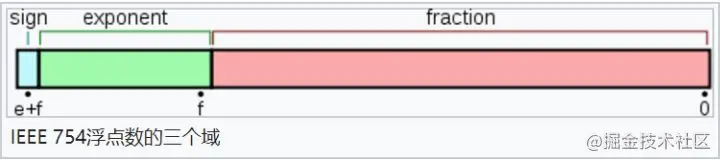
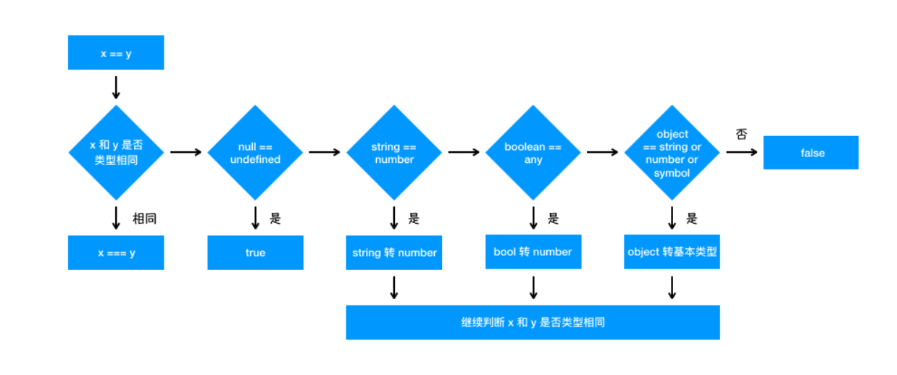
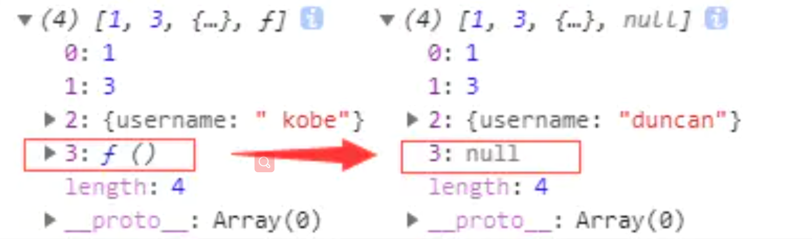

# 数据类型

## 有哪些数据类型

基本数据类型（栈）：布尔，数字（Number和BigInt），字符串，空和未定义，Symbol

引用数据类型（堆）：Object

### BigInt

任意大的整数

### Number

常规数字或者NaN

####  为什么0.1+0.2 ! == 0.3，如何让其相等  

>js中Number类型的实现原理是：
>
>遵循IEEE 754标准，使用64位固定长度来表示，也就是标准的double双精度浮点数。在二进制科学表示法中，双精度浮点数的小数部分最多只能保留52位，再加上前面的1，其实就是保留53位有效数字，剩余的需要舍去，遵从“0舍1入”的原则。

下面看一下**双精度数是如何保存**的： 

- 第一部分（蓝色）：用来存储符号位（sign），用来区分正负数，0表示正数，占用1位
- 第二部分（绿色）：用来存储指数（exponent），占用11位
- 第三部分（红色）：用来存储小数（fraction），占用52位

*双精度浮点数*(double)是计算机使用的一种数据类型，使用 64 位（8字节） 来存储一个浮点数。 它可以表示十进制的15或16位有效数字


#### isNaN 和 Number.isNaN 函数的区别？

 Number.isNaN 会首先判断传入参数是否为数字，如果是数字再继续判断是否为 NaN ，不会进行数据类型的转换

isNaNh会尝试将这个参数转换为数值，任何不能被转换为数值的的值都会返回 true，因此非数字值传入也会返回 true ，会影响 NaN 的判断


### Symbol

表示独一无二。它通过 `Symbol` 函数生成。一般用作属性名，保证不与其他属性名冲突

注意：

Symbol做属性名时，

**1、不能用点运算符访问（只能通过obj[Symbol]）**

**2、不能被遍历，想要遍历获取只能通过Object.getOwnPropertySymbols()**


### null和undefined的区别

undefined表示未定义，null表示有值，但值为空

不同点：type of的结果不一样


为什么 typeof null 的结果是Object？

```
第一版的js中用32位来存储值，前1-3位表示数据类型,000表示对象。而null指针的值全是0，所以被判断为Object
```

>000: object   - 当前存储的数据指向一个对象。
>1: int      - 当前存储的数据是一个 31 位的有符号整数。
>010: double   - 当前存储的数据指向一个双精度的浮点数。
>100: string   - 当前存储的数据指向一个字符串。
>110: boolean  - 当前存储的数据是布尔值。


## 判断数据类型

- typeof可以正确判断除了null以外的基本数据类型，可以判断function的对象类型
- instanceof也不准确，他的原理是查看原型是否在原型链上（如：A instanceof B是用来判断B的原型是否在A的原型链上）


### 判断引用数据类型

通过原型链：instanceof，arr.constructor，

字符串：Object.prototype.toString.call()

toString是Object的原型方法，而Array、function等**类型作为Object的实例，都重写了toString方法**

### 判断基本数据类型

typeOf判断除了null以外的基本数据类型，null可以做单独判断

判断null

- 最简单的是通过`null===null`来判断是否为null
- `Object.prototype.__proto__===a`判断a是否为原始对象原型的原型即null

判断是否为NaN

- `isNaN(any)`直接调用此方法判断是否为非数值

一些其他判断

- `Object.is(a,b)`判断a与b是否完全相等，与===基本相同，不同点在于Object.is判断`+0不等于-0`，`NaN等于自身`


### 为什么typeof可以检测类型，有没有更好的方法

> js在底层存储变量的时候会在变量的机器码的低位1-3位存储其类型信息(000：对象，010：浮点数，100：字符串，110：布尔，1：整数)，但是null所有机器码均为0，直接被当做了对象来看待。 那么有没有更好的办法区分类型呢，一般使用Object.prototype.toString.call()


## ==和===的区别

===严格判断，**==如果类型不一致会进行隐式类型转换**

来看下《Javascript高级程序设计》关于==和===的规则

> 1.如果有一个操作数是布尔值，则在比较前先将其转换为数值，true转换为1，false转换为0，例如false == 0，true == 1
> 2.如果一个操作数是字符串，另一个操作数是数值，先将字符串转换成数值，例如"1"==1,'' ==0
> 3.如果一个操作数是对象，另一个操作数不是，则调用对象的valueOf()方法，用得到的基本类型按照前面的规则进行比较。**(解释不清楚)**
> 4.null和undefined是相等的。
> 5.如果有一个数是NaN，则相等操作符返回false，而不相等操作符返回true。NaN == NaN返回为false，因为规则如此。
> 6.如果两个操作数是对象，则比较它们是不是同一个对象。如果两个操作数都指向同一个对象，则相等操作符返回true，否则返回false。
> 例如：var obj = {a:1};foo = obj;bar = obj;foo==bar;foo==bar返回为true，因为他们指向同一个对象，obj。

即：

- boolean则转为数值
- 对象和基本数据类型：valueOf()
- 有NaN，则结果为false
- 对象和对象：看引用地址是否一样
- null == undefined




### JavaScript 中如何进行隐式类型转换？

`ToPrimitive`方法，这是 JavaScript 中每个值隐含的自带的方法，用来将值 （无论是基本类型值还是对象）转换为基本类型值。如果值为基本类型，则直接返回值本身；如果值为对象，其看起来大概是这样：

```js
/**
* @obj 需要转换的对象
* @type 期望的结果类型
*/
ToPrimitive(obj,type)
```

>**（1）当**`type`**为**`number`**时规则如下：**
>
>- 调用`obj`的`valueOf`方法，如果为原始值，则返回，否则下一步；
>- 调用`obj`的`toString`方法，后续同上；
>- 抛出`TypeError` 异常。
>
>**（2）当**`type`**为**`string`**时规则如下：**
>
>- 调用`obj`的`toString`方法，如果为原始值，则返回，否则下一步；
>- 调用`obj`的`valueOf`方法，后续同上；
>- 抛出`TypeError` 异常。
>
>**注意：**
>
>- 如果对象为 Date 对象，则`type`默认为`string`；
>- 其他情况下，`type`默认为`number`。

如果两边都是字符串，则比较字母表顺序：

```javascript
'ca' < 'bd' // false
'a' < 'b' // true
```


#### 其他值到字符串的转换规则？

>- Null 和 Undefined 类型 ，null 转换为 "null"，undefined 转换为 "undefined"，
>- Boolean 类型，true 转换为 "true"，false 转换为 "false"。
>- Number 类型的值直接转换，不过那些极小和极大的数字会使用指数形式。
>- Symbol 类型的值直接转换，但是只允许显式强制类型转换，使用隐式强制类型转换会产生错误。
>- 对普通对象来说，除非自行定义 toString() 方法，否则会调用 toString()（Object.prototype.toString()）来返回内部属性 [[Class]] 的值，如"[object Object]"。如果对象有自己的 toString() 方法，字符串化时就会调用该方法并使用其返回值。
>
>

####  其他值到数字值的转换规则？

>- Undefined 类型的值转换为 NaN。
>- Null 类型的值转换为 0。
>- Boolean 类型的值，true 转换为 1，false 转换为 0。
>- String 类型的值转换如同使用 Number() 函数进行转换，如果包含非数字值则转换为 NaN，空字符串为 0。
>- Symbol 类型的值不能转换为数字，会报错。
>- 对象（包括数组）会首先被转换为相应的基本类型值，如果返回的是非数字的基本类型值，则再遵循以上规则将其强制转换为数字。
>
>

#### 其他值到布尔类型的值的3转换规则？

以下这些是假值： • undefined • null • false • +0、-0 和 NaN • ""

除此之外都是真值


### `+` 操作符什么时候用于字符串的拼接？

如果 + 的其中一个操作数是字符串（或者通过以上步骤最终得到字符串），则执行字符串拼接，否则执行数字加法。

那么对于除了加法的运算符来说，只要其中一方是数字，那么另一方就会被转为数字。


## 拷贝

参考：

[深拷贝和浅拷贝](https://zhuanlan.zhihu.com/p/146664126)

[浅拷贝与深拷贝](https://juejin.cn/post/6844904197595332622#heading-0)

浅拷贝和深拷贝**只针对引用数据类型**

###  object.assign和扩展运算法是深拷贝还是浅拷贝，两者区别

都是浅拷贝

区别：
Object.assign()：会触发 ES6 setter。
扩展操作符:不复制继承的属性或类的属性，但是它会复制ES6的 symbols 属性。


#### 赋值

赋值，赋的其实是该对象的在栈中的地址，而不是堆中的数据。

#### 浅拷贝

浅拷贝只拷贝第一层属性，对于第一层的引用类型的值无法拷贝。

拷贝的是对象第一层，第二层开始，引用类型只复制地址，不复制值。

只复制对象的第一层空间（如果第一层空间中有引用数据类型，那么拷贝的只是他的地址；如果是剧本数据类型，就直接拷贝的是值）

#### 深拷贝

深拷贝是拷贝的引用对象的值，而不是地址。

>总而言之，浅拷贝只复制指向某个对象的指针，而不复制对象本身，**新旧对象还是共享同一块内存**。但深拷贝会另外创造一个一模一样的对象，**新对象跟原对象不共享内存**，修改新对象不会改到原对象。


#### 浅拷贝的实现方式：

1.Object.assign()

`**Object.assign()**` 方法用于将所有可枚举属性的值从一个或多个源对象分配到目标对象。它将返回目标对象。

```js
let obj1 = { person: {name: "kobe", age: 41},sports:'basketball' };
let obj2 = Object.assign({}, obj1);
obj2.person.name = "wade";
obj2.sports = 'football'
console.log(obj1); // { person: { name: 'wade', age: 41 }, sports: 'basketball' }
```

2.数组的拼接和裁剪

Array.prototype.concat()

```js
let arr = [1, 3, {
    username: 'kobe'
    }];
let arr2 = arr.concat();    
arr2[2].username = 'wade';
console.log(arr); //[ 1, 3, { username: 'wade' } ]
```

Array.prototype.slice()

```js
let arr = [1, 3, {
    username: ' kobe'
    }];
let arr3 = arr.slice();
arr3[2].username = 'wade'
console.log(arr); // [ 1, 3, { username: 'wade' } ]
```

3.lodash的clone方法

```js
var _ = require('lodash');
var obj1 = {
    a: 1,
    b: { f: { g: 1 } },
    c: [1, 2, 3]
};
var obj2 = _.clone(obj1);
console.log(obj1.b.f === obj2.b.f);// true
```

4.es6的展开运算符

```js
let obj1 = { name: 'Kobe', address:{x:100,y:100}}
let obj2= {... obj1}
obj1.address.x = 200;
obj1.name = 'wade'
console.log('obj2',obj2) // obj2 { name: 'Kobe', address: { x: 200, y: 100 } }	
```

#### 深拷贝的实现方式：

1.手写递归

```js
function deepClone(obj, hash = new WeakMap()) {  if (obj === null) return obj; // 如果是null或者undefined我就不进行拷贝操作  if (obj instanceof Date) return new Date(obj);  if (obj instanceof RegExp) return new RegExp(obj);  // 可能是对象或者普通的值  如果是函数的话是不需要深拷贝  if (typeof obj !== "object") return obj;  // 是对象的话就把对象的值放进去  if (hash.get(obj)) return hash.get(obj);  let cloneObj = new obj.constructor();  // 找到的是所属类原型上的constructor,而原型上的 constructor指向的是当前类本身  hash.set(obj, cloneObj);  for (let key in obj) {    if (obj.hasOwnProperty(key)) {      // 实现一个递归拷贝      cloneObj[key] = deepClone(obj[key], hash);    }  }  return cloneObj;}let obj = { name: 1, address: { x: 100 } };obj.o = obj; // 对象存在循环引用的情况let d = deepClone(obj);obj.address.x = 200;console.log(d);
```

https://juejin.cn/post/6844904197595332622#heading-13

2.lodash中cloneDeep()

3.JSON.parse(JSON.stringify())

```js
let arr = [1, 3, {    username: ' kobe'}];let arr4 = JSON.parse(JSON.stringify(arr));arr4[2].username = 'duncan'; console.log(arr, arr4)
```

**这种方法虽然可以实现数组或对象深拷贝,但不能处理函数和正则**，因为这两者基于JSON.stringify和JSON.parse处理后，得到的正则就不再是正则（变为空对象），得到的函数就不再是函数（变为null）了。

比如下面的例子：

```js
let arr = [1, 3, {    username: ' kobe'},function(){}];let arr4 = JSON.parse(JSON.stringify(arr));arr4[2].username = 'duncan'; console.log(arr, arr4)
```




## 数组

### 数组有哪些原生方法？

- 数组和字符串的转换方法：toString()、toLocalString()、join() 其中 join() 方法可以指定转换为字符串时的分隔符。

- 数组尾部操作的方法 pop() 和 push()，push 方法可以传入多个参数。

- 数组首部操作的方法 shift() 和 unshift() 重排序的方法 reverse() 和 sort()，sort() 方法可以传入一个函数来进行比较，传入前后两个值，如果返回值为正数，则交换两个参数的位置。

- 数组连接的方法 concat() ，返回的是拼接好的数组，不影响原数组。

- 数组截取办法 slice()，用于截取数组中的一部分返回，不影响原数组。

- 数组插入方法 splice()，影响原数组查找特定项的索引的方法，indexOf() 和 lastIndexOf() 迭代方法 every()、some()、filter()、map() 和 forEach() 方法

  some()：只要有一个是true，便返回true；every()：只要有一个是false，便返回false.

- 数组归并方法 reduce() 和 reduceRight() 方法，reduce()对数组正序操作；reduceRight()对数组逆序操作


## 面试题

#### null和undefined的区别

意义上来说，null代表“没有对象”，没有值； undefined代表“缺少值”，声明了但是未赋值

用法上：

```js
// null1.原型链的终点2.作为函数参数，代表参数不是对象// undefined1.变量声明但是没有赋值2.如果函数调用未给参数，则是undefined3.函数默认返回值为undefined
```

#### null是对象吗

虽然 typeof null 返回的值是 object,但是null不是对象，而是基本数据类型的一种

#### 基本数据类型和复杂数据类型的区别

- 基本数据类型存储在栈内存，存储的是值。
- 复杂数据类型的值存储在堆内存，地址（指向堆中的值）存储在栈内存。当我们把对象赋值给另外一个变量的时候，复制的是地址，指向同一块内存空间，当其中一个对象改变时，另一个对象也会变化。

#### JSON

JSON.stringify 函数：把对象转化为 JSON 格式的字符串

JSON.parse() 函数：把字符串转化为对象

