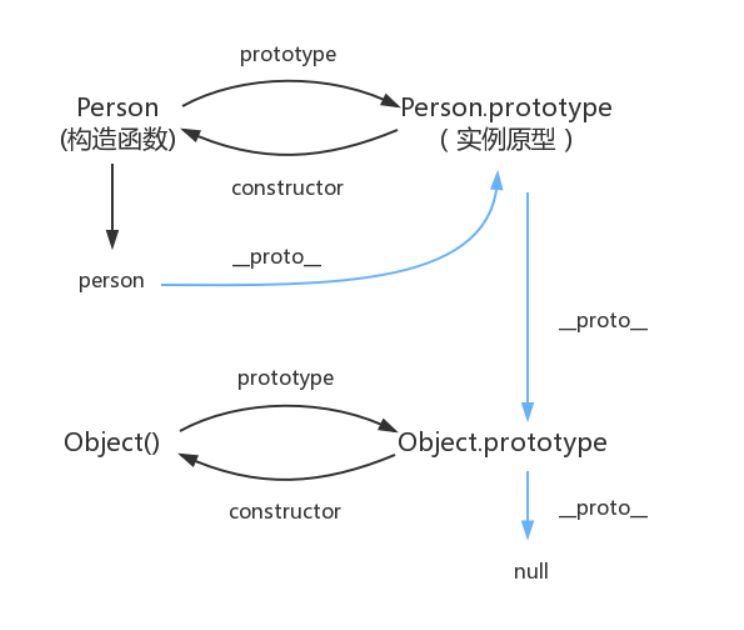

## 一. 原型和原型链

### 1. 什么是原型？

为了解决构造函数创建对象时，**共有属性被重复声明**的问题，出现了原型的概念。

- 每个函数都有原型prototype，每个对象都有\_proto\_。每个对象的_proto_指向其构造函数的prototype。
- 每一个对象或者函数都会从原型"继承"属性


### 2. 什么是原型链？

**每个对象的_proto_指向其构造函数的prototype。**这种链条式关系叫作原型链

**原型链的机制：**

当对象寻找某一属性时，如果自身属性没有就**沿着原型链上依次往上找**，直到一个对象的原型对象为**null**（null没有原型）。这个就叫原型链

**构造函数的prototype是个对象，他可能是由另外一个构造函数创建的！**

 

原型是一个对象，那原型的原型也是对象，顺着找下去关系就如下所示，蓝色的线即为原型链：




### 原型链指向

```javascript
p.__proto__  // Person.prototype
Person.prototype.__proto__  // Object.prototype
p.__proto__.__proto__ //Object.prototype
p.__proto__.constructor.prototype.__proto__ // Object.prototype
Person.prototype.constructor.prototype.__proto__ // Object.prototype
p1.__proto__.constructor // Person
Person.prototype.constructor  // Person
```


