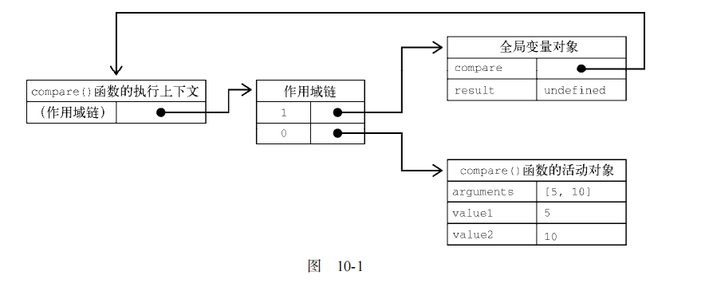
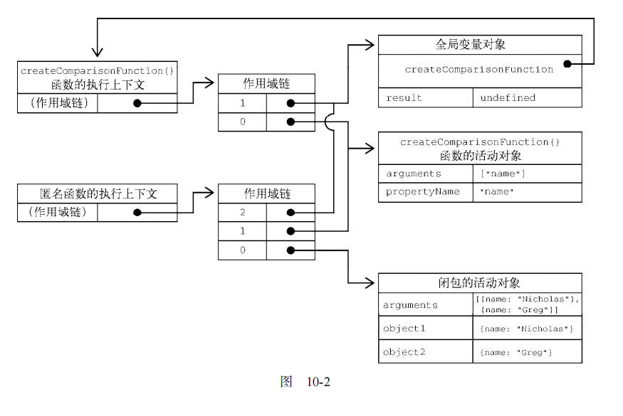
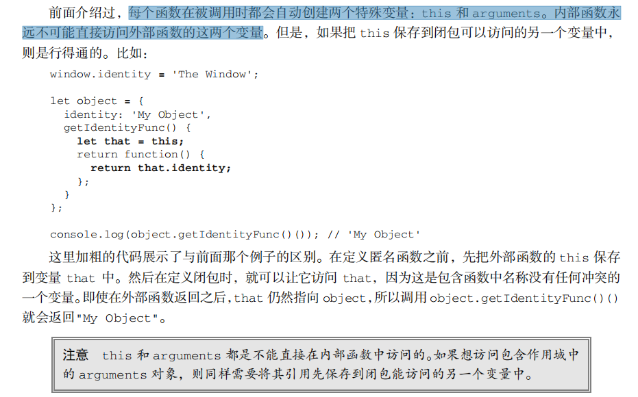

## 作用域

### 什么是作用域？

作用域是指程序源代码中定义变量的区域。

个人理解就是 **变量的作用范围**

### 作用域的作用

作用域规定了如何查找变量，也就是确定当前执行代码对变量的访问权限。

JavaScript 采用词法作用域(lexical scoping)，也就是静态作用域。

### 作用域下面的几个概念

#### 说一下静态作用域和动态作用域的区别

静态作用域是根据书写位置来查找变量，动态作用域是从调用函数的作用域查找变量

让我们认真看个例子就能明白之间的区别：

```js
var value = 1;

function foo() {
    console.log(value);
}

function bar() {
    var value = 2;
    foo();
}

bar();

// 结果是 ???
```

假设JavaScript采用静态作用域，让我们分析下执行过程：

执行 foo 函数，先从 foo 函数内部查找是否有局部变量 value，如果没有，就根据书写的位置，查找上面一层的代码，也就是 value 等于 1，所以结果会打印 1。

假设JavaScript采用动态作用域，让我们分析下执行过程：

执行 foo 函数，依然是从 foo 函数内部查找是否有局部变量 value。如果没有，就从调用函数的作用域，也就是 bar 函数内部查找 value 变量，所以结果会打印 2。

前面我们已经说了，JavaScript采用的是静态作用域，所以这个例子的结果是 1。

参考：[JavaScript深入之词法作用域和动态作用域](https://github.com/mqyqingfeng/Blog/issues/3#)#3


## 作用域链

当查找变量的时候，会先从当前上下文的变量对象中查找，如果没有找到，就会从父级(词法层面上的父级)执行上下文的变量对象中查找，一直找到全局上下文的变量对象，也就是全局对象。这样由多个执行上下文的变量对象构成的链表就叫做作用域链

下面，让我们以一个函数的创建和激活两个时期来讲解作用域链是如何创建和变化的。

上面讲到函数作用域是在创建的阶段确定
这是因为函数有一个内部属性 [[scope]]，当函数创建的时候，就会保存所有父变量对象到其中，你可以理解 [[scope]] 就是所有父变量对象的层级链，但是注意：[[scope]] 并不代表完整的作用域链！

举个?

```
function out() {
    function inner() {
        ...
    }
}
```

函数创建时，各自的[[scope]]为：

```js
out.[[scope]] = [
  globalContext.VO
];

inner.[[scope]] = [
    outContext.AO,
    globalContext.VO
];
```

**当函数激活时，进入函数上下文，创建 AO 后，就会将活动对象添加到作用链的前端。**
这时候执行上下文的作用域链，我们命名为 Scope：

```js
Scope = [AO].concat([[Scope]]);
```

至此，作用域链创建完毕。


#### 块级作用域和局部作用域

let和const是声明的变量属于块级作用域，var声明的变量属于全局作用域

注意：

块级作用域下，for循环的条件语句的作用域与其循环体的作用域不同，条件语句块属于循环体的父级作用域，例子如下：

```js
// 以下语句使用let声明不报错，说明为不同作用域
for (let i = 0; i < 5; i++) {
  let i = 5
  if(i) {
      console.log(i)  // 1,2,3,4
  }
}
--------------------------------------------
// 此语句报错，说明循环体为条件语句块的子作用域
// for循环执行顺序为：条件语句块1->条件语句块2->循环体->条件语句块3->条件语句块2 依次类推
for (let i = 0; i < 5; i=x) { // x is not defined
  let x = 5
}
```

#### 隐式全局变量和显示全局变量

所有未定义的变量直接赋值后，会自动声明为全局作用域的变量

- 注意：(隐式全局变量可以用delete删除，var定义的则不行)

```js
a=1 // 隐式全局变量 严格模式报错
var b=2 // 显式全局变量
console.log(a,b) //1 2
delete a  // 严格模式报错
delete b  // 严格模式报错
console.log(b,a) // 2   a is not defined 
```

## 闭包

### 什么是闭包

>**闭包指的是那些引用了另一个函数作用域中变量的函数，嵌套函数中最为常见**


#### 从实践角度：

以下函数才算是闭包：

1. **即使创建它的上下文已经销毁，它仍然存在（比如，内部函数从父函数中返回）**
2. 在代码中引用了自由变量（凡是跨了自己的作用域的变量都叫自由变量）

```js
var scope = "global scope";

function checkscope() {
  var scope = "local scope";

  function f() {
    return scope;
  }

  return f;
}

var foo = checkscope();
foo();
```


### 闭包的用途


1、创建私有变量：闭包使我们在函数外部能够访问到函数内部的变量。通过使用闭包，可以通过在外部调用闭包函数，从而在外部访问到函数内部的变量，可以使用这种方法来创建私有变量。

2、另一个用途是使已经运行结束的函数上下文中的变量对象继续留在内存中，因为闭包函数保留了这个变量对象的引用，所以这个变量对象不会被回收。


#### 7 举出闭包实际场景运用的例子

```
引用其他作用域的变量的函数都叫作闭包

场景：
防抖节流
创建私有变量
```


### 如何回收闭包

通常，如果引用闭包的函数是一个全局变量，那么闭包会一直存在直到页面关闭；但如果这个闭包以后不再使用的话，就会造成内存泄漏。

如果引用闭包的函数是个局部变量，等函数销毁后，在下次 JavaScript 引擎执行垃圾回收时，判断闭包这块内容如果已经不再被使用了，那么 JavaScript 引擎的垃圾回收器就会回收这块内存。

所以在使用闭包的时候，你要尽量注意一个原则：**如果该闭包会一直使用，那么它可以作为全局变量而存在；但如果使用频率不高，而且占用内存又比较大的话，那就尽量让它成为一个局部变量。**


#### **经典面试题：循环中使用闭包解决 var 定义函数的问题**

```javascript
for (var i = 1; i <= 5; i++) {
  setTimeout(function timer() {
    console.log(i)
  }, i * 1000)
}
```

首先因为 `setTimeout` 是个异步函数，所以会先把循环全部执行完毕，这时候 `i` 就是 6 了，所以会输出一堆 6。解决办法有三种：

- 第一种是使用闭包的方式

```javascript
for (var i = 1; i <= 5; i++) {  
    (function(j) {    
        setTimeout(function timer() { 
            console.log(j)    
        }, j * 1000)  
    })(i)
}

```

在上述代码中，首先使用了立即执行函数将 `i` 传入函数内部，这个时候值就被固定在了参数 `j` 上面不会改变，当下次执行 `timer` 这个闭包的时候，就可以使用外部函数的变量 `j`，从而达到目的。

- 第二种就是使用 `setTimeout` 的第三个参数，这个参数会被当成 `timer` 函数的参数传入。

```javascript
for (var i = 1; i <= 5; i++) {
  setTimeout(
    function timer(j) {
      console.log(j)
    },
    i * 1000,
    i
  )
}
复制代码
```

- 第三种就是使用 `let` 定义 `i` 了来解决问题了，这个也是最为推荐的方式

```javascript
for (let i = 1; i <= 5; i++) {
  setTimeout(function timer() {
    console.log(i)
  }, i * 1000)
}
```


#### 面试题1

```js
var data = [];

for (var i = 0; i < 3; i++) {
  data[i] = function () {
    console.log(i);
  };
}

data[0]();
data[1]();
data[2]();
```

答案是都是 3


##### 分析原因：

答案是都是 3，让我们分析一下原因：

当执行到 data[0] 函数之前，此时全局上下文的 VO 为：

```js
globalContext = {
    VO: {
        data: [...],
        i: 3
    }
}
```

当执行 data[0] 函数的时候，data[0] 函数的作用域链为：

```js
data[0]Context = {
    Scope: [AO, globalContext.VO]
}
```

data[0]Context 的 AO 并没有 i 值，所以会从 globalContext.VO 中查找，i 为 3，所以打印的结果就是 3。


#### 注意：

var 存在变量提升，所以


```js
for(var i = 0; i < 10; i++){
    arr[i] = function(){
    	return i;
    };
}
```

等同于


```js
var i
for(i = 0; i < 10; i++){
    arr[i] = function(){
    return i;
  };
}
```

实际上就是定义了一个全局变量。


虽然你return的是i，但是你在调用arr[i]这个函数的时候，会沿着作用域链找到arr[i]这个函数的上一层作用域，在这里即是全局作用域。所以你调用的时候var已经是10了，可以在 for循环后面添加一个console.log(i)验证。


let 会创建一个作用域。则，这里就会形成一个闭包

所以，使用let定义时，则分成了三层 Global --> Closure --> Local 作用域

所以你在调用arr[i]这个函数时，其实会根据作用域链找到Closure（闭包）中的 变量 i 。

使用下面这行代码，打开浏览器中的Source面板并查看右侧的Scope（作用域链）验证。


```js
var arr = []
for(let i = 0 ;i<10 ;i++){
  arr[i] = function(){
    debugger
    console.log(i);
  };
}
for(var j = 0; j < arr.length; j++){
  console.log(arr[j]());
}//0-9
```


#### 面试题2

让我们改成闭包看看：

```js
var data = [];

for (var i = 0; i < 3; i++) {
  data[i] = (function (i) {
        return function(){
            console.log(i);
        }
  })(i);
}

data[0]();
data[1]();
data[2]();
```

当执行到 data[0] 函数之前，此时全局上下文的 VO 为：

```js
globalContext = {
    VO: {
        data: [...],
        i: 3
    }
}
```

跟没改之前一模一样。

当执行 data[0] 函数的时候，data[0] 函数的作用域链发生了改变：

```js
data[0]Context = {    Scope: [AO, 匿名函数Context.AO globalContext.VO]}
```

匿名函数执行上下文的AO为：

```js
匿名函数Context = {
    AO: {
        arguments: {
            0: 0,
            length: 1
        },
        i: 0
    }
}
```

data[0]Context 的 AO 并没有 i 值，所以会沿着作用域链从匿名函数 Context.AO 中查找，这时候就会找 i 为 0，找到了就不会往 globalContext.VO 中查找了，即使 globalContext.VO 也有 i 的值(值为3)，所以打印的结果就是0。

data[1] 和 data[2] 是一样的道理。


## 闭包的使用场景

比如常见的防抖节流

```js
// 防抖
function debounce(fn, delay = 300) {
  let timer; //闭包引用的外界变量
  return function () {
    const args = arguments;
    if (timer) {
      clearTimeout(timer);
    }
    timer = setTimeout(() => {
      fn.apply(this, args);
    }, delay);
  };
}
复制代码
```

使用闭包可以在 JavaScript 中模拟块级作用域

```js
function outputNumbers(count) {
  (function () {
    for (var i = 0; i < count; i++) {
      alert(i);
    }
  })();
  alert(i); //导致一个错误！
}
复制代码
```

闭包可以用于在对象中创建私有变量

```js
var aaa = (function () {
  var a = 1;
  function bbb() {
    a++;
    console.log(a);
  }
  function ccc() {
    a++;
    console.log(a);
  }
  return {
    b: bbb, //json结构
    c: ccc,
  };
})();
console.log(aaa.a); //undefined
aaa.b(); //2
aaa.c(); //3
```


# 总结


## 闭包

引用了其他函数作用域中的变量的函数叫作闭包。存在形式普遍出现在嵌套函数中。

### 为什么会产生闭包？或者说闭包形成的原因是什么？

首先，js是静态作用域。即查找变量是根据书写位置查找的，而不是从调用函数的作用域进行查找（静态作用域是根据书写位置来查找变量，动态作用域是从调用函数的作用域查找变量）

当执行一个函数的时候，会给这个函数创建一个函数执行上下文并分别创建它的变量对象和作用域链，确定this的指向。

这里先不谈this指向问题。

1. 在创建活动对象的时候，会用arguments和其他的命名参数来初始化活动对象。
2. 然后把内部函数的变量对象放入内部函数作用域链上的第一个，把外部函数的变量对象放到作用域链上的第二个。这个作用域链一直向外串起所有外部函数的活动对象，直到全局执行上下文终止
3. 函数内部的代码访问变量对象的时候，就会沿着作用域链一直向上查找。函数执行完毕后，局部的活动对象就会被销毁
4. 但是闭包就不一样，在一个函数内部定义的函数会把其包含函数的活动对象添加到自己的作用域链中。因为内部函数依旧存活，所以不会释放它作用域链上的外部函数的变量对象。


>**变量对象和活动对象是什么关系？**
>
>未进入执行阶段之前，变量对象(VO)中的属性都不能访问！但是进入执行阶段之后，变量对象(VO)转变为了活动对象(AO)，里面的属性都能被访问了，然后开始进行执行阶段的操作。
>它们其实都是同一个对象，只是处于执行上下文的不同生命周期。


>**作用域链的存在形式？**
>
>作用域链其实是一个包含指针的列表，每个指针分别指向一个变量对象

>**执行上下文的两个阶段**
>
>1. 创建阶段：创建阶段，执行上下文会分别创建变量对象，建立作用域链，以及确定this的指向。
>
>2. 代码执行阶段：代码执行阶段，进行变量赋值，函数引用，以及执行其他代码。

注意：**内部函数不能直接访问外部函数的this和arguments**

#### 进入执行上下文，此时还没有执行代码，变量对象包括有

1. 函数所有形参(如果是函数上下文)
   - 没有实参，属性值设为 `undefined`
2. 函数声明
   - 由名称和对应值（函数对象 `function-object`）组成一个变量对象的属性被创建
   - 如果出现函数重名，则完全 **替换** 
3. 变量声明
   - 没有实参，属性值设为 `undefined`
   - 如果变量名称跟已经声明的形式参数或函数相同，则变量声明 **不会干扰已经存在的属性**
4. 注意：函数提升优先级比变量提升高，且不会被变量声明覆盖，但是会被变量赋值覆盖，也会被后面的同名函数替换（例子请看下方红色注意代码部分）


# 红宝书

闭包指的是那些引用了另一个函数作用域中变量的函数，通常是在嵌套函数中实现的。

```js
function createComparisonFunction(propertyName) { 
     return function(object1, object2) { 
         let value1 = object1[propertyName]; 
         let value2 = object2[propertyName]; 
         if (value1 < value2) { 
         	return -1; 
         } 
         else if (value1 > value2) { 
         	return 1; 
         } 
         else { 
         	return 0; 
         } 
     }; 
}
```


>理解作用域链创建和使用的细节对理解闭包非常重要。
>
>在调用一个函数时，会为这个函数调用创建一个执行上下文，并创建一个作用域链。然后用 arguments和其他命名参数来初始化这个函数的活动对象。外部函数的活动对象是内部函数作用域链上的第二个对象。这个作用域链一直向外串起了所有包含函数的活动对象，直到全局执行上下文才终止。

在函数执行时，要从作用域链中查找变量，以便读、写值。来看下面的代码：

```js
function compare(value1, value2) { 
     if (value1 < value2) { 
     	return -1; 
     } 
    else if (value1 > value2) { 
     	return 1; 
     } 
    else { 
     return 0; 
     } 
} 
let result = compare(5, 10)
```

这里定义的 compare()函数是在全局上下文中调用的。第一次调用 compare()时，会为它创建一 个包含 arguments、value1 和 value2 的活动对象，这个对象是其作用域链上的第一个对象。而全局上下文的变量对象则是 compare()作用域链上的第二个对象，其中包含 this、result 和 compare。 

函数执行时，每个执行上下文中都会有一个包含其中变量的对象。全局上下文中的叫变量对象，它会在代码执行期间始终存在。而函数局部上下文中的叫活动对象，只在函数执行期间存在。在定义compare()函数时，就会为它创建作用域链，预装载全局变量对象，并保存在内部的[[Scope]]中。在调用这个函数时，会创建相应的执行上下文，然后通过复制函数的[[Scope]]来创建其作用域链。接着会创建函数的活动对象（用作变量对象）并将其推入作用域链的前端。在这个例子中，这意味着 compare()函数执行上下文的作用域链中有两个变量对象：局部变量对象和全局变量对象。作用域链其实是一个包含指针的列表，每个指针分别指向一个变量对象，但物理上并不会包含相应的对象




函数内部的代码在访问变量时，就会使用给定的名称从作用域链中查找变量。函数执行完毕后，局部活动对象会被销毁，内存中就只剩下全局作用域。不过，闭包就不一样了。

在一个函数内部定义的函数会把其包含函数的活动对象添加到自己的作用域链中。因此，在createComparisonFunction()函数中，匿名函数的作用域链中实际上包含 createComparisonFunction()的活动对象。图 10-2 展示了以下代码执行后的结果。

```js
let compare = createComparisonFunction('name'); 
let result = compare({ name: 'Nicholas' }, { name: 'Matt' });
```




在 createComparisonFunction()返回匿名函数后，它的作用域链被初始化为包含 createComparisonFunction()的活动对象和全局变量对象。这样，匿名函数就可以访问到 createComparisonFunction()可以访问的所有变量。另一个有意思的副作用就是，createComparisonFunction()的活动对象并不能在它执行完毕后销毁，因为匿名函数的作用域链中仍然有对它的引用。在 createComparisonFunction()执行完毕后，其执行上下文的作用域链会销毁，但它的活动对象仍然会保留在内存中，直到匿名函数被销毁后才会被销毁：

```js
// 创建比较函数let compareNames = createComparisonFunction('name'); // 调用函数let result = compareNames({ name: 'Nicholas' }, { name: 'Matt' }); // 解除对函数的引用，这样就可以释放内存了compareNames = null; 
```

这里，创建的比较函数被保存在变量 compareNames 中。把 compareNames 设置为等于 null 会解除对函数的引用，从而让垃圾回收程序可以将内存释放掉。作用域链也会被销毁，其他作用域（除全局作用域之外）也可以销毁.

>注意 因为闭包会保留它们包含函数的作用域，所以比其他函数更占用内存。过度使用闭包可能导致内存过度占用，因此建议仅在十分必要时使用。V8 等优化的 JavaScript 引擎会努力回收被闭包困住的内存，不过我们还是建议在使用闭包时要谨慎。




