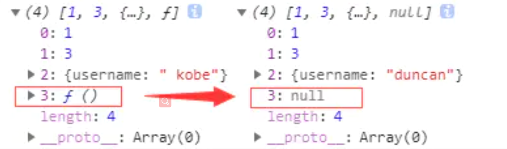

### 拷贝

参考：

[深拷贝和浅拷贝](https://zhuanlan.zhihu.com/p/146664126)

[浅拷贝与深拷贝](https://juejin.cn/post/6844904197595332622#heading-0)

浅拷贝和深拷贝**只针对引用数据类型**

#### 赋值

赋值，赋的其实是该对象的在栈中的地址，而不是堆中的数据。

#### 浅拷贝

浅拷贝只拷贝第一层属性，对于第一层的引用类型的值无法拷贝。

拷贝的是对象第一层，第二层开始，引用类型只复制地址，不复制值。

只复制对象的第一层空间（如果第一层空间中有引用数据类型，那么拷贝的只是他的地址；如果是剧本数据类型，就直接拷贝的是值）

#### 深拷贝

深拷贝是拷贝的引用对象的值，而不是地址。

>总而言之，浅拷贝只复制指向某个对象的指针，而不复制对象本身，**新旧对象还是共享同一块内存**。但深拷贝会另外创造一个一模一样的对象，**新对象跟原对象不共享内存**，修改新对象不会改到原对象。


#### 浅拷贝的实现方式：

##### 1.Object.assign()

`**Object.assign()**` 方法用于将所有可枚举属性的值从一个或多个源对象分配到目标对象。它将返回目标对象。

```js
let obj1 = { person: {name: "kobe", age: 41},sports:'basketball' };
let obj2 = Object.assign({}, obj1);
obj2.person.name = "wade";
obj2.sports = 'football'
console.log(obj1); // { person: { name: 'wade', age: 41 }, sports: 'basketball' }
```

##### 2.数组的拼接和裁剪

Array.prototype.concat()

```js
let arr = [1, 3, {
    username: 'kobe'
    }];
let arr2 = arr.concat();    
arr2[2].username = 'wade';
console.log(arr); //[ 1, 3, { username: 'wade' } ]
```

Array.prototype.slice()

```js
let arr = [1, 3, {
    username: ' kobe'
    }];
let arr3 = arr.slice();
arr3[2].username = 'wade'
console.log(arr); // [ 1, 3, { username: 'wade' } ]
```

##### 3.lodash的clone方法

```js
var _ = require('lodash');
var obj1 = {
    a: 1,
    b: { f: { g: 1 } },
    c: [1, 2, 3]
};
var obj2 = _.clone(obj1);
console.log(obj1.b.f === obj2.b.f);// true
```

##### 4.es6的展开运算符

```js
let obj1 = { name: 'Kobe', address:{x:100,y:100}}
let obj2= {... obj1}
obj1.address.x = 200;
obj1.name = 'wade'
console.log('obj2',obj2) // obj2 { name: 'Kobe', address: { x: 200, y: 100 } }	
```

#### 深拷贝的实现方式：

##### 1.手写递归

```js
function deepClone(obj, hash = new WeakMap()) {
  if (obj === null) return obj; // 如果是null或者undefined我就不进行拷贝操作
  if (obj instanceof Date) return new Date(obj);
  if (obj instanceof RegExp) return new RegExp(obj);
  // 可能是对象或者普通的值  如果是函数的话是不需要深拷贝
  if (typeof obj !== "object") return obj;
  // 是对象的话就把对象的值放进去
  if (hash.get(obj)) return hash.get(obj);
  let cloneObj = new obj.constructor();
  // 找到的是所属类原型上的constructor,而原型上的 constructor指向的是当前类本身
  hash.set(obj, cloneObj);
  for (let key in obj) {
    if (obj.hasOwnProperty(key)) {
      // 实现一个递归拷贝
      cloneObj[key] = deepClone(obj[key], hash);
    }
  }
  return cloneObj;
}
let obj = { name: 1, address: { x: 100 } };
obj.o = obj; // 对象存在循环引用的情况
let d = deepClone(obj);
obj.address.x = 200;
console.log(d);
```

https://juejin.cn/post/6844904197595332622#heading-13

##### 2.lodash中cloneDeep()

##### 3.JSON.parse(JSON.stringify())

```js
let arr = [1, 3, {
    username: ' kobe'
}];
let arr4 = JSON.parse(JSON.stringify(arr));
arr4[2].username = 'duncan'; 
console.log(arr, arr4)
```

**这种方法虽然可以实现数组或对象深拷贝,但不能处理函数和正则**，因为这两者基于JSON.stringify和JSON.parse处理后，得到的正则就不再是正则（变为空对象），得到的函数就不再是函数（变为null）了。

比如下面的例子：

```js
let arr = [1, 3, {
    username: ' kobe'
},function(){}];
let arr4 = JSON.parse(JSON.stringify(arr));
arr4[2].username = 'duncan'; 
console.log(arr, arr4)
```




