# 前言

先上一个面试题：做前端少不了跟动画打交道，那么实现一个动画有哪些方式呢？

- **JavaScript**：`setTimeout` 和 `setInterval`
- **Css3**：`transition` 和 `animation`
- **Html**：`canvas` 和 `SVG`
- **requestAnimationFrame** **API**
- ...
- 你还知道哪些方式可以实现动画?

个人想法：中秋活动中，那个兔子移动和灯笼飘动的复杂动画，考虑一下是不是可以用requestAnimationFrame做呢？

# requestAnimationFrame  API

## 是什么

本文主要学习 `requestAnimationFrame API` ， 顾名思义，**请求动画帧**，也称 **帧循环**。

文中贴的 `js` 代码全都是真实代码，复制即可运行。

## 怎么玩

我们学习一个东西，肯定是要先看看 `MDN` 怎么说的。

> **window.requestAnimationFrame()**  
>
> 告诉浏览器——你希望执行一个动画，并且要求浏览器在下次重绘之前调用指定的回调函数更新动画。该方法需要传入一个回调函数作为参数，该回调函数会在浏览器下一次重绘之前执行。

**浏览器的重绘与回流** 后续会单独出一篇文章来学习。现在不懂也没关系，不影响我们学习 `requestAnimationFrame API` 。

我们先初步认识一下它，根据文档。我们给它传递一个回调函数 `test` 。

```js
//html代码全文通用，所以只在此贴出一次
<body>
  <h1>requestAnimationFrame API</h1>
  <button id='begin' class="begin">开始</button>
  <button id='end' class="end">停止</button>
</body>

//js
(() => {
  function test() {
    console.log('🚀🚀hello ~ requestAnimationFrame');
  }
  requestAnimationFrame(test)
})()
复制代码
```

可以看到，控制台成功的输出了一次 `log` 。

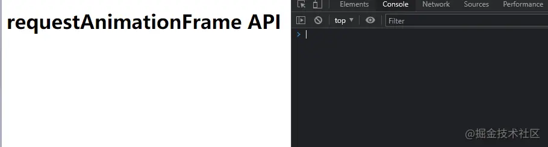

但是它只执行了一次，怎么做动画呢？别急，再看看 `MDN` 怎么说。

> **注意：若你想在浏览器下次重绘之前继续更新下一帧动画，那么回调函数自身必须再次调用`window.requestAnimationFrame()`**

原来在回调函数中要再次调用 `requestAnimationFrame` 才可以，修改代码再试一下。

```js
(() => {
  let n = 0
  function test() {
    n++
    console.log(`🚀🚀hello ~ requestAnimationFrame ${n}`);
    requestAnimationFrame(test)
  }
  requestAnimationFrame(test)
})()
复制代码
```

看一下，确实是一直在执行了。 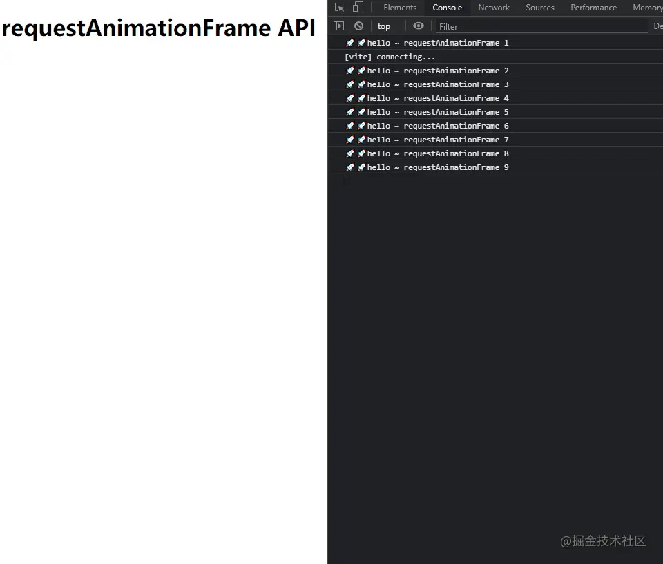

## 执行频率

这时候有小伙伴就要问了，我没有像 `setTimeout` 和 `setInterval` 那样设置时间，它为什么会间隔执行呢？

再看看文档怎么说。

> 回调函数执行次数通常是每秒 **60** 次，但在大多数遵循 `W3C` 建议的浏览器中，回调函数执行次数通常与   **浏览器屏幕刷新次数** 相匹配。

这回就知道了，原来它根本就不用手动设置执行间隔时间，而是根据 **浏览器屏幕刷新次数** 自动调整了,也就是说浏览器屏幕刷新多少次，它就执行多少次。看到这我只想说一句 **厉害坏了** 。

那么什么是 **浏览器屏幕刷新次数** 呢？

**屏幕刷新频率（次数）：** 屏幕每秒出现图像的次数。普通笔记本为60Hz。

## 回调参数

老规矩，先看文档。

> 回调函数会被传入[`DOMHighResTimeStamp`](https://link.juejin.cn?target=https%3A%2F%2Fdeveloper.mozilla.org%2Fzh-CN%2Fdocs%2FWeb%2FAPI%2FDOMHighResTimeStamp)参数，[`DOMHighResTimeStamp`](https://link.juejin.cn?target=https%3A%2F%2Fdeveloper.mozilla.org%2Fzh-CN%2Fdocs%2FWeb%2FAPI%2FDOMHighResTimeStamp)指示当前被 `requestAnimationFrame()` 排序的回调函数被触发的时间。

修改代码来看一下这个参数。

```js
(() => {
  function test(timestamp) {
    console.log(`🚀🚀hello ~ requestAnimationFrame ${timestamp}`);
    requestAnimationFrame(test)
  }
  requestAnimationFrame(test)
})()
复制代码
```

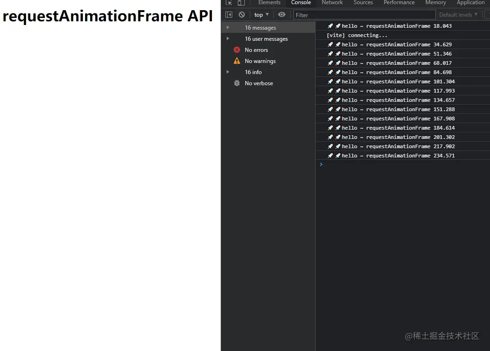

好家伙，精确到到小数点后三位。那么文档这段文字是什么意思呢？

> 在同一个帧中的 **多个回调函数** ，它们每一个都会接受到一个 **相同的时间戳** ，即使在计算上一个回调函数的工作负载期间已经 **消耗了一些时间** 。该时间戳是一个十进制数，单位毫秒，最小精度为1ms(1000μs)。

修改代码，我们同时执行两个 `requestAnimationFrame`  来看一下。

```js
(() => {
  function test1(timestamp) {
    console.log(`🚀🚀hello ~ requestAnimationFrame1 ${timestamp}`);
    requestAnimationFrame(test1)
  }
  function test2(timestamp) {
    console.log(`🚀🚀hello ~ requestAnimationFrame2 ${timestamp}`);
    requestAnimationFrame(test2)
  }
  requestAnimationFrame(test1)
  requestAnimationFrame(test2)

})()
复制代码
```

可以看到，两个 `requestAnimationFrame` 在控制台输出的时间戳是一样的。也就是浏览器刷新一次的时候，执行所有的 `requestAnimationFrame` ，并且它们的回调参数是一模一样的。

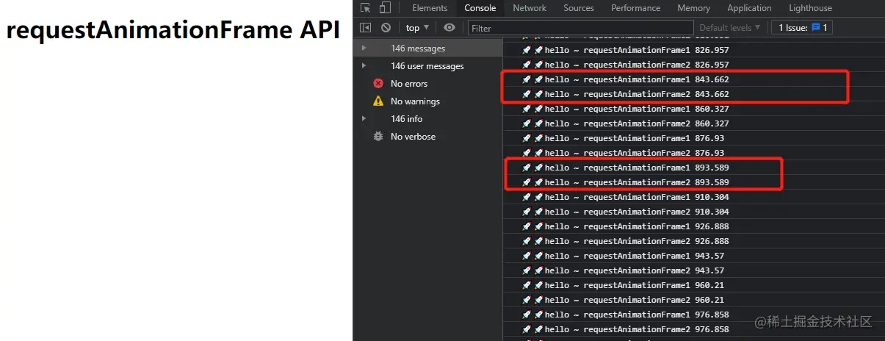

## 浏览器的自我拯救

> 为了提高性能和电池寿命，因此在大多数浏览器里，当`requestAnimationFrame()` 运行在后台标签页或者隐藏的[``](https://link.juejin.cn?target=https%3A%2F%2Fdeveloper.mozilla.org%2Fzh-CN%2Fdocs%2FWeb%2FHTML%2FElement%2Fiframe) 里时，`requestAnimationFrame()` 会被暂停调用以提升性能和电池寿命。

这个就厉害了，你要是当时没有浏览页面，并且也没关掉，那么 `requestAnimationFrame() `一直在这跑，多消耗性能啊。人家开发者早都想到了，也就是说，只要你当前没看我，那我就偷懒了（`是不是跟你们上班一样，领导没盯着你，你就刷掘金摸鱼`）。

上个代码验证一下，为了方便，我添加了一个 `button` 。

```js
  const beginBtn = document.querySelector("#begin")
  beginBtn.addEventListener("click", () => {
    requestAnimationFrame(test)
  })
  
  let n = 0
  function test() {
    n++
    console.log(`🚀🚀hello ~ requestAnimationFrame ${n}`);
    requestAnimationFrame(test)
  }
复制代码
```

可以看到，控制台打印到一半（高度）的时候，我切到另一个页面，几秒钟后我切回来的时候，依然是接着一半的位置进行输出。

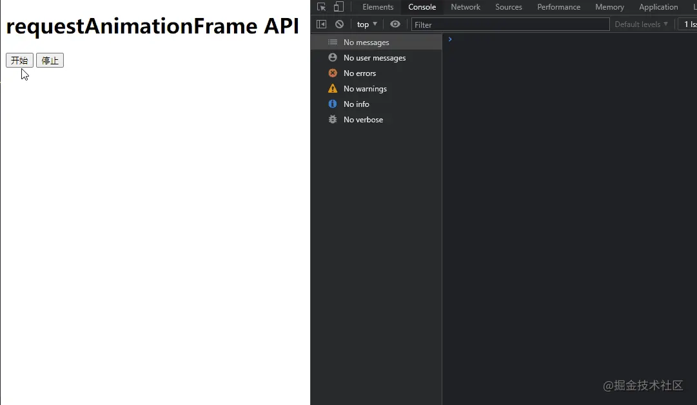

## 返回值

> 一个 `long` 整数，请求 ID ，是回调列表中唯一的标识。是个非零值，没别的意义。

以下代码点击开始的时候，输出 `requestAnimationFrame` 的返回值。可以看见，每执行一次，数值就会 **+1**

```js
(() => {
  const beginBtn = document.querySelector("#begin")
  
  let myRef;
  
  beginBtn.addEventListener("click", () => {
    myRef = requestAnimationFrame(test)
  })
  
  function test() {
    myRef = requestAnimationFrame(test)
    console.log('🚀🚀~ myRef:', myRef);
  }
})()
复制代码
```

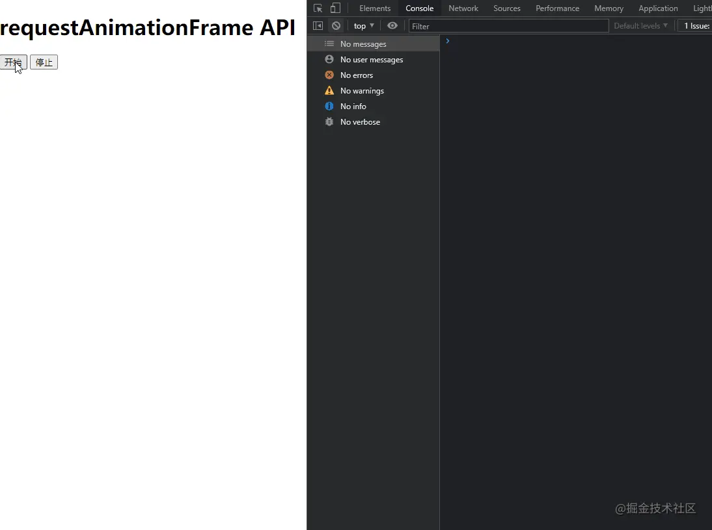

## 终止执行

> 你可以传这个值给 [`window.cancelAnimationFrame()`](https://link.juejin.cn?target=https%3A%2F%2Fdeveloper.mozilla.org%2Fzh-CN%2Fdocs%2FWeb%2FAPI%2FWindow%2FcancelAnimationFrame) 以取消回调函数。

那如果我想要在特定的条件下终止 `requestAnimationFrame` 怎么办呢，官方也给出了答案，那就是 `cancelAnimationFrame API` 。 只需要把 `requestAnimationFrame` 的返回值作为参数传递给 `cancelAnimationFrame` 就可以了。

```js
(() => {
  const beginBtn = document.querySelector("#begin")

  const endBtn = document.querySelector("#end")

  let myRef;

  beginBtn.addEventListener("click", () => {
    myRef = requestAnimationFrame(test)
  })

  endBtn.addEventListener("click", () => {
    cancelAnimationFrame(myRef)
  })

  function test() {
    myRef = requestAnimationFrame(test)
    console.log('🚀🚀~ myRef:', myRef);
  }
})()
复制代码
```

可以看到，当我点击开始的时候控制台持续输出内容，当我点击停止的时候，控制台停止输出。

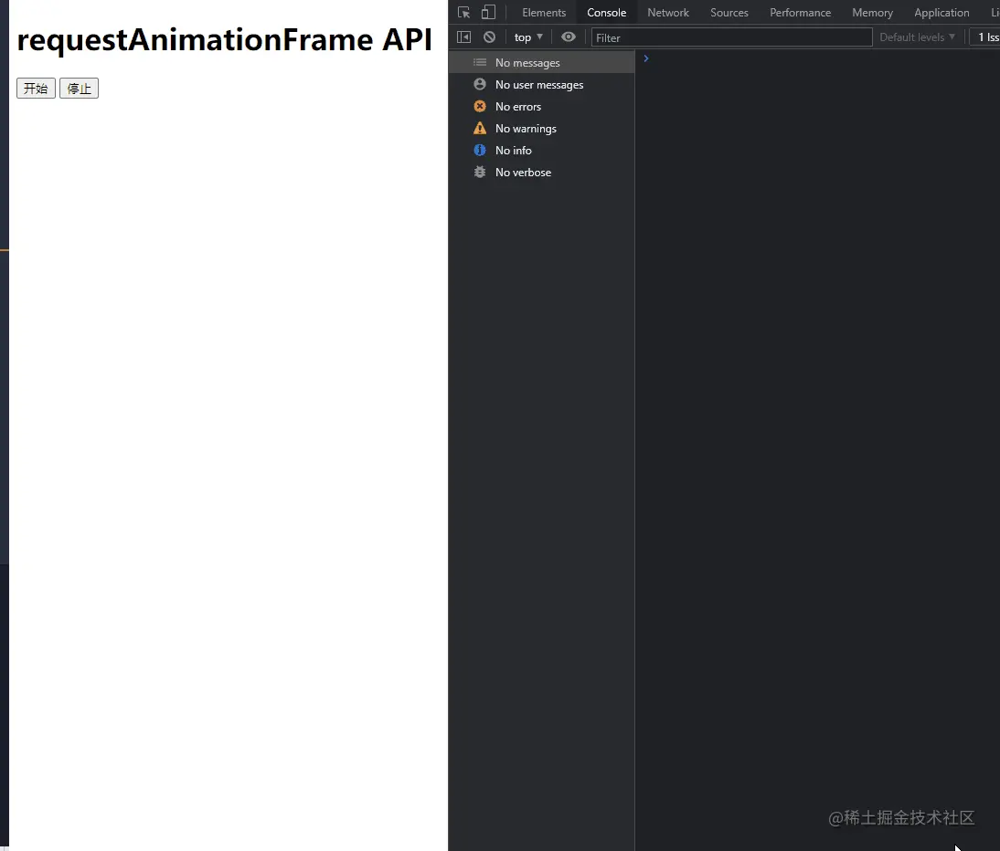

其实不用这个 `API` 也可以达到终止执行的目的，比如简单的 `if语句` 。

```js
(() => {
  function test(timestamp) {
    console.log(`🚀🚀hello ~ requestAnimationFrame ${timestamp}`);
    if (timestamp < 500) {
      requestAnimationFrame(test)
    }
  }
  requestAnimationFrame(test)
})()
复制代码
```

可以看到，当 `timestamp` 超过500的时候就停止了。当然还有更多可能性，这就要靠小伙伴们开动聪明的脑袋瓜子了。

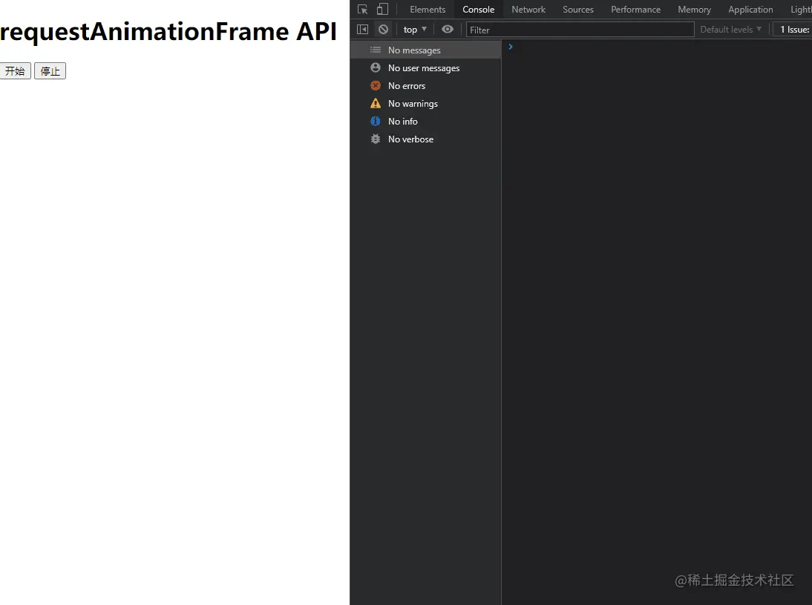

## 小技巧

我们这样就可以把每两次执行的时间间隔传递给外部使用了。外部拿到以后就可以搞事情了，比如时间间隔累加到 **1000** 就执行什么什么操作~

```js
(() => {
  let startTime = Date.now();

  function handleTicker() {
    foo(Date.now() - startTime);
    startTime = Date.now();
    requestAnimationFrame(handleTicker);
  }

  requestAnimationFrame(handleTicker);

  let t = 0
  function foo(timeInterval) {
    t += timeInterval
    console.log('🚀🚀~ t:', t);
    if (t > 1000) {
      console.log('🚀🚀~ 搞事情');
      t = 0
    }
  }
})()
复制代码
```

可以看到，当 `t` 累加大于 `1000` 的时候，就搞了一次事情，然后重置 `t` ，以此类推。

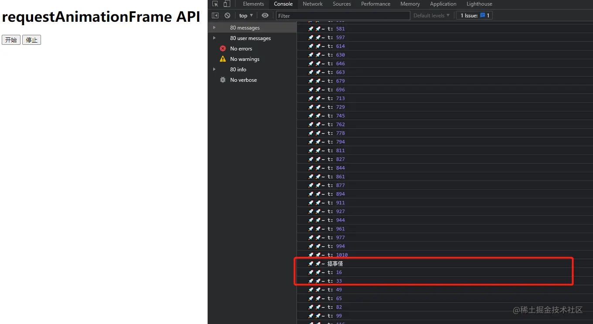

## 动画演示

标题都说是一个神器的动画 `API` 了，不假装贴个动画就会被说 **“标题党”** 了。所以我还是决定实现一个简单的 `demo` 吧。

```html
<style>
  #box {
    width: 0px;
    height: 50px;
    background-color: blue;
  }
</style>
<body>
  <h1>requestAnimationFrame API</h1>
  <button id='begin' class="begin">开始</button>
  <button id='end' class="end">停止</button>
  <div id='box'></div>
</body>
复制代码
(() => {
  const beginBtn = document.querySelector("#begin")
  const endBtn = document.querySelector("#end")
  const box = document.querySelector("#box")
  let myRef;

  beginBtn.addEventListener("click", () => {
    myRef = requestAnimationFrame(test)
  })

  endBtn.addEventListener("click", () => {
    cancelAnimationFrame(myRef)
  })

  function test() {
    box.style.width = `${myRef}%`
    myRef = requestAnimationFrame(test)
  }
})()
复制代码
```

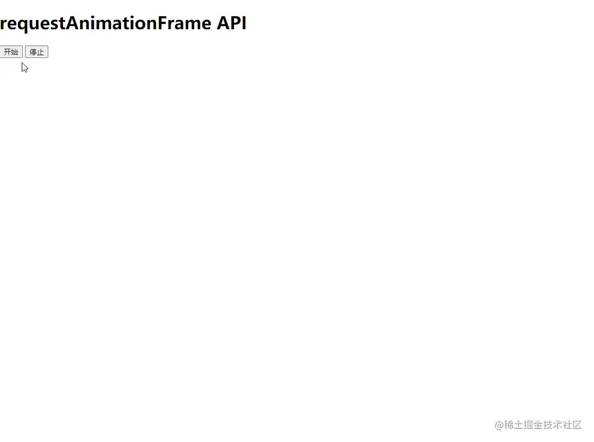

## 兼容性

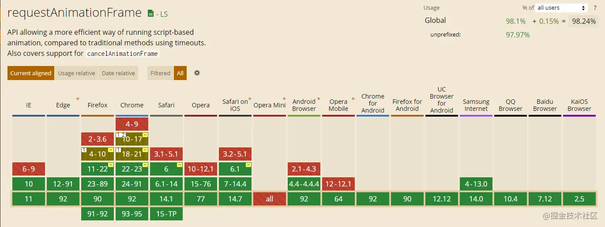

兼容性如图所示，这里放出链接，小伙伴们需要查阅详情的话请点击自行查找。

[Can I Use](https://link.juejin.cn?target=https%3A%2F%2Fcaniuse.com%2F)

这篇文章讲了一些底层原理，并且给出了 `requestAnimationFrame` 的全平台兼容处理，本人并没有替大家探雷，有需求的自行冲浪 ~

[深入理解requestAnimationFrame](https://link.juejin.cn?target=https%3A%2F%2Fwww.cnblogs.com%2Flibin-1%2Fp%2F6099746.html)

# 比试比试

## setTimeout && setInterval

`setTimeout` 和 `setInterval` 的问题是，它们不够精确。它们的内在运行机制决定了 **时间间隔参数** 实际上只是指定了把动画代码添加到 **浏览器UI线程队列** 中以等待执行的时间。如果队列前面已经加入了其它任务，那动画代码就要等前面的 **任务完成后** 再执行，并且如果时间间隔过短（小于16.7ms）会造成丢帧，所以就会导致动画可能不会按照预设的去执行，降低用户体验。

`requestAnimationFrame` 采用 **浏览器时间间隔** ，保持最佳绘制效率，不会因为间隔时间过短，造成过度绘制，消耗性能；也不会因为间隔时间太长，使用动画卡顿不流畅，让各种网页动画效果能够有一个 **统一** 的刷新机制，从而节省系统资源，提高系统性能，改善视觉效果。

## CSS3动画

`CSS3` 的`transition` 和 `animation` 搭配使用可以说是非常强大了，但是也有的触手伸不到的地方，比如说 `scrollTop`，另外 `CSS3` 动画支持的贝塞尔曲线也是有限的。

那么，`CSS3` 做不到的就可以用到 `requestAnimationFrame` 来解决了。


##### 使用css3动画代替js的动画有什么好处？

> css和js动画各有优劣
>
> 1. 不占用JS主线程
> 2. 可以利用硬件加速
> 3. 浏览器可对动画做优化（元素不可见时不动画，减少对FPS的影响）