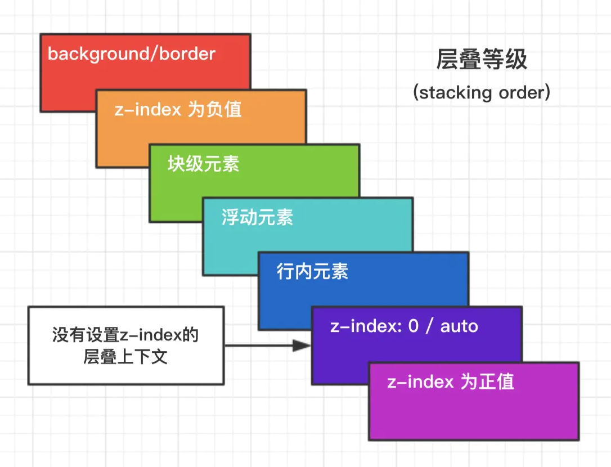
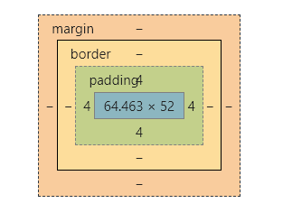

#### 8 css 优先级是怎么计算的

```
!important > 行内 > id选择器 > class选择器 > 伪类选择器  > 标签选择器> 通配符*
```


#### 12 position 有哪些值，作用分别是什么

```
static：元素处于文档流，忽略left，top，z-index这些属性
relative: 相对原本的位置
absolute：相对relative或者absolute元素，没有的话就相对body元素
fixed：相对body定位
sticky：吸顶。如果你设置了 top: 50px，那么在 sticky 元素到达距离相对定位的元素顶部 50px 的位置时固定，不再向上移动（相当于此时 fixed 定位）。
inherit：继承父级的position
```


#### 13 垂直水平居中实现方式

```
水平：
行内：text-align  块级：margin：0 auto 

竖直：
display：table-cell
line-height = height
flex
absolute+transform
grid

```

#### 在CSS中，有继承性的属性主要有以下几种：

1、**字体系列属性**

- font-family：字体系列
- font-weight：字体的粗细
- font-size：字体的大小
- font-style：字体的风格

2、**文本系列属性**

- text-indent：文本缩进
- text-align：文本水平对齐
- line-height：行高
- word-spacing：单词之间的间距
- letter-spacing：中文或者字母之间的间距
- text-transform：控制文本大小写（就是uppercase、lowercase、capitalize这三个）
- color：文本颜色

3、**元素可见性**

- visibility：控制元素显示隐藏

4、**列表布局属性**

- list-style：列表风格，包括list-style-type、list-style-image等

5、**光标属性**

- cursor：光标显示为何种形态


重绘和回流

## 居中对齐

### 水平居中

flex或者absolute+translate

text-align（行内元素）

margin：0 auto（块级元素）

### 竖直居中

flex或者absolute+translate

display：table-cell

line-height=height

### 水平垂直居中

flex/absolute+translate

其实还有grid，只不过性能和兼容的问题，不太推荐

# 层叠上下文

## 如何产生层叠上下文

其实，层叠上下文也基本上是有一些特定的CSS属性创建的，一般有3种方法：

1. `HTML`中的根元素`<html></html>`本身就具有层叠上下文，称为“根层叠上下文”。
2. 普通元素设置`position`属性为**非**`static`值并设置`z-index`属性为具体数值，产生层叠上下文。
3. CSS3中的新属性也可以产生层叠上下文：
   - `flex`
   - `transform`
   - `opacity`
   - `filter`
   - `will-change`
   - `-webkit-overflow-scrolling

## 层叠等级（层叠上下文在z轴上的排序）



# 布局

## 不定宽高元素，垂直水平居中

参考文章：[「干货」CSS 不定宽高的垂直水平居中（最全 9 种）](https://juejin.im/post/6844903933350150158)


## 三栏布局

[详解 CSS 七种三栏布局技巧](https://juejin.im/entry/6844903462283509768#comment)

[负margin技术原理与运用 | CSS](https://juejin.im/post/6847902222106230797)

[浅谈margin负值](https://zhuanlan.zhihu.com/p/25892372)

flex


#### 1.Flex 布局

布局的传统解决方案，基于盒状模型，依赖 display 属性 + position 属性 + float 属性。它对于那些特殊布局非常不方便，比如，垂直居中就不容易实现。

Flex 是 Flexible Box 的缩写，意为"弹性布局",用来为盒状模型提供最大的灵活性。指定容器 display: flex 即可。 简单的分为容器属性和元素属性。

容器的属性：

- flex-direction：决定主轴的方向（即子 item 的排列方法）flex-direction: row | row-reverse | column | column-reverse;

- flex-wrap：决定换行规则 flex-wrap: nowrap | wrap | wrap-reverse;

- flex-flow： .box { flex-flow: || ; }

- justify-content：对其方式，水平主轴对齐方式

- align-content：对其方式，副轴对齐方式

- align-items：对齐方式，竖直轴线方向

  

项目的属性（元素的属性）：

- order 属性：定义项目的排列顺序，顺序越小，排列越靠前，默认为 0
- flex-grow 属性：定义项目的放大比例，即使存在空间，也不会放大
- flex-shrink 属性：定义了项目的缩小比例，当空间不足的情况下会等比例的缩小，如果 定义个 item 的 flow-shrink 为 0，则为不缩小
- flex-basis 属性：定义了在分配多余的空间，项目占据的空间。
- flex：是 flex-grow 和 flex-shrink、flex-basis 的简写，默认值为 0 1 auto。flex:1就是flex: 1 1 0%;
- align-self：允许单个项目与其他项目不一样的对齐方式，可以覆盖
- align-items，默认属 性为 auto，表示继承父元素的 align-items 比如说，用 flex 实现圣杯布局

#### 2.Rem 布局

首先 Rem 相对于根(html)的 font-size 大小来计算。简单的说它就是一个相对单例 如:font-size:10px;,那么（1rem = 10px）了解计算原理后首先解决怎么在不同设备上设置 html 的 font-size 大小。其实 rem 布局的本质是等比缩放，一般是基于宽度。

**优点**：可以快速适用移动端布局，字体，图片高度

**缺点**：

①目前 ie 不支持，对 pc 页面来讲使用次数不多；
 ②数据量大：所有的图片，盒子都需要我们去给一个准确的值；才能保证不同机型的适配；
 ③在响应式布局中，必须通过 js 来动态控制根元素 font-size 的大小。也就是说 css 样式和 js 代码有一定的耦合性。且必须将改变 font-size 的代码放在 css 样式之前。

#### 3.百分比布局

通过百分比单位 " % " 来实现响应式的效果。通过百分比单位可以使得浏览器中的组件的宽和高随着浏览器的变化而变化，从而实现响应式的效果。 直观的理解，我们可能会认为子元素的百分比完全相对于直接父元素，height 百分比相 对于 height，width 百分比相对于 width。 padding、border、margin 等等不论是垂直方向还是水平方向，都相对于直接父元素的 width。 除了 border-radius 外，还有比如 translate、background-size 等都是相对于自身的。

**缺点**：

（1）计算困难
 （2）各个属性中如果使用百分比，相对父元素的属性并不是唯一的。造成我们使用百分比单位容易使布局问题变得复杂。

#### 4.浮动布局

浮动布局:当元素浮动以后可以向左或向右移动，直到它的外边缘碰到包含它的框或者另外一个浮动元素的边框为止。元素浮动以后会脱离正常的文档流，所以文档的普通流中的框就变的好像浮动元素不存在一样。

**优点**

这样做的优点就是在图文混排的时候可以很好的使文字环绕在图片周围。另外当元素浮动了起来之后，它有着块级元素的一些性质例如可以设置宽高等，但它与inline-block还是有一些区别的，第一个就是关于横向排序的时候，float可以设置方向而inline-block方向是固定的；还有一个就是inline-block在使用时有时会有空白间隙的问题

**缺点**

最明显的缺点就是浮动元素一旦脱离了文档流，就无法撑起父元素，`会造成父级元素高度塌陷`


# 选择器优先级

！important>内联样式>外部样式

外部样式里面：#id>.class>标签选择器>伪类>*通配符>继承>默认

# 清除浮动

去除浮动影响，防止高度塌陷：

1.通过尾部元素：:after/<br />使用clear：both

2.通过BFC

3.直接规定父元素的高度


# position

## [语法](https://developer.mozilla.org/zh-CN/docs/Web/CSS/position#语法)

`position` 属性被指定为从下面的值列表中选择的单个关键字。

### [取值](https://developer.mozilla.org/zh-CN/docs/Web/CSS/position#取值)

- `static`

  该关键字指定元素使用正常的布局行为，即元素在文档常规流中当前的布局位置。此时 `top`, `right`, `bottom`, `left` 和 `z-index `属性无效。

- `relative`

  该关键字下，元素先放置在未添加定位时的位置，再在不改变页面布局的前提下调整元素位置（因此会在此元素未添加定位时所在位置留下空白）。position:relative 对 table-*-group, table-row, table-column, table-cell, table-caption 元素无效。

- `absolute`

  元素会被移出正常文档流，并不为元素预留空间，通过指定元素相对于最近的非 static 定位祖先元素的偏移，来确定元素位置。绝对定位的元素可以设置外边距（margins），且不会与其他边距合并。

- `fixed`

  元素会被移出正常文档流，并不为元素预留空间，而是通过指定元素相对于屏幕视口（viewport）的位置来指定元素位置。元素的位置在屏幕滚动时不会改变。打印时，元素会出现在的每页的固定位置。`fixed` 属性会创建新的层叠上下文。当元素祖先的 `transform`, `perspective` 或 `filter` 属性非 `none` 时，容器由视口改为该祖先。

- `sticky`

  元素根据正常文档流进行定位，然后相对它的*最近滚动祖先（nearest scrolling ancestor）*和 [containing block](https://developer.mozilla.org/en-US/docs/Web/CSS/Containing_block) (最近块级祖先 nearest block-level ancestor)，包括table-related元素，基于`top`, `right`, `bottom`, 和 `left`的值进行偏移。偏移值不会影响任何其他元素的位置。


## [确定包含块](https://developer.mozilla.org/zh-CN/docs/Web/CSS/Containing_block#确定包含块)

确定一个元素的包含块的过程完全依赖于这个元素的 [`position`](https://developer.mozilla.org/zh-CN/docs/Web/CSS/position) 属性：

1. 如果 position 属性为 `**static**` 、 `**relative**` **或 `sticky`**，包含块可能由它的最近的祖先**块元素**（比如说inline-block, block 或 list-item元素）的内容区的边缘组成，也可能会建立格式化上下文(比如说 a table container, flex container, grid container, 或者是 the block container 自身)。
2. 如果 position 属性为 `**absolute**` ，包含块就是由它的最近的 position 的值不是 `static` （也就是值为`fixed`, `absolute`, `relative` 或 `sticky`）的祖先元素的内边距区的边缘组成。
3. 如果 position 属性是 **`fixed`**，在连续媒体的情况下(continuous media)包含块是 [viewport](https://developer.mozilla.org/zh-CN/docs/Glossary/Viewport) ,在分页媒体(paged media)下的情况下包含块是分页区域(page area)。
4. 如果 position 属性是absolute或fixed，包含块也可能是由满足以下条件的最近父级元素的内边距区的边缘组成的：
   1.  [`transform`](https://developer.mozilla.org/zh-CN/docs/Web/CSS/transform) 或 [`perspective`](https://developer.mozilla.org/zh-CN/docs/Web/CSS/perspective) 的值不是 `none`
   2.  [`will-change`](https://developer.mozilla.org/zh-CN/docs/Web/CSS/will-change) 的值是 `transform` 或 `perspective`
   3.  [`filter`](https://developer.mozilla.org/zh-CN/docs/Web/CSS/filter) 的值不是 `none` 或 `will-change` 的值是 `filter`(只在 Firefox 下生效).
   4.  [`contain`](https://developer.mozilla.org/zh-CN/docs/Web/CSS/contain) 的值是 `paint` (例如: `contain: paint;`)


# 盒模型


- `content-box` (W3C 标准盒模型)：盒子大小就是content大小
- `border-box` (IE 盒模型)：盒子大小还包括padding和border

可通过`box-sizing`进行设置。

不写box-sizing的话，写了DOCTYPE类型的，使用content-box；不写就使用border-box



# picture（浏览器分辨率自适应优化备用）

```html
<picture>
  // type 属性允许你为 <source> 元素的 srcset 属性指向的资源指定一个 MIME 类型。如果用户代理不支持指定的类型，那么这个 <source> 元素会被跳过。
  // srcset设置图片地址
  <source srcset="mdn-logo.svg" type="image/svg+xml" media="(min-width:800px)"> 
  
</picture>
```

## 响应式布局

## 介绍视窗(Viewport)单位

视窗(Viewport)是你的浏览器实际显示内容的区域——换句话说是你的**不包括工具栏和按钮的网页浏览器**。

比方说我们有一个`1000px`（宽）和`800px`（高）的视窗(Viewport)

- **`vw`**——代表视窗(Viewport)的宽度为`1%`，在我们的例子里`50vw = 500px`。
- **`vh`**——窗口高度的百分比 `50vh = 400px`。
- **`vmin`**——vmin的值是当前`vw`和`vh`中较小的值。在我们的例子里因为是横向模式，所以`50vim = 400px`。
- **`vmax`**——大尺寸的百分比。`50vmax = 500px`。


