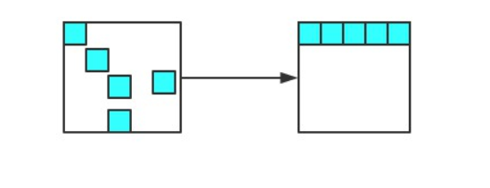

# 垃圾回收

参考：

[聊聊V8引擎的垃圾回收](https://juejin.cn/post/6844903591510016007)

## 为什么要有垃圾回收

>在C语言和C++语言中，我们如果想要开辟一块堆内存的话，需要先计算需要内存的大小，然后自己通过**malloc**函数去手动分配，在用完之后，还要时刻记得用**free**函数去清理释放，否则这块内存就会被永久占用，造成内存泄露。

V8引擎替我们封装好了，根据定义对象的大小去自动分配内存，不用像c语言中手动分配内存，清理释放。这样可以把更多的精力放到复杂应用上。


## 新生代，老生代

v8 引擎将内存分为了新生代和老生代。

新创建的对象或者只经历过一次垃圾回收的对象被称为新生代。经历过多次垃圾回收的对象被称为老生代。

### 新生代

新生代被分为 From 和 To 两个空间。处于使用状态的半空间称为**From空间**，处于闲置状态的半空间称为**To空间**。当 From 空间满了的时候会执行 Scavenge 算法进行垃圾回收。当我们执行垃圾回收算法的时候应用逻辑将会停止，等垃圾回收结束后再继续执行。

#### Scavenge 算法（清除算法）

Scavenge 算法分为三步：

1. 首先检查 From 空间的存活对象，如果对象存活则判断对象是否满足晋升到老生代的条件，如果满足条件则晋升到老生代。如果不满足条件则移动 To 空间。

2. 如果对象不存活，则释放对象的空间。

3. 最后将 From 空间和 To 空间角色进行交换。

   

   ```
   个人总结：
   1、From空间中，把经历过不止一次清除算法的存活变量移动到老生代，只经历过1次或者没有经历过清除算法的移动到To空间（如果此时To空间使用超过25%，则移过来变量直接晋升为老生代）。
   2、释放From空间，然后把From空间和To空间进行对换
   ```

   

### 老生代

#### 老生代的条件

新生代对象晋升到老生代有两个条件：

- 第一个是判断是对象否已经经过一次 Scavenge 回收。若经历过，则将对象从 From 空间复制到老生代中；若没有经历，则复制到 To 空间。

- 第二个是 To 空间的内存使用占比是否超过限制。当对象从 From 空间复制到 To 空间时，若 To 空间使用超过 25%，则对象直接晋升到老生代中。设置 25% 的原因主要是因为算法结束后，两个空间结束后会交换位置，如果 To 空间的内存太小，会影响后续的内存分配。


#### 老生代的两个算法

老生代采用了标记清除法和标记压缩法。

##### 标记清除

标记清除法首先标记出所有的存活对象，标记完清掉所有没标记的。

由于标记清除后会造成很多的内存碎片，不便于后面的内存分配。所以为了解决内存碎片的问题引入了标记压缩法。

##### 标记压缩

整理内存碎片。V8 的解决方式非常简单粗暴，在清除阶段结束后，把存活的对象全部往一端靠拢。



由于是移动对象，它的执行速度不可能很快，事实上也是整个过程中最耗时间的部分。


参考：

[V8垃圾回收GC](https://libin1991.github.io/2019/11/19/V8%E5%9E%83%E5%9C%BE%E5%9B%9E%E6%94%B6GC/)


## 引用计数算法为什么被淘汰

**策略**

引用计数（Reference Counting），这其实是早先的一种垃圾回收算法，它把 `对象是否不再需要` 简化定义为 `对象有没有其他对象引用到它`，如果没有引用指向该对象（零引用），对象将被垃圾回收机制回收，目前很少使用这种算法了，因为它的问题很多，不过我们还是需要了解一下

它的策略是跟踪记录每个变量值被使用的次数

- 当声明了一个变量并且将一个引用类型赋值给该变量的时候这个值的引用次数就为 1
- 如果同一个值又被赋给另一个变量，那么引用数加 1
- 如果该变量的值被其他的值覆盖了，则引用次数减 1
- 当这个值的引用次数变为 0 的时候，说明没有变量在使用，这个值没法被访问了，回收空间，垃圾回收器会在运行的时候清理掉引用次数为 0 的值占用的内存

如下例

```js
let a = new Object() 	// 此对象的引用计数为 1（a引用）
let b = a 		// 此对象的引用计数是 2（a,b引用）
a = null  		// 此对象的引用计数为 1（b引用）
b = null 	 	// 此对象的引用计数为 0（无引用）
...			// GC 回收此对象
复制代码
```

这种方式是不是很简单？确实很简单，不过在引用计数这种算法出现没多久，就遇到了一个很严重的问题——循环引用，即对象 A 有一个指针指向对象 B，而对象 B 也引用了对象 A ，如下面这个例子

```js
function test(){
  let A = new Object()
  let B = new Object()
  
  A.b = B
  B.a = A
}
复制代码
```

如上所示，对象 A 和 B 通过各自的属性相互引用着，按照上文的引用计数策略，它们的引用数量都是 2，但是，在函数 `test` 执行完成之后，对象 A 和 B 是要被清理的，但使用引用计数则不会被清理，因为它们的引用数量不会变成 0，假如此函数在程序中被多次调用，那么就会造成大量的内存不会被释放

我们再用标记清除的角度看一下，当函数结束后，两个对象都不在作用域中，A 和 B 都会被当作非活动对象来清除掉，相比之下，引用计数则不会释放，也就会造成大量无用内存占用，这也是后来放弃引用计数，使用标记清除的原因之一

> 在 IE8 以及更早版本的 IE 中，`BOM` 和 `DOM` 对象并非是原生 `JavaScript` 对象，它是由 `C++` 实现的 `组件对象模型对象（COM，Component Object Model）`，而 `COM` 对象使用 引用计数算法来实现垃圾回收，所以即使浏览器使用的是标记清除算法，只要涉及到 ` COM` 对象的循环引用，就还是无法被回收掉，就比如两个互相引用的 `DOM` 对象等等，而想要解决循环引用，需要将引用地址置为 `null` 来切断变量与之前引用值的关系，如下
>
> ```js
> // COM对象
> let ele = document.getElementById("xxx")
> let obj = new Object()
> 
> // 造成循环引用
> obj.ele = ele
> ele.obj = obj
> 
> // 切断引用关系
> obj.ele = null
> ele.obj = null
> 复制代码
> ```
>
> 不过在 IE9 及以后的 `BOM` 与 `DOM` 对象都改成了 `JavaScript` 对象，也就避免了上面的问题
>
> 此处参考 JavaScript高级程序设计 第四版 4.3.2 小节

**优点**

引用计数算法的优点我们对比标记清除来看就会清晰很多，首先引用计数在引用值为 0 时，也就是在变成垃圾的那一刻就会被回收，所以它可以立即回收垃圾

而标记清除算法需要每隔一段时间进行一次，那在应用程序（JS脚本）运行过程中线程就必须要暂停去执行一段时间的 `GC`，另外，标记清除算法需要遍历堆里的活动以及非活动对象来清除，而引用计数则只需要在引用时计数就可以了

**缺点**

引用计数的缺点想必大家也都很明朗了，首先它需要一个计数器，而此计数器需要占很大的位置，因为我们也不知道被引用数量的上限，还有就是无法解决循环引用无法回收的问题，这也是最严重的


## 内存泄漏

### 什么叫内存泄漏？

系统进程不再使用的内存空间，没有被及时释放，叫作内存泄漏

### 哪些操作会造成内存泄漏

**还在使用不需要的变量，函数和dom**

1、**被遗忘的计时器或回调函数：** 设置了 setInterval 定时器，而忘记取消它，如果循环函数有对外部变量的引用的话，那么这个变量会被一直留在内存中，而无法被回收。

2、**闭包：** 不合理的使用闭包，从而导致某些变量一直被留在内存当中。

3、**意外的全局变量：** 由于使用未声明的变量，而意外的创建了一个全局变量，而使这个变量一直留在内存中无法被回收。

4、**脱离 DOM 的引用：** 获取一个 DOM 元素的引用，而后面这个元素被删除，由于一直保留了对这个元素的引用，所以它也无法被回收。


### 如何测出内存泄漏

[排查内存泄露](../性能优化/排查内存泄露.md)


