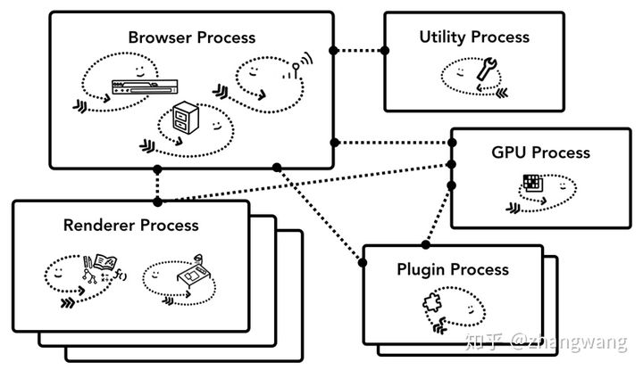
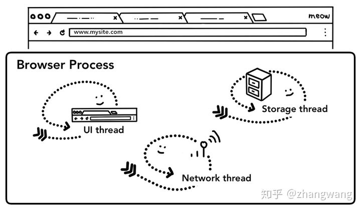
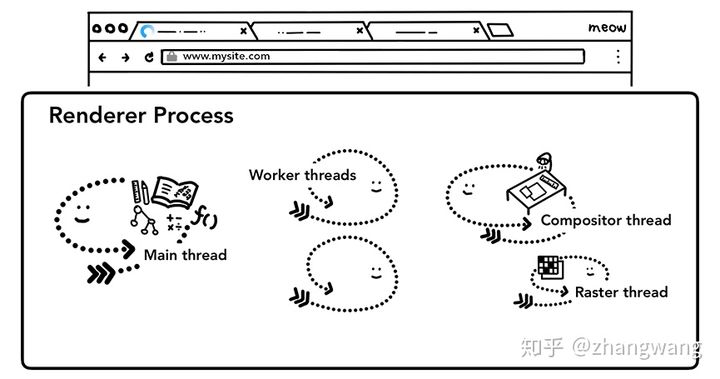
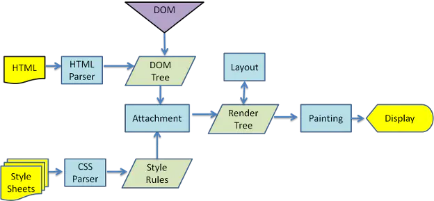
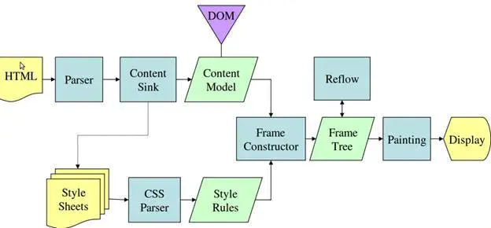

# 浏览器工作原理

## 进程和线程

浏览器也是如此，以 Chrome 为例，它由多个进程组成，每个进程都有自己核心的职责，它们相互配合完成浏览器的整体功能，每个进程中又包含多个线程，一个进程内的多个线程也会协同工作，配合完成所在进程的职责。

当我们启动一个应用，计算机会创建一个进程，操作系统会为进程分配一部分内存，应用的所有状态都会保存在这块内存中，应用也许还会创建多个线程来辅助工作，这些线程可以共享这部分内存中的数据。如果应用关闭，进程会被终结，操作系统会释放相关内存。

一个进程还可以要求操作系统生成另一个进程来执行不同的任务，系统会为新的进程分配独立的内存，两个进程之间可以使用 IPC （Inter Process Communication）进行通信。


## 浏览器的多进程架构


以 Chrome 为例进行说明 ：

Chrome 采用多进程架构，其顶层存在一个 Browser process 用以协调浏览器的其它进程。




具体说来，Chrome 的主要进程及其职责如下：

- Browser Process：

1. 负责包括地址栏，书签栏，前进后退按钮等部分的工作；
2. 负责处理浏览器的一些不可见的底层操作，比如网络请求和文件访问；

- Renderer Process：

1. 负责一个 tab 内关于网页呈现的所有事情

- Plugin Process：

1. 负责控制一个网页用到的所有插件，如 flash

- GPU Process

1. 负责处理 GPU 相关的任务


emsp;&emsp;最新的Chrome浏览器的进程有五种：

1. 浏览器主进程（只有一个）
   1. 负责包括地址栏，书签栏，前进后退按钮等部分的工作；
   2. 负责处理浏览器的一些不可见的底层操作，比如网络请求和文件访问；
2. 插件进程（一个页面可能会有多个插件，插件进程之间相互隔离，防止干扰）
3. GPU进程（只有一个GPU进程，处理GPU相关工作）
4. 渲染进程（可能有多个）：负责一个 tab 内关于网页呈现的所有事情
5. 网络进程（只有一个网络进程），负责网络资源的加载

### Chrome 多进程架构的优缺点

**优点**

1. 某一渲染进程出问题不会影响其他进程
2. 更为安全，在系统层面上限定了不同进程的权限

**缺点**

由于不同进程间的内存不共享，不同进程的内存常常需要包含相同的内容。

### 限制最大进程数

为了节省内存，Chrome 限制了最多的进程数，最大进程数量由设备的内存和 CPU 能力决定，当达到这一限制时，新打开的 Tab 会共用之前同一个站点的渲染进程。

### IFrame的渲染

同一个 Tab 下的跨站 iframe 使用单独的进程来渲染，这样会更为安全


## 导航过程发生了什么

浏览器 Tab 外的工作主要由 Browser Process 掌控，Browser Process 又对这些工作进一步划分，使用不同线程进行处理：

- UI thread ： 控制浏览器上的按钮及输入框；
- network thread: 处理网络请求；
- storage thread: 控制文件等的访问；

浏览器主进程中的不同线程


1、看是否有强缓存

2、DNS查找对应IP

3、根据IP进行三次握手，建立TCP连接

4、发送请求，读取响应报文

​	网络线程读取content-type判断响应报文的格式，如果是html，下一步把数据传给渲染进程；
​	如果是zip或者其他文件，会把相关数据传给下载管理器。


## 渲染进程如何工作？

渲染进程中主要包含以下线程：




1. 主线程 Main thread
2. 工作线程 Worker thread
3. 排版线程 Compositor thread
4. 光栅线程 Raster thread

### 渲染的流程

1、构建DOM树

2、构建DOM的过程中如果在 html 中存在 `` `<link>` 等标签，会把这些请求传递给 Browser process 中的 network thread 进行相关资源的下载。

加载图片，js，css等资源（从网络或者cache中获取）

**JS 的下载与执行**

当遇到 `<script>` 标签时，渲染进程会停止解析 HTML，而去加载

​		（停止解析 html 的原因在于 JS 可能会改变 DOM 的结构（使用诸如 `document.write()`等API）。但是如果在`<script>` 标签上添加了 `async` 或 `defer` 等属性，浏览器会异步的加载和执行JS代码，而不会阻塞渲染。	）


4、计算样式和获取每个元素的布局

5、绘制页面

6、


https://zhuanlan.zhihu.com/p/47407398

点这个进行整理！！贼拉好！！！！


## **浏览器工作原理**

[一篇好文地址](https://www.html5rocks.com/zh/tutorials/internals/howbrowserswork/)

## **目录**

- [浏览器主要结构](#main-components)

- [呈现引擎](#rendering-engine)

  

---

### <span id="main-components">**浏览器主要结构**</span>

&emsp;&emsp;浏览器主要组成部分如下：

- **用户界面**：包括地址栏、前进/后退按钮、书签菜单等。除了浏览器主窗口显示的您请求的页面外，其他显示的各个部分都属于用户界面；
- **浏览器引擎**：在用户界面和呈现引擎之间传送指令；
- **呈现引擎**：负责显示请求的内容。如果请求的内容是 HTML，它就负责解析 HTML 和 CSS 内容，并将解析后的内容显示在屏幕上；
- **网络**：用于网络调用，比如 HTTP 请求。其接口与平台无关，并为所有平台提供底层实现；
- **用户界面后端**：用于绘制基本的窗口小部件，比如组合框和窗口。其公开了与平台无关的通用接口，而在底层使用操作系统的用户界面方法；
- **JavaScript解释器**：用于解析和执行 JavaScript 代码；
- **数据存储**：这是持久层。浏览器需要在硬盘上保存各种数据，例如 Cookie。新的 HTML 规范 (HTML5) 定义了“网络数据库”，这是一个完整（但是轻便）的浏览器内数据库。


&emsp;&emsp;最新的Chrome浏览器的进程有五种：

- 一个浏览器主进程

&emsp;&emsp;界面显示、用户交互、子进程管理、存储功能

- 一个网络（NetWork）进程

&emsp;&emsp;网络资源的加载

- 一个GPU进程

&emsp;&emsp;绘制UI界面

- 多个渲染进程

&emsp;&emsp;将HTML、CSS和JavaScript转换为用户可以与之交互的网页；

&emsp;&emsp;渲染引擎Blink和JavaScript引擎V8都是运行在该进程中；

&emsp;&emsp;默认情况下，Chrome会为每个Tab标签创建一个渲染进程，出于安全考虑，渲染进程都是运行在沙箱模式下，不能获取系统权限对硬盘进行读写等；

```
注意：

1. 同一站点的Tab页共用一个渲染进程，新页面会复用父页面的渲染进程，这一策略就是**同源策略**，所以同一站点需要协议、域名、端口都相同；
2. 渲染进程还包含了很多子线程，有合成线程（Compositor）、合成图块栅格化线程（Compositor Tile Worker）、主线程。
```

- 多个插件进程：插件容易崩溃，因此做一个隔离，免得影响整个页面

---

### <span id="rendering-engine">**呈现引擎**</span>

<font color="#f70404">&emsp;&emsp;注：和大多数浏览器不同，Chrome浏览器的每个标签页都分别对应一个呈现引擎实例，每个标签页都是一个独立的进程</font>


Webkit内核的渲染主流程：



Geoko内核的渲染主流程：



对比来看主要在css的解析环节有区别