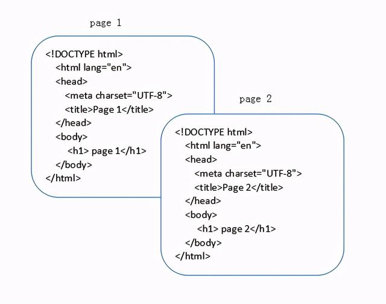
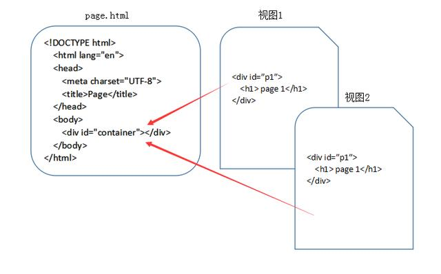

# 前端路由及其原理

看[这里](https://juejin.cn/post/6844903890278694919)

## 目录

- [前言](#former)

- [前端路由由来](#why)

- [hash模式](#hash)

- [history模式](#history)

- [如何抉择两种模式](#choose)

  

---

## 前言

&emsp;&emsp;现代前端项目多为单页Web应用`（SPA，single page web application）`，路由是其中的重要环节。

&emsp;&emsp;SPA 就是一个web项目只有一个 HTML 页面，一旦页面加载完成，SPA 不会因为用户的操作而进行页面的重新加载或跳转，取而代之的是利用 JavaScript 动态变换 HTML 的内容，从而模拟多个视图间的跳转。

&emsp;&emsp;下面两张图可以对比来看传统页面与 SPA 视图间的区别：



上图表明了，在传统的网站设计中，每个HTML文件都是一个完成的HTML页面，涵盖了完整的HTML结构。



&emsp;上图表明了，在 SPA 的应用设计中，一个应用只有一个HTML文件，在HTML文件中包含一个占位符(即图中的 container)，占位符对应的内容由每个视图来决定，对于 SPA 来说，页面的切换就是视图之间的切换。

---

## 前端路由的由来

&emsp;&emsp;SPA 的出现大大提高了web应用的交互体验，与用户的交互过程中不再需要重新刷新页面，获取数据也是通过 AJAX 异步获取，页面显示变得更加流畅。但由于 SPA 中用户的交互是通过 JavaScript 改变 HTML 内容来实现的，页面本身的 url 并没有变化，这导致了**两个问题**：

1. SPA 无法记住用户的操作记录，无论是刷新、前进还是后退，都无法展示用户真实期望的内容
2. SPA 中虽然由于业务的不同会有多种页面展示形式，但**只有一个 url，对 SEO 不友好，不方便搜索引擎进行收录**

&emsp;&emsp;前端路由就是为了解决以上问题而出现的。简单的说，就是在保证只有一个 HTML 页面，且与用户交互时不刷新和跳转页面的同时，为 SPA 中的每个视图展示形式匹配一个特殊的 url。在刷新、前进、后退和 SEO 时均通过这个特殊的 url 来实现。

&emsp;&emsp;为了实现这一目的，需要做到以下两点：

1. 改变 url 且不让浏览器向服务器发送请求
2. 可以监听到 url 的变化

&emsp;&emsp;hash 模式和 history 模式实现了上面的功能。

---

## **hash 模式**

&emsp;&emsp;hash 指的就是 url 后的 # 号以及后面的字符，例如 www.baidu.com/#hash ，其中 #hash 就是我们期望的hash值。

&emsp;&emsp;由于 hash 值得变化不会导致浏览器向服务器发送请求，而且 hash 的改变会触发 hashchange 事件，浏览器的前进后退也能对其进行控制，所以在 H5 的history模式出现之前，基本都是使用 hash 模式来实现前端路由。

**使用到的 api**

```js
window.location.hash = 'hash字符串';    //  用于设置 hash 值
let hash = window.location.hash;   //  获取当前 hash 值

// 监听 hash 变化，点击浏览器的前进后退会触发
window.addEventListener('hashchange', function(event) {
    let newURL = event.newURL;  //  hash 改变后的新 url
    let oldURL = event.oldURL;  //  hash 改变前的旧 url
}, false);
```


---

## **history 模式**

&emsp;&emsp;在 HTML5 之前，浏览器已经有了 history 对象，但在早期的 history 中只能用于多页面的跳转。

**在 HTML5 规范中，新增了以下几个 API：**

```js
history.pushState();    //  添加新的状态到历史状态栈
history.replaceState(); //  用新的状态代替当前状态
history.state   //  返回当前状态对象
```

history.pushState 和 history.replaceState 均接收三个参数（state，title，url），说明如下：

1. state：合法的 JavaScript 对象，可以用在 popstate 事件中
2. title：现在大多数浏览器忽略这个参数，可以直接用null代替
3. url：任意有效的 URL，用于更新浏览器的地址栏

history.pushState 和 history.replaceState 的区别在于：

- history.pushState 在保留现有历史记录的同时，将 url 加入到历史记录中
- history.replaceState 会将历史记录中的当前页面历史替换为 url

&emsp;&emsp;由于 history.pushState() 和 history.replaceState() 可以改变 url 同时不会刷新页面，所以在 HTML5 中的history 具备了实现前端路由的能力。


---

## 使用js如何改变url，并且页面不刷新？

> 改变URL的目的是让js拿到不同的参数，进行不同的页面渲染，其实就是vue-router的原理
>
> 最简单的就是改变hash，改变hash是并不会刷新页面的，也会改变URL，也能监听hashchange事件进行页面的渲染
>
> 还有一种就是使用history.pushState()方法，该方法也可以改变url然后不刷新页面，但是该方法并不能够触发popstate事件，不过pushState使我们手动触发的，还能不知道url改变了么，其实这时候并不需要监听popstate我们就能够知道url改变拿到参数并渲染页面


## **如何抉择两种模式**

hash 模式相比于 history 模式的有点：

- 兼容性更好，可以兼容到 IE8
- 无需服务端配合处理非单页面的 url 地址

hash 模式相比于 history 模式的缺点：

- 看起来更丑
- 会导致锚点功能失效
- 相同 hash 值不会触发动作将记录加入到历史栈中，而 pushState 则可以

&emsp;&emsp;综上所述，当不需要兼容老版本 IE 浏览器，并且可以控制服务端覆盖所有情况的候选资源时，可以使用 history 模式，反之只能用丑陋的 hash 模式。

