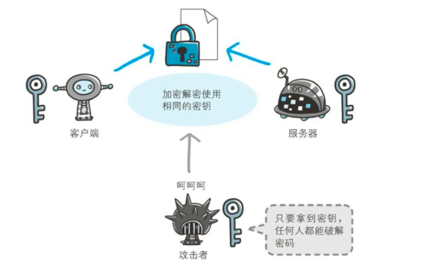
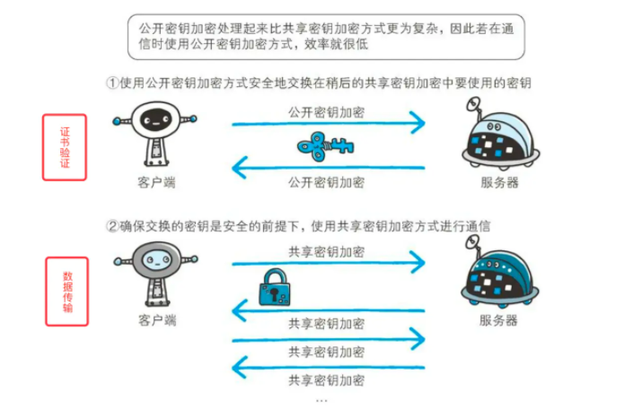
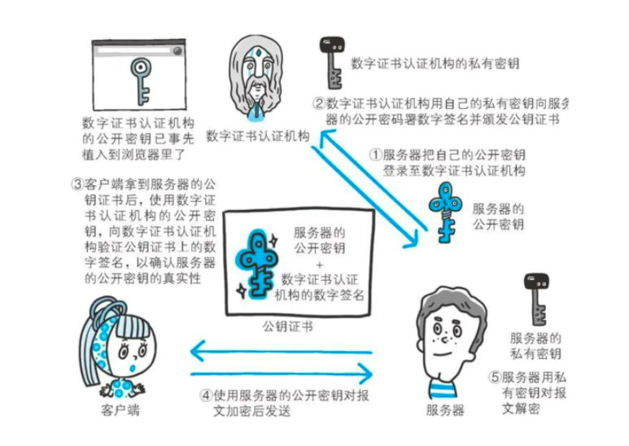

# HTTPS加密传输过程

`HTTPS`全称`Hyper Text Transfer Protocol over SecureSocket Layer`，是以安全为目标的`HTTP`通道，在`HTTP`的基础上通过传输加密和身份认证保证了传输过程的安全性。`HTTPS`在`HTTP`的基础下加入`SSL`层，`HTTPS`的安全基础是`SSL`，因此加密的详细内容就需要`SSL`。

## 知识储备

### HTTP

`HTTP`是应用层协议，默认运行在`80`端口，是一种不安全的传输协议，经其传输的数据都是未加密的明文数据，可以被中间人攻击，获取到你的网络传输数据，这也就是尽量不要使用公共场所`WIFI`的原因。

### HTTPS

`HTTPS`是应用层协议，默认运行在`443`端口，是一种安全的传输协议，通过在`HTTP`层与运输层的`TCP`直接加入一个加密/身份验证层来保证安全传输。

### SSL

`SSL`安全套接层`Secure Sockets Layer`，位于`TCP/IP`协议与各种应用层协议之间，为数据通讯提供安全支持。`SSL`协议可分为两层：
`SSL`记录协议`SSL Record Protocol`：它建立在可靠的传输协议如`TCP`之上，为高层协议提供数据封装、压缩、加密等基本功能的支持。
`SSL`握手协议`SSL Handshake Protocol`：它建立在`SSL`记录协议之上，用于在实际的数据传输开始前，通讯双方进行身份认证、协商加密算法、交换加密密钥等。

### TLS

`TLS`传输层安全性协议`Transport Layer Security`用于在两个通信应用程序之间提供保密性和数据完整性，其由`TLS`记录协议和`TLS`握手协议组成。`TLS1.0`即为`SSL3.0`的标准化版本，`SSL`最初由网景`Netscape`提出研发，在`SSL3.0`时由国际互联网工程任务组`IETF`进行了标准化并添加了少量机制，并更名为`TLS1.0`。

### 对称加密

简单来说对称加密的加密密钥和解密密钥是相同的，对称加密的效率要比非对称加密高。

### 非对称加密

简单来说非对称加密的加密密钥与解密密钥是不同的，需要一把公钥与一把私钥，私钥不能被其他任何人知道，公钥则可以随意公开。公钥加密，私钥解密；私钥数字签名，公钥验证。

### CA

由于公钥是放在服务器的，在建立连接的过程中将公钥传输到用户，但是如何避免中间人攻击，即在传输公钥的过程中避免劫持，于是引入第三方认证权威机构`CA`，大多数操作系统的`CA`证书是默认安装的，`CA`也拥有一个公钥和私钥。任何人都可以得到`CA`的证书，其包含公钥，用以验证它所签发的证书。`CA`为服务申请者颁发证书，在`CA`判明申请者的身份后，便为他分配一个公钥，并且`CA`将该公钥与申请者的身份信息绑在一起，并为之签字后，便形成证书发给申请者。如果一个用户想鉴别一个证书的真伪，他就用`CA`的公钥对那个证书上的签字进行验证，一旦验证通过，该证书就被认为是有效的。证书实际是由证书签证机关`CA`签发的对用户的公钥的认证。

## 传输过程

1. 首先`TCP`三次握手建立链接，这是数据传输基础，在此之上开始`SSL`
2. 客户端首先发送`Client Hello`开始`SSL`通信，报文中包含客户端支持的`SSL`版本、随机值`Random1`、加密算法以及密钥长度等。
3. 服务器发送`Server Hello`，和客户端一样，在报文中包含`SSL`版本、随机值`Random2`以及加密组件，此后服务端将证书也发送到客户端。
4. 此时客户端需要对服务端发送的证书进行验证，通过操作系统内置的`CA`证书，将服务器发送的证书的数字签名进行解密，并将证书的公钥进行相同算法的`HASH`与解密的数字签名解密的内容进行对比，验证证书是否合法有效，是否被劫持更换。
5. 客户端验证证书合法，然后生成一个随机值`Random3`，用公钥对`Random3`进行加密，生成`Pre-Master Key`，客户端以`Client Key Exchange`报文将`Pre-Master Key`发送到服务端，此后发送`Change Cipher Spec`报文表示此后数据传输进行加密传输。
6. 服务端将`Pre-Master Key`用自己的私钥解密为`Random3`,服务端发送`Change Cipher Spec`报文表示此后数据传输进行加密传输。
7. 此时客户端与服务端都拥有三个随机字符串，且`Random3`是密文传输的，是安全状态的，此时则可以使用这三个字符串进行对称加密传输。由于非对称加密慢，不能每次传输数据都进行非对称加密，所以使用非对称加密将密钥协商好然后使用对称加密进行数据传输。
8. 此时便正常进行`HTTP`数据传输，但是由于`SSL`加密的作用，此时的`HTTP`传输便是安全的，此为`HTTPS`的传输过程，其中`2`、`3`、`5`、`6`也被称为`SSL`四次握手。

## 每日一题

```
https://github.com/WindrunnerMax/EveryDay
```


## https解决的问题

https很好的解决了http的三个缺点（被监听、被篡改、被伪装），https不是一种新的协议，它是http+SSL(TLS)的结合体，SSL是一种独立协议，所以其它协议比如smtp等也可以跟ssl结合。https改变了通信方式，它由以前的http—–>tcp，改为http——>SSL—–>tcp；https采用了共享密钥加密+公开密钥加密的方式

- 防监听 
  - 数据是加密的，所以监听得到的数据是密文，hacker看不懂。
- 防伪装 
  - 伪装分为客户端伪装和服务器伪装，通信双方携带证书，证书相当于身份证，有证书就认为合法，没有证书就认为非法，证书由第三方颁布，很难伪造
- 防篡改 
  - https对数据做了摘要，篡改数据会被感知到。hacker即使从中改了数据也白搭。


# https

### HTTPS


#### 相比于HTTP有什么区别？

- HTTP 明文传输，数据都是未加密的，安全性较差，HTTPS（SSL+HTTP） 数据传输过程是加密的，安全性较好。

- 使用 HTTPS 协议需要到 CA（Certificate Authority，数字证书认证机构） 申请证书，一般免费证书较少，因而需要一定费用。证书颁发机构如：Symantec、Comodo、GoDaddy 和 GlobalSign 等。

- HTTP 页面响应速度比 HTTPS 快，主要是因为 HTTP 使用 TCP 三次握手建立连接，客户端和服务器需要交换 3 个包，而 HTTPS除了 TCP 的三个包，还要加上 ssl 握手需要的 9 个包，所以一共是 12 个包。

- http 和 https 使用的是完全不同的连接方式，用的端口也不一样，前者是 80，后者是 443。

- HTTPS 其实就是建构在 SSL/TLS 之上的 HTTP 协议，所以，要比较 HTTPS 比 HTTP 要更耗费服务器资源。

  参考：[HTTP 与 HTTPS 的区别](https://www.runoob.com/w3cnote/http-vs-https.html)

  

#### 相比于HTTP有什么优势？优势如何实现的？

https更安全。因为HTTPS = HTTP + 加密 + 证书 + 完整性保护。而相关安全操作是通过 SSL 协议来进行实现的。

[[秃破前端面试] —— HTTP && HTTPS](https://juejin.cn/post/6844904029416341512#heading-6)

混合加密：保证效率和安全

数字签证


##### 混合加密机制

混合加密机制。也就是对称加密与非对称加密混用来实现加密机制。

###### 数据传输阶段 —— 对称密钥加密

对称密钥加密又称为共享密钥加密（Common key crypto system），是在加密和解密阶段使用同一个密钥的方式。这也就意味着通信双方必须都存储一份相同的密钥，但是这也就意味着，只要攻击者获取到密钥，那么一样可以进行攻击。




因此，加密的重中之重就是**如何能安全的发送密钥不被窃取？**证书交验证阶段 —— 非对称密钥加密

###### 证书交验证阶段 —— 非对称密钥加密

公开密钥加密（Public-key cryptography）解决了上述的发送密钥问题。它采用一对儿非对称的密钥，一把是私有密钥（private key），一把是公开密钥（public key）。加密过程就是，发送加密报文的一方使用对方的公开密钥进行加密，接收方使用自己本地的私有密钥进行解密，也就是说发送方并不需要附带着发送用来解密的密钥，这种方式就不需要考虑密钥在传输过程中被攻击者获取到。

私有密钥与公开密钥的关系是一对多的关系，公开密钥可以发送转交给任何人，而只要采用公开密钥加密的报文，都只能使用本地唯一的私有密钥进行解密。

###### 混合加密机制

上面说了，HTTPS 采用的是混合加密，那么既然非对称的公开密钥方式更好，为啥不只采一种呢？

原因是，非对称的公开加密相比对称的共享密钥加密处理起来更为复杂，效率更低，在前端业务交互中，一般来说都是存在大量的 HTTP 请求的，所以非对称加密的效率是无法被接受的。此外非对称加密的场景只在服务端保存私钥，也就是说一对公私钥只能是单向传输数据，用来确认通信安全以及服务端返回证书。确认安全之后，传输数据采用的就是速度更快的共享密钥。




##### 数字签名，数字证书流程

上面的过程也存在一个问题，安全的本质是使用密钥来进行数据加密解密。那么如果最本质的密钥都是有问题的，那么安全性就无从谈起，因此，这个密钥必须是通信双方，也就是客户端和服务端都认证通过的才行。这个工作既不能客户端去做，也不能服务端去做，一般来说是交给第三方权威机构 —— 数字证书认证机构（CA，Certificate Authority）。





##### TLS握手

##### RSA握手

##### DNS


#### HTTPS全是优点吗？

- 速度会慢 2～100 倍

HTTPS慢其实是慢在 SSL 协议通信商上，因为 SSL 协议要进行加密解密处理，会占用CPU和网络资源，总体上会慢一些。

- CA证书一般来说不免费

其次就是，申请 CA 证书是需要花钱的，当然，现在很多手段可以申请到免费的 HTTPS 证书，但是大部分权威的还是收费的。所以大部分小型个人开发者，使用的应该都是HTTP协议。