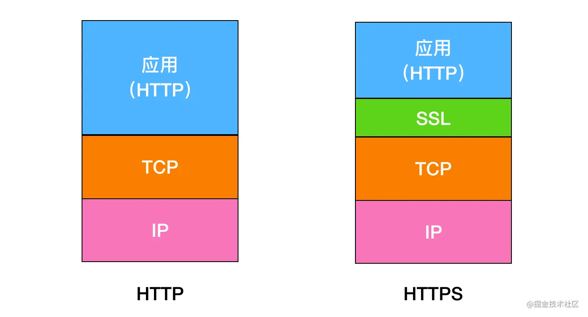

## HTTPS

https不是一种新的协议，它是http+SSL(TLS)的结合体

### HTTP的缺点：

1、明文传输： HTTP 本身是明文传输，用户和服务端之间的传输内容都能被中间者查看。也就是说 你在网上搜索、购物、访问的网点、点击的页面等信息，都可以被「中间人」获取。

2、页面劫持：黑客可以直接篡改用户的浏览页面

### HTTPS如何保证安全

#### 1、TLS/SSL

TLS是SSL的标准版。

##### SSL

位于`TCP/IP`协议与应用层协议之间：

`SSL`协议分为两层：
1、记录协议：为高层协议提供数据封装、压缩、加密等基本功能（它建立在可靠的传输协议如`TCP`之上）
2、握手协议：在数据进行传输前，给通讯双方进行身份认证、协商加密算法、交换加密密钥等（它建立在`SSL`记录协议之上，）

#### 2、混合加密

混合加密 = 对称加密 += 非对称加密

1、对称加密：加密密钥和解密密钥相同（对称加密的效率要比非对称加密高）
2、非对称加密：加密密钥与解密密钥不同，需要一把公钥与一把私钥，私钥不能被其他任何人知道，公钥可以随意公开。
	公钥用来加密，私钥用来解密；私钥数字签名，公钥验证。

###### 数据传输阶段 —— 对称密钥加密

加密和解密用的是同一把钥匙。只要攻击者获取到密钥，那么一样可以进行攻击。

因此，加密的重中之重就是**如何能安全的发送密钥不被窃取？**证书交验证阶段 —— 非对称密钥加密

###### 证书交验证阶段 —— 非对称密钥加密

加密过程就是，发送加密报文的一方使用对方的公开密钥进行加密，接收方使用自己本地的私有密钥进行解密，也就是说发送方并不需要附带着发送用来解密的密钥，这种方式就不需要考虑密钥在传输过程中被攻击者获取到。

发送方用对方得到公开密钥进行加密，用本地的私钥解密

私有密钥与公开密钥的关系是一对多的关系，公开密钥可以发送转交给任何人，而只要采用公开密钥加密的报文，都只能使用本地唯一的私有密钥进行解密。

###### 数字签名，数字证书流程

上面的过程也存在一个问题，安全的本质是使用密钥来进行数据加密解密。但是如果最本质的密钥都是有问题的，那么安全性就无从谈起，因此，这个密钥必须是通信双方，也就是客户端和服务端都认证通过的才行。这个工作既不能客户端去做，也不能服务端去做，一般来说是交给第三方权威机构 —— 数字证书认证机构（CA，Certificate Authority）。

###### 非对称加密的缺点：

上面说了，HTTPS 采用的是混合加密，那么既然非对称的公开密钥方式更好，为啥不只采一种呢？

原因：非对称的公开加密相比对称的共享密钥加密，处理起来更为复杂，效率更低。

此外非对称加密的场景只在服务端保存私钥，也就是说一对公私钥只能是单向传输数据，用来确认通信安全以及服务端返回证书。确认安全之后，传输数据采用的就是速度更快的共享密钥。

#### HTTPS的缺点

1. 速度会慢 2～100 倍
   HTTPS慢其实是慢在 SSL 协议通信商上，因为 SSL 协议要进行加密解密处理，会占用CPU和网络资源，总体上会慢一些。

2. CA证书一般来说不免费

   其次就是，申请 CA 证书是需要花钱的，当然，现在很多手段可以申请到免费的 HTTPS 证书，但是大部分权威的还是收费的。所以大部分小型个人开发者，使用的应该都是HTTP协议。

### HTTPS整体的传输过程

1. 首先`TCP`三次握手建立链接，这是数据传输基础，在此之上开始`SSL`
2. 客户端首先发送`Client Hello`开始`SSL`通信，报文中包含客户端支持的`SSL`版本、随机值`Random1`、加密算法以及密钥长度等。
3. 服务器发送`Server Hello`，和客户端一样，在报文中包含`SSL`版本、随机值`Random2`以及加密组件，此后服务端将证书也发送到客户端。
4. 此时客户端需要对服务端发送的证书进行验证，通过操作系统内置的`CA`证书，将服务器发送的证书的数字签名进行解密，并将证书的公钥进行相同算法的`HASH`与解密的数字签名解密的内容进行对比，验证证书是否合法有效，是否被劫持更换。
5. 客户端验证证书合法，然后生成一个随机值`Random3`，用公钥对`Random3`进行加密，生成`Pre-Master Key`，客户端以`Client Key Exchange`报文将`Pre-Master Key`发送到服务端，此后发送`Change Cipher Spec`报文表示此后数据传输进行加密传输。
6. 服务端将`Pre-Master Key`用自己的私钥解密为`Random3`,服务端发送`Change Cipher Spec`报文表示此后数据传输进行加密传输。
7. 此时客户端与服务端都拥有三个随机字符串，且`Random3`是密文传输的，是安全状态的，此时则可以使用这三个字符串进行对称加密传输。由于非对称加密慢，不能每次传输数据都进行非对称加密，所以使用非对称加密将密钥协商好然后使用对称加密进行数据传输。
8. 此时便正常进行`HTTP`数据传输，但是由于`SSL`加密的作用，此时的`HTTP`传输便是安全的，此为`HTTPS`的传输过程，其中`2`、`3`、`5`、`6`也被称为`SSL`四次握手。