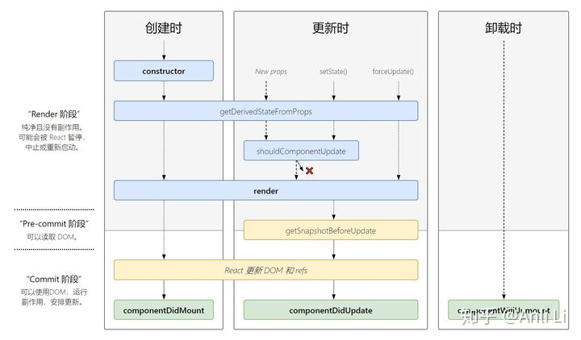

# 生命周期

## 四个阶段

### 初始化

- constructor

### 挂载

- componentWillMount（废弃，替换为getDerivedStateFromProps）
- render
- componentDidMount

### 更新(派生状态，判断是否触发render，触发render，获取快照，可以使用DOM或者安排副作用)

- componentWillReceiveProps（废弃，替换为getDerivedStateFromProps）
- shouldComponentUpdate
- componentWillUpdate（废弃）
- render
- getSnapshotBeforeUpdate
- componentDidUpdate

### 卸载

- componentWillUnmount




## 初始化

### constructor()

用来初始化state或者绑定方法。

注意：在实现子类的构造函数的时候，需要在前面加上super(porops)，否则this.props在构造函数中可能会报错：未定义


## 挂载

### static getDerivedStateFromProps()

挂载和更新时都会执行，返回值决定**是否更新State值**

用法：返回一个对象来更新state，如果返回null表示不更新任何内容

```js
static getDerivedStateFromProps(nextProps, prevState) {
    return obj || null;
}
```

1、静态方法，所以不能在这个函数里使用 `this`

2、这个函数会返回一个对象用来更新当前的 `state` 对象，如果不需要更新可以返回 `null`

### render()

render为纯函数，即：在不修改state和props的情况下，每次都会返回相同的结果。

当state或者props发生改变时候，会触发render。

注：render阶段有diff算法，虚拟DOM的相关知识点要复习


#### 什么时候会触发重渲染？

1. 执行setstate或者forceUpdate()

2. props改变

3. 父组件重渲染：父组件重新渲染，子组件跟着重新渲染


注意：shouldComponentUpdate可以避免不必要的渲染


### componentDidmount()

在组件挂载后立即执行。依赖dom的初始化，发送网络请求或者添加订阅消息，都可以放到这里。


## 更新

### getDerivedStateFromProps() 

同上

### shouldConponentUpdate()

总结：propsp和state改变时触发，用来做优化避免重复渲染的(return false即不渲染)

```js
shouldComponentUpdate(nextProps, nextState)
```

触发条件：**只有props和state改变时会触发**，首次渲染和forceUpdate()的时候不会触发

>在说这个生命周期函数之前，来看两个问题：
>
>1、**setState 函数在任何情况下都会导致组件重新渲染吗？例如下面这种情况：**
>
>```javascript
>this.setState({number: this.state.number})
>```
>
>答案：会
>
>2、**如果没有调用 setState，props 值也没有变化，是不是组件就不会重新渲染？**
>
>答案：如果是父组件重新渲染时，不管传入的 props 有没有变化，都会引起子组件的重新渲染。
>
>

**此方法仅作为性能优化的方式而存在**

可以比较 `this.props` 和 `nextProps` ，`this.state` 和 `nextState` 值是否变化，来确认返回 true 或者 `false`。当返回 `false` 时，组件的更新过程停止，后续的 `render`、`componentDidUpdate` 也不会被调用。


### render()


### getSnapshotBeforeUpdate()

```javascript
getSnapshotBeforeUpdate(prevProps, prevState)
```

**可以在更新DOM之前获取最新的渲染数据**，它的调用是在 render 之后， update 之前；多用在`UI`处理中，如需要以特殊方式处理滚动位置的聊天线程等

- **该生命周期钩子触发的时机** ：被调用于 `render` 之后、更新 `DOM` 和 `refs` 之前
- **该生命周期钩子的作用：** 它能让你在组件更新 `DOM` 和 `refs` 之前，从 `DOM` 中捕获一些信息（例如滚动位置）


### componentDidUpdate()

`componentDidUpdate()`会在更新后会被立即调用（首次渲染不会执行此方法）

如果`shouldComponentUpdate()`返回值为`false`，则不会调用`componentDidUpdate()`。
你也可以在`componentDidUpdate()`中直接调用`setState()`，但请注意它必须被包裹在一个条件语句里，否则会导致死循环，因为他将无限次触发`componentDidUpdate()`。

如果组件实现了`getSnapshotBeforeUpdate()`生命周期(不常用)，则它的返回值将作为`componentDidUpdate()`的第三个参数`snapshot`参数传递，否则此参数将为`undefined`。


## 卸载

### componentWillUnmount()

`componentWillUnmount()`会在组件卸载及销毁之前直接调用，在此方法中执行必要的清理操作，例如清除`timer`、取消网络请求或清除在`componentDidMount()`中创建的订阅等。


### static getDerivedStateFromError()

此生命周期会在后代组件抛出错误后被调用，它将抛出的错误作为参数，并返回一个值以更新`state`。`getDerivedStateFromError()`会在渲染阶段调用，因此不允许出现副作用，如遇此类情况，请改用`componentDidCatch()`。

```js
static getDerivedStateFromError(error) {}
```

### componentDidCatch()

此生命周期在后代组件抛出错误后被调用，`componentDidCatch()`会在提交阶段被调用，因此允许执行副作用，它应该用于记录错误之类的情况它接收两个参数：

- `error`: 抛出的错误。
- `info`: 带有`componentStack key`的对象，其中包含有关组件引发错误的栈信息。

```js
componentDidCatch(error, info) {}
```


## 为什么废弃三个生命周期

废弃的原因，是在React16的Fiber架构中，调和过程会多次执行will周期，不再是一次执行，失去了原有的意义。

此外，多次执行，在周期中如果有setState或dom操作，会触发多次重绘，影响性能，也会导致数据错乱

### **1、componentWillMount**

1、componentWillMount的功能完全可以用componentDidMount和 constructor替代（请求放到didmount，初始化放到construtor）

2、如果在 willMount 中订阅事件，但在服务端这并不会执行 willUnMount事件


**WillReceiveProps和WillUpdate会在每次组件更新的时候执行。但是Fiber的出现，导致每帧都有可能执行更高优先级任务，从而导致重新渲染。而这个时候，WillReceiveProps和WillUpdate重复执行肯定会造成资源的浪费**

### **2、componentWillReceiveProps**

在老版本的 React 中，如果组件自身的某个 state 跟其 props 密切相关的话，一直都没有一种很优雅的处理方式去更新 state，而是需要在 componentWilReceiveProps 中判断前后两个 props 是否相同，如果不同再将新的 props更新到相应的 state 上去。这样做一来会破坏 state 数据的单一数据源，导致组件状态变得不可预测，另一方面也会增加组件的重绘次数。类似的业务需求也有很多，如一个可以横向滑动的列表，当前高亮的 Tab 显然隶属于列表自身的时，根据传入的某个值，直接定位到某个 Tab。为了解决这些问题，React引入了第一个新的生命周期：getDerivedStateFromProps。它有以下的优点∶

- getDSFP是静态方法，在这里不能使用this，也就是一个纯函数，开发者不能写出副作用的代码
- 开发者只能通过prevState而不是prevProps来做对比，保证了state和props之间的简单关系以及不需要处理第一次渲染时prevProps为空的情况
- 基于第一点，将状态变化（setState）和昂贵操作（tabChange）区分开，更加便于 render 和 commit 阶段操作或者说优化。

### **3、componentWillUpdate**

与 componentWillReceiveProps 类似，许多开发者也会在 componentWillUpdate 中根据 props 的变化去触发一些回调 。 但不论是 componentWilReceiveProps 还 是 componentWilUpdate，都有可能在一次更新中被调用多次，也就是说写在这里的回调函数也有可能会被调用多次，这显然是不可取的。与 componentDidMount 类 似， componentDidUpdate 也不存在这样的问题，一次更新中 componentDidUpdate 只会被调用一次，所以将原先写在 componentWillUpdate 中 的 回 调 迁 移 至 componentDidUpdate 就可以解决这个问题。

另外一种情况则是需要获取DOM元素状态，但是由于在fber中，render可打断，可能在wilMount中获取到的元素状态很可能与实际需要的不同，这个通常可以使用第二个新增的生命函数的解决 getSnapshotBeforeUpdate(prevProps, prevState)


componentWillReceiveProps和componentWillUpdate因为fiber机制的出现，都有可能执行多次


