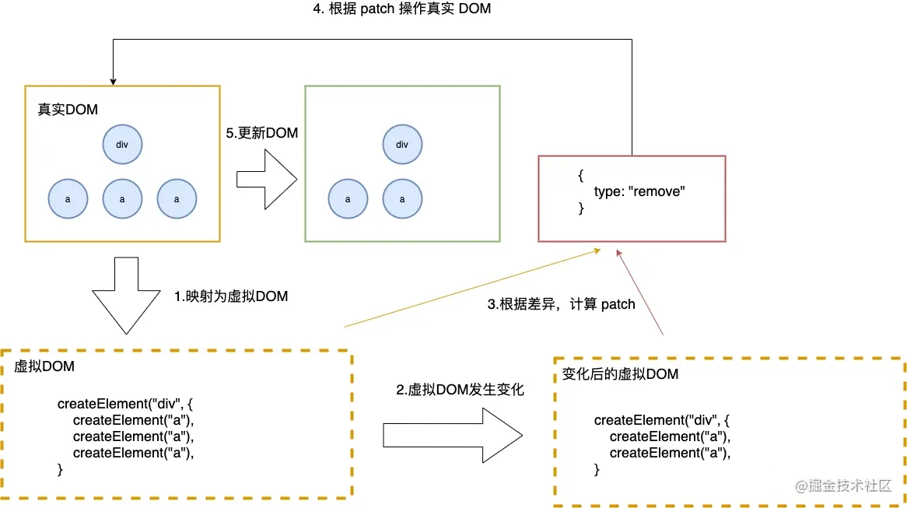

# JSX

## 对JSX的理解

jsx是快速生成React元素的一种语法，实际就是React.createElement(component,  props, ...children)的语法糖。同事它是js的语法扩展，支持js的所有功能。


## JSX发展史

jsx是FaceBook为了提升转码效率和减少开发难度，创造的JS的一种语法扩展，包含JS的所有功能。

一开始，大家使用PHP的字符串拼接进行开发。

```php
$str = "<ul>";
foreach ($talks as $talk) {
  $str += "<li>" . $talk->name . "</li>";
}
$str += "</ul>";
```

缺点：可读性不高，还容易造成`XSS`等安全问题。

XSS安全问题的应对方法是对用户的任何输入进行excape()方法的转义。但是这样的话，对字符串进行转义，为了得到原内容，又得对代码进行反转义，一来一回，转义时间大大增加。同事还会有不小心把Html标签也转义的风险，那么`html`标签就会展示给用户，造成用户不好的体验。

后来，为了更高的编码效率，避免转义`html`标签，facebook开发了`XHP`。`XHP`是`PHP`的语法拓展，允许开发者在`PHP`直接中使用`HTML`标签。

```php+HTML
$content = <ul />;
foreach ($talks as $talk) {
  $content->appendChild(<li>{$talk->name}</li>);
}
```

再后来，facebook提出一个大胆的想法，把`XHP`的扩展功能迁移到`js`中，即创造一种扩展让`js`支持`xml`，该扩展成为`jsx`。

```js
const content = (
  <TalkList>
    {talks.map(talk => <Talk talk={talk} />)}
  </TalkList>
);
```

## JSX的优点

- 更加语义化，好上手

- JSX 的最终是会转化为 js，试过将html模板编译为js模板的人就会知道，js模板是远远的比html效率高。首先是少了html模板的网络请求，其次是在执行的时候少了编译的过程，因为在生成js文件的时候就已经被编译好了，不会再客户端浪费资源去编译。

  


## 扩展：

### 静态类型

**编译时就知道变量类型的是静态类型；运行时才知道一个变量类型的叫做动态类型**。比如：

`const a = 1`,是静态类型的，编译的时候变量类型就被确定了。
 `var name = student.getName();` 这行 JavaScript 代码就是动态类型的，因为这行代码只有在被执行的时候才知道 name 是字符串类型的，甚至是 null 或 undefined 类型。

### 强类型和弱类型

**不允许隐式转换的是强类型，允许隐式转换的是弱类型**。


## JSX原理，为什么自定义的React组件必须大写

结论：

babel在编译过程中会判断 JSX 组件的首字母。

如果是小写，则当做原生的DOM标签解析，就编译成字符串。如果是大写，则认为是自定义组件，编译成对象。

解释：

JSX实际上是React.createElement(component, props, ...children)的语法糖。如下JSX代码

```js
<MyButton color="blue" shadowSize={2}>
  Click Me
</MyButton>
```

会编译为

```js
React.createElement(MyButton, {
  color: "blue",
  shadowSize: 2
}, "Click Me");
```

注意：这里的MyButton不是字符串，而是一个对象

如果没有子节点，你还可以使用自闭合的标签形式，如

```js
<div className="sidebar" />
```

会编译为

```js
React.createElement("div", {
  className: "sidebar"
});
```


## 虚拟DOM

重点总结大概两点：

1、虚拟DOM 就是用 原生的JS对象来描述 DOM节点。

2、带来的好处是方便配合不同的渲染工具实现跨平台渲染


### 虚拟DOM是什么

虚拟DOM 就是使用一个 原生的JavaScript对象来描述 一个DOM节点。

```js
<div id="wrap">
    <p class="text">好好学习，天天向上</p>
</div>
```

使用虚拟DOM表示如下：

```js
const element = {
  // 标签名
  tagName: 'div',
  properties: {
    id: 'wrap',
  },
  children: [
    {
      tagName: 'p',
      properties: {
        class: 'text',
        children: ['好好学习，天天向上']
      },
    }
  ]
}
```


这样的好处：

将页面的状态抽象为JS对象的形式，配合不同的渲染工具，使跨平台渲染成为可能。通过事务处理机制，将多次DOM修改的结果一次性的更新到页面上，从而有效的减少页面渲染的次数，减少修改DOM的重绘重排次数，提高渲染性能。


### **为什么要用 Virtual DOM：**

**（1）保证性能下限，在不进行手动优化的情况下，提供过得去的性能**

下面对比一下修改DOM时真实DOM操作和Virtual DOM的过程，来看一下它们重排重绘的性能消耗∶

- 真实DOM∶ 生成HTML字符串＋ 重建所有的DOM元素
- Virtual DOM∶ 生成vNode＋ DOMDiff＋必要的DOM更新

Virtual DOM的更新DOM的准备工作耗费更多的时间，也就是JS层面，相比于更多的DOM操作它的消费是极其便宜的。尤雨溪在社区论坛中说道∶ 框架给你的保证是，你不需要手动优化的情况下，我依然可以给你提供过得去的性能。 

**（2）跨平台** Virtual DOM本质上是JavaScript的对象，它可以很方便的跨平台操作，比如服务端渲染、uniapp等。


## diff算法

###  DOM-diff过程

```
1. 产生虚拟Dom（JS对象）
2. 虚拟Dom转化为真实Dom
3. diff算法，判断两个虚拟dom树的差异，得出差异对象
4. 将差异对象应用到真正的dom上
```

 


### 如何计算差异对象？

树与树对比：只对同一层的节点进行比较，节点不在则直接删除（传统diff跨级进行对比，时间复杂度O(n^3),新算法只要对比同级，所以未O(n)）
循环的同级子节点，通过标记key进行列表对比

注意：

1. 使用数组下标作为 `key` 值

   在元素不重新排序的前提下是可行的。

   但如果元素顺序发生改变，等于修改了元素的 `key` 值，原本的值和key就对应不上了，就会产生乱套的现象

  2. 使用不稳定的 `key` 值（例如通过 Math.random()生成的）会导致许多组件实例和 `DOM` 节点被不必要地重新创建，可能导致性能下降和子组件中的状态丢失。


### 为什么列表循环渲染的key最好不要用index

举例说明

```
变化前数组的值是[1,2,3,4]，key就是对应的下标：0，1，2，3
变化后数组的值是[4,3,2,1]，key对应的下标也是：0，1，2，3
复制代码
```

- 那么diff算法在变化前的数组找到key =0的值是1，在变化后数组里找到的key=0的值是4
- 因为子元素不一样就重新删除并更新
- 但是如果加了唯一的key,如下

```
变化前数组的值是[1,2,3,4]，key就是对应的下标：id0，id1，id2，id3
变化后数组的值是[4,3,2,1]，key对应的下标也是：id3，id2，id1，id0
复制代码
```

- 那么diff算法在变化前的数组找到key =id0的值是1，在变化后数组里找到的key=id0的值也是1
- 因为子元素相同，就不删除并更新，只做移动操作，这就提升了性能


## 其他问题

### 时间复杂度为什么是`O(n^3)`

对于树，我们也是一样的，我们定义三种操作，用来将一棵树转化为另外一棵树：

- 删除 删除一个节点，将它的children交给它的父节点
- 插入 在children中 插入一个节点
- 修改 修改节点的值


###  虚拟 DOM 的引入与直接操作原生 DOM 相比，哪一个效率更高，为什么

在首次渲染大量DOM时，由于多了一层虚拟DOM的计算，虚拟DOM也会比innerHTML插入慢。

1、DOM结构简单的时候，操控原生DOM效率更高，因为少了生成虚拟DOM和解析转换为真实DOM的过程

2、DOM结构复杂的时候，操控虚拟DOM效率更高，他只更新差异对象上的dom

总结：

虚拟 DOM 的优越之处在于，它能够在提供更爽、更高效的研发模式（也就是函数式的 UI 编程方式）的同时，仍然保持一个还不错的性能。


### 虚拟DOM的优缺点

自我总结：主要是性能上面的提升，只会更新需要更新的节点，没有更改的节点不回去重新渲染。

#### 优点

- `Virtual DOM`在牺牲(牺牲很关键)部分性能的前提下，增加了可维护性，这也是很多框架的通性。
- 实现了对`DOM`的集中化操作，在数据改变时先对虚拟`DOM`进行修改，再反映到真实的`DOM`，用最小的代价来更新`DOM`，提高效率。
- 打开了函数式`UI`编程的大门。
- 可以渲染到`DOM`以外的端，使得框架跨平台，比如`ReactNative`，`React VR`等。
- 可以更好的实现`SSR`，同构渲染等。
- 组件的高度抽象化。

#### 缺点

- 首次渲染大量`DOM`时，由于多了一层虚拟`DOM`的计算，会比`innerHTML`插入慢。
- 虚拟`DOM`需要在内存中的维护一份`DOM`的副本，多占用了部分内存。
- 如果虚拟`DOM`大量更改，这是合适的。但是单一的、频繁的更新的话，虚拟`DOM`将会花费更多的时间处理计算的工作。所以如果你有一个`DOM`节点相对较少页面，用虚拟`DOM`，它实际上有可能会更慢，但对于大多数单页面应用，这应该都会更快。


### 为什么要使用Key，key有什么好处

在处理循环子节点的时候，

如果是增删节点，就不需要将之前的所有子节点破坏掉，然后新建所有子节点；只需要在对应位置添加需要增删的节点就可以了。

如果是修改节点，可以直接根据key值快速找到对应的节点，从而进行修改。


