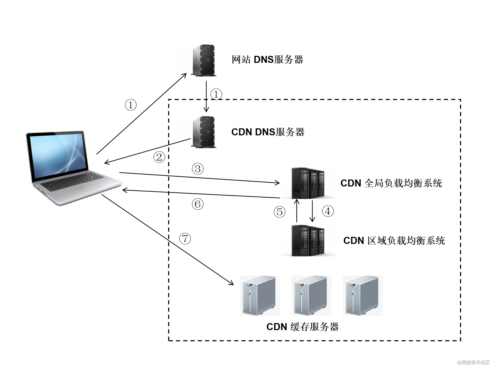
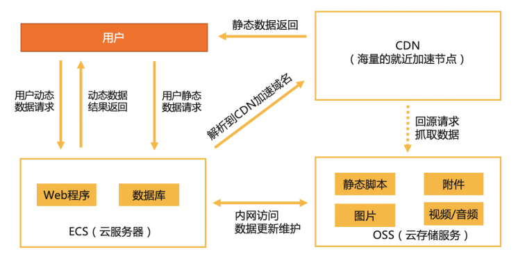
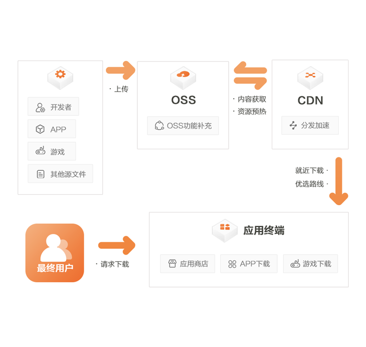

## DNS解析

```
顺序：host文件 ，DNS缓存，DNS服务器
```

先在本地的**host文件**中查找是否有对应的IP地址

——>没有就去翻本地的**DNS缓存**中有没有

——>第一次访问某个域名，本地的DNS缓存中肯定找不到，那就去**DNS服务器**进行查找

​	DNS服务器的查找顺序是从根域名服务器开始，一次向上递归查找

​	具体顺序如下：

>1. 询问根域名，获取顶级域名 .com 的 NS(Name Server) 和 A(Address)，NS为顶级域名的名字，A即NS对应的ip地址
>2. 询问顶级域名，获取二级域名 .tencnet.com 的NS 和 A
>3. 询问二级域名，获取三级域名 .cloud.tencent.com 的NS 和 A
>4. 询问三级域名，获取四级域名 .tlab.cloud.tencent.com 的NS 和 A
>5. 最后，将tlab.cloud.tencent.com的ip地址返回给用户，并且缓存
>6. 用户获取到真正的ip地址，并且缓存


## CDN负载均衡

**CDN的全称是Content Delivery Network，即内容分发网络**。

根据每台机器的负载量和距离用户地理位置等等，来合理的分配响应用户请求的具体是哪一个服务器，这种过程就是DNS负载均衡

### 栗子（帮助理解）

不知道你们有没有注意这样一件事，你访问`baidu.com`的时候，每次响应的并非是同一个服务器（IP地址不同），一般大公司都有成百上千台服务器来支撑访问，假设只有一个服务器，那它的性能和存储量要多大才能支撑这样大量的访问呢？DNS可以返回一个合适的机器的IP给用户，例如可以根据每台机器的负载量，该机器离用户地理位置的距离等等，这种过程就是DNS负载均衡


### **CDN的工作原理：** 

（1）用户未使用CDN缓存资源的过程：

1. 浏览器通过DNS对域名进行解析（就是上面的DNS解析过程），依次得到此域名对应的IP地址
2. 浏览器根据得到的IP地址，向域名的服务主机发送数据请求
3. 服务器向浏览器返回响应数据

（2）用户使用CDN缓存资源的过程：

1. 对于点击的数据的URL，经过本地DNS系统的解析，发现该URL对应的是一个CDN专用的DNS服务器，DNS系统就会将域名解析权交给[CNAME](https://blog.csdn.net/tz2101/article/details/47736081)指向的CDN专用的DNS服务器。
2. CND专用DNS服务器将CND的全局负载均衡设备IP地址返回给用户
3. 用户向CDN的全局负载均衡设备发起数据请求
4. CDN的全局负载均衡设备根据用户的IP地址，以及用户请求的内容URL，选择一台用户所属区域的区域负载均衡设备，告诉用户向这台设备发起请求
5. 区域负载均衡设备选择一台合适的缓存服务器来提供服务，将该缓存服务器的IP地址返回给全局负载均衡设备
6. 全局负载均衡设备把服务器的IP地址返回给用户
7. 用户向该缓存服务器发起请求，缓存服务器响应用户的请求，将用户所需内容发送至用户终端。

如果缓存服务器没有用户想要的内容，那么缓存服务器就会向它的上一级缓存服务器请求内容，以此类推，直到获取到需要的资源。最后如果还是没有，就会回到自己的服务器去获取资源。

 

CNAME（意为：别名)：在域名解析中，实际上解析出来的指定域名对应的IP地址，或者该域名的一个CNAME，然后再根据这个CNAME来查找对应的IP地址。


### CDN作用

一般会用来托管Web资源（包括文本、图片和脚本等），可供下载的资源（媒体文件、软件、文档等），应用程序（门户网站等）。使用CDN来加速这些资源的访问。


## oss和cdn的区别

oss是什么？cdn是什么？

1、对象存储OSS（Object Storage Service）是阿里云提供的海量、安全、低成本、高持久的云存储服务。

2、阿里云内容分发网络（Content Delivery Network，简称CDN）是建立并覆盖在承载网之上，由分布在不同区域的边缘节点服务器群组成的分布式网络。

------

😒首先OSS只是阿里云的对象存储英文简称，相对应的腾讯云对象存储简称是COS,华为云对象存储是OBS。以下内容用oss简称。

😃然而它到底具有什么作用呢？把网站静态文件放在服务器上不也一样吗？加速我直接用CDN就好了，为什么还要用OSS?

🤷‍♂️细细道来

1. 对象存储最基础的功能就是可以存储海量资源了，只要你愿意就可以无限扩展，当然资费比直接扩容服务器硬盘便宜多了，更适合做大型网站还有图片分享，音视频等等需要大量存储空间的网站，另外oss还支持对图片，音频等资源的自动压缩等节省请求流量的功能。
2. 再者就是oss解决了服务器的性能瓶颈问题，试想一下，如果你的网站哪天开始出名了，请求服务器的人数突然增多，此时选择升级服务器的带宽显然不现实（贵的要命），而使用对象存储，就没有带宽的限制了，其实还是有限制，不过峰值很高，对于大多数站点来说相当于没有限制。按下行流量大小收费（一般都有优惠包可以买。ps:下行流量是指用户在一段时间内请求服务器所接收到的所有流量，上行流量自然是你在一段时间内上传到网络上的所有数据流量）。
   
3. 然而oss没有缓存机制，同一个文件在没有本地缓存的情况下，比如有100个人同时请求这个文件那么就要花费100倍的流量，就算买了流量包，用户量一大，一下就给你刷刷没了，况且似乎oss不能手动限制带宽，这样一旦有人攻击网站，短时间内就会产生高额的oss流量费用。
4. 此时，cdn就派上用场了，cdn通过将静态内容分发到边缘节点（离请求地最近的节点），因为oss是有地域限制的，虽然带宽上限很高，但是如果存储地点离请求地点远的话，传输起来速度还是会慢的。用cdn的话可以给你将资源分发到最近的节点，并且可以将数据缓存起来，提升同一个文件被同一地区客户大量重复并发下载的体验，此时无论同一个地区的用户怎么大量请求，都有cdn的缓存给予资源反馈。大量的节省了oss流量费用。当资源有发生变化时，或者缓存到期，才会去动用oss的流量包。此时oss产生的流量就很低了。所以，这样使用cdn的原因就是有缓存，流量计费比oss低，并且带宽上限更高，还能手动设置带宽，可以有效防止无带宽限制下短时间使用掉大量流量。
   
5. 那么，我只用cdn不行吗？是可以的，但是如果你的服务器不够强大，当某个地区首次请求资源时，或者文件内容发生改变，相当于没有缓存资源了，cdn还是要请求服务器才能获取缓存资源，此时依然受到服务器带宽的限制，如果你的服务器带宽很大，财大气粗，那么当我没说。。
6. 所以，将oss和cdn搭配起来是一种比较好的加速站点方式


