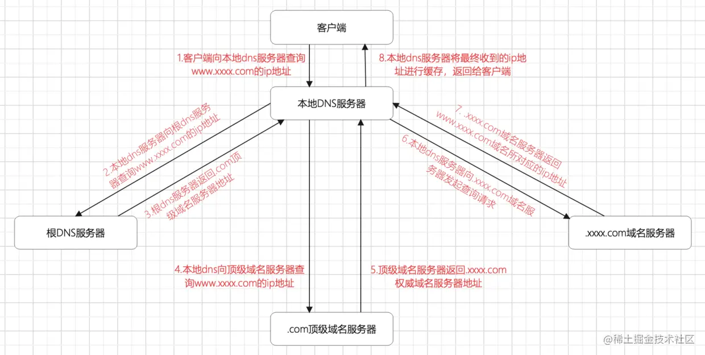
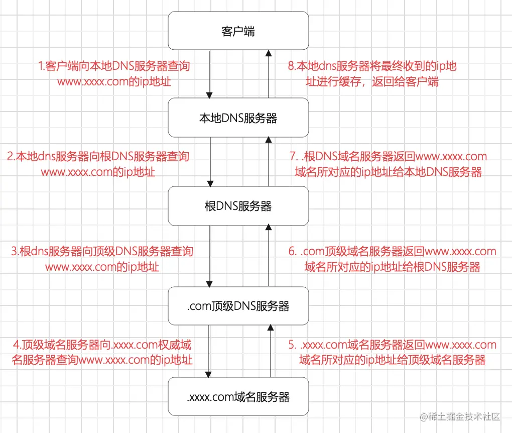
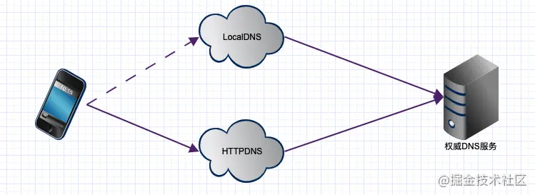
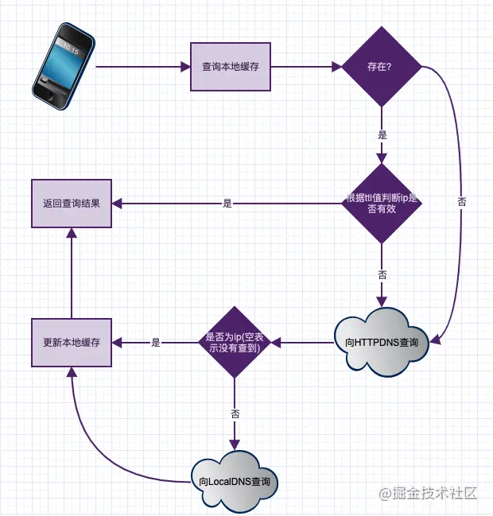

## 什么是DNS解析

DNS全称domain name system，中文名为“域名系统”。那么DNS解析又被称为域名解析。 前面的文章中我们说过，在互联网中，我们访问一台计算机最终都是通过ip来访问。域名和ip之间有一个映射关系，通过域名访问网站最终也会转化成ip来进行访问。从域名解析出ip的整个过程，我们就称之为DNS解析。而DNS的资源信息都是存储在DNS服务器上。

## 根域名服务器

全球有13台根域名服务器，包括一台主根服务器和12台辅根服务器。其中一台主根服务器加9台辅根服务器在美国；其它三台辅根服务器，其中欧洲两台分别在英国和瑞典；亚洲一台在日本。

13个根域名服务器，并不是13台实体服务器。每一个根域名服务器背后都有很多台实体服务器在运行。每个根服务器都有若干个镜像根服务器分布在全球各地。

## DNS解析过程

在讲DNS解析过程之前，我们先了解一下域名的组成。 域名是由两个或两个以上部分组成，各部分之间用”.”分割。最后一个点我们称之为顶级域名，顶级域名的子域名我们称之为二级域名。二级域名的子域名我们称之为三级域名。 如：域名www.xxxx.com，其中.com就是我们所说的顶级域名；而xxxx.com为.com的子域名，即二级域名；www.xxxx.com为二级域名的子域名，其中www为主机名。

DNS解析分为迭代查询和递归查询两种。

### **迭代查询**

迭代查询是通过逐级获取子域名的权威DNS服务器地址，并通过权威服务器地址最终拿到域名ip地址。流程如下：

1.客户端向本地DNS服务器发起请求查询www.xxxx.com的ip地址（本地DNS是电脑设置的DNS，一般默认为运营商的DNS，如电信为114.114.114.114） 2.本地DNS服务器收到请求后，向根域名服务器发起解析请求查询www.xxxx.com的ip地址 3.根域名服务器向本地DNS服务器返回.com顶级域名服务器地址 4.本地DNS服务器收到响应后，向顶级域名服务器发起解析请求 5.顶级域名服务器收到请求后，返回.xxxx.com权威域名服务器地址 6.本地DNS服务器收到响应后，向.xxxx.com权威域名服务器发起解析请求 7 .xxxx.com权威域名服务器收到请求后，返回www.xxxx.com对应的域名ip给本地DNS服务器 8.本地DNS收到域名ip后返回给客户端，并进行缓存

迭代查询流程图：



### **递归查询**

递归查询是通过递归的访问各级域名服务器，查询到ip地址后递归的返回给客户端，流程如下：

1.客户端向本地DNS服务器发起请求查询www.xxxx.com的ip地址 2.本地DNS服务器向根DNS服务器发起解析请求 3.根DNS服务器收到请求后，向.com顶级DNS服务器发起查询请求 4..com顶级DNS服务器收到请求后，向.xxxx.com权威服务器发起查询请求 5..xxxx.com返回www.xxxx.com所对应的ip地址给.com顶级DNS服务器 6.顶级DNS服务器返回ip地址给根DNS服务器 7.根DNS服务器返回ip给本地DNS服务器 8.本地DNS服务器把ip进行缓存，并返回给客户端

流程图： 

- ## DNS资源记录

DNS服务器的资源记录常见的几种有：A记录、NS记录、CNAME记录

1.A记录 A记录是指记录域名和其对应的ip，也正是因为A记录，才能由域名到ip解析成功。如果为ipv6地址，则需要添加AAAA记录。

2.NS记录 NS记录我们称之为域名解析服务器记录，用来指定子域名解析的域名解析服务器

3.CNAME记录 CNAME记录我们称之为别名记录，一般用来指定域名的别名。如www.baidu.com便有一个别名为www.a.shifen.com。


- ## 传统DNS存在的问题

1.DNS劫持 由于传统DNS是通过UDP明文传输的，我们知道UDP数据传输本身是不可靠的，这就可能会被钓鱼DNS服务器劫持，从而解析出错误的ip地址。

2.域名转发 如A运营商为了节约成本，将解析请求转发至B运营商，从而返回了域名在B运营商对应的ip地址，造成跨运营商访问，进而影响访问速度。

3.解析延迟 因为DNS查询过程，无论递归和迭代都需要请求多个DNS服务器才能最终获取ip，这就可能会造成一定的解析延时，而如果DNS服务器距离客户端较远，解析延时则更为明显。

## HttpDNS

为解决传统DNS的诸多问题，人们推出了HttpDNS的域名解析方案，HttpDNS不走传统的DNS解析，而是通过http请求直连的方式获取域名所对应的ip，这样就可以解决传统DNS可能被劫持的问题。由于客户端请求的是HttpDNS服务器，不走运营商本地DNS，所以也就不存在域名转发的问题 而其DNS服务器集群分布在多个地点多个运营商，它可以根据客户端的国家、省市、运营商等信息选择最佳的服务节点进行解析，这样也从一定程度上解决DNS解析延迟问题。 如今腾讯、阿里、谷歌等都有自己的HttpDNS服务，我也在项目中使用了阿里的HttpDNS服务，从而极大的提升了国外用户的访问速度。大家可根据实际情况选择适合自己的HttpDNS服务。


### 3.1 什么是HTTPDNS

HTTPDNS使用HTTP与DNS服务器交互，代替传统的基于UDP的DNS协议，域名解析请求直接发送到HTTPDNS服务端，从而绕过运营商的Local DNS








### 3.2 HTTPDNS的特性

#### 3.2.1 防止域名劫持

由于 HttpDns 是通过 IP 直接请求 HTTP 获取服务器 A 记录地址，不存在向本地运营商询问 domain 解析过程，所以从根本避免了劫持问题。

#### 3.2.2 精准调度

HTTPDNS能够直接获取到用户的IP地址，从而实现精确定位与导流


## DNS解析

客户端和DNS服务器之间使用的是递归查询，而DNS服务器之间使用的是迭代查询.

```
顺序：host文件 ，DNS缓存，DNS服务器
```

先在本地的**host文件**中查找是否有对应的IP地址

——>没有就去翻本地的**DNS缓存**中有没有

——>第一次访问某个域名，本地的DNS缓存中肯定找不到，那就去**DNS服务器**进行查找

​	DNS服务器的查找顺序是从根域名服务器开始，一次向上递归查找

​	具体顺序如下：

>1. 询问根域名，获取顶级域名 .com 的 NS(Name Server) 和 A(Address)，NS为顶级域名的名字，A即NS对应的ip地址
>2. 询问顶级域名，获取二级域名 .tencnet.com 的NS 和 A
>3. 询问二级域名，获取三级域名 .cloud.tencent.com 的NS 和 A
>4. 询问三级域名，获取四级域名 .tlab.cloud.tencent.com 的NS 和 A
>5. 最后，将tlab.cloud.tencent.com的ip地址返回给用户，并且缓存
>6. 用户获取到真正的ip地址，并且缓存


## CDN负载均衡

**CDN的全称是Content Delivery Network，即内容分发网络**。

根据每台机器的负载量和距离用户地理位置等等，来合理的分配响应用户请求的具体是哪一个服务器，这种过程就是DNS负载均衡

### 栗子（帮助理解）

不知道你们有没有注意这样一件事，你访问`baidu.com`的时候，每次响应的并非是同一个服务器（IP地址不同），一般大公司都有成百上千台服务器来支撑访问，假设只有一个服务器，那它的性能和存储量要多大才能支撑这样大量的访问呢？DNS可以返回一个合适的机器的IP给用户，例如可以根据每台机器的负载量，该机器离用户地理位置的距离等等，这种过程就是DNS负载均衡


### **CDN的工作原理：** 

（1）用户未使用CDN缓存资源的过程：

1. 浏览器通过DNS对域名进行解析（就是上面的DNS解析过程），依次得到此域名对应的IP地址
2. 浏览器根据得到的IP地址，向域名的服务主机发送数据请求
3. 服务器向浏览器返回响应数据

（2）用户使用CDN缓存资源的过程：

1. 对于点击的数据的URL，经过本地DNS系统的解析，发现该URL对应的是一个CDN专用的DNS服务器，DNS系统就会将域名解析权交给[CNAME](https://blog.csdn.net/tz2101/article/details/47736081)指向的CDN专用的DNS服务器。
2. CND专用DNS服务器将CND的全局负载均衡设备IP地址返回给用户
3. 用户向CDN的全局负载均衡设备发起数据请求
4. CDN的全局负载均衡设备根据用户的IP地址，以及用户请求的内容URL，选择一台用户所属区域的区域负载均衡设备，告诉用户向这台设备发起请求
5. 区域负载均衡设备选择一台合适的缓存服务器来提供服务，将该缓存服务器的IP地址返回给全局负载均衡设备
6. 全局负载均衡设备把服务器的IP地址返回给用户
7. 用户向该缓存服务器发起请求，缓存服务器响应用户的请求，将用户所需内容发送至用户终端。

如果缓存服务器没有用户想要的内容，那么缓存服务器就会向它的上一级缓存服务器请求内容，以此类推，直到获取到需要的资源。最后如果还是没有，就会回到自己的服务器去获取资源。

 

CNAME（意为：别名)：在域名解析中，实际上解析出来的指定域名对应的IP地址，或者该域名的一个CNAME，然后再根据这个CNAME来查找对应的IP地址。


### CDN作用

一般会用来托管Web资源（包括文本、图片和脚本等），可供下载的资源（媒体文件、软件、文档等），应用程序（门户网站等）。使用CDN来加速这些资源的访问。


## oss和cdn的区别

oss是什么？cdn是什么？

1、对象存储OSS（Object Storage Service）是阿里云提供的海量、安全、低成本、高持久的云存储服务。

2、阿里云内容分发网络（Content Delivery Network，简称CDN）是建立并覆盖在承载网之上，由分布在不同区域的边缘节点服务器群组成的分布式网络。

------

😒首先OSS只是阿里云的对象存储英文简称，相对应的腾讯云对象存储简称是COS,华为云对象存储是OBS。以下内容用oss简称。

😃然而它到底具有什么作用呢？把网站静态文件放在服务器上不也一样吗？加速我直接用CDN就好了，为什么还要用OSS?

🤷‍♂️细细道来

1. 对象存储最基础的功能就是可以存储海量资源了，只要你愿意就可以无限扩展，当然资费比直接扩容服务器硬盘便宜多了，更适合做大型网站还有图片分享，音视频等等需要大量存储空间的网站，另外oss还支持对图片，音频等资源的自动压缩等节省请求流量的功能。
2. 再者就是oss解决了服务器的性能瓶颈问题，试想一下，如果你的网站哪天开始出名了，请求服务器的人数突然增多，此时选择升级服务器的带宽显然不现实（贵的要命），而使用对象存储，就没有带宽的限制了，其实还是有限制，不过峰值很高，对于大多数站点来说相当于没有限制。按下行流量大小收费（一般都有优惠包可以买。ps:下行流量是指用户在一段时间内请求服务器所接收到的所有流量，上行流量自然是你在一段时间内上传到网络上的所有数据流量）。
   
3. 然而oss没有缓存机制，同一个文件在没有本地缓存的情况下，比如有100个人同时请求这个文件那么就要花费100倍的流量，就算买了流量包，用户量一大，一下就给你刷刷没了，况且似乎oss不能手动限制带宽，这样一旦有人攻击网站，短时间内就会产生高额的oss流量费用。
4. 此时，cdn就派上用场了，cdn通过将静态内容分发到边缘节点（离请求地最近的节点），因为oss是有地域限制的，虽然带宽上限很高，但是如果存储地点离请求地点远的话，传输起来速度还是会慢的。用cdn的话可以给你将资源分发到最近的节点，并且可以将数据缓存起来，提升同一个文件被同一地区客户大量重复并发下载的体验，此时无论同一个地区的用户怎么大量请求，都有cdn的缓存给予资源反馈。大量的节省了oss流量费用。当资源有发生变化时，或者缓存到期，才会去动用oss的流量包。此时oss产生的流量就很低了。所以，这样使用cdn的原因就是有缓存，流量计费比oss低，并且带宽上限更高，还能手动设置带宽，可以有效防止无带宽限制下短时间使用掉大量流量。
   
5. 那么，我只用cdn不行吗？是可以的，但是如果你的服务器不够强大，当某个地区首次请求资源时，或者文件内容发生改变，相当于没有缓存资源了，cdn还是要请求服务器才能获取缓存资源，此时依然受到服务器带宽的限制，如果你的服务器带宽很大，财大气粗，那么当我没说。。
6. 所以，将oss和cdn搭配起来是一种比较好的加速站点方式


