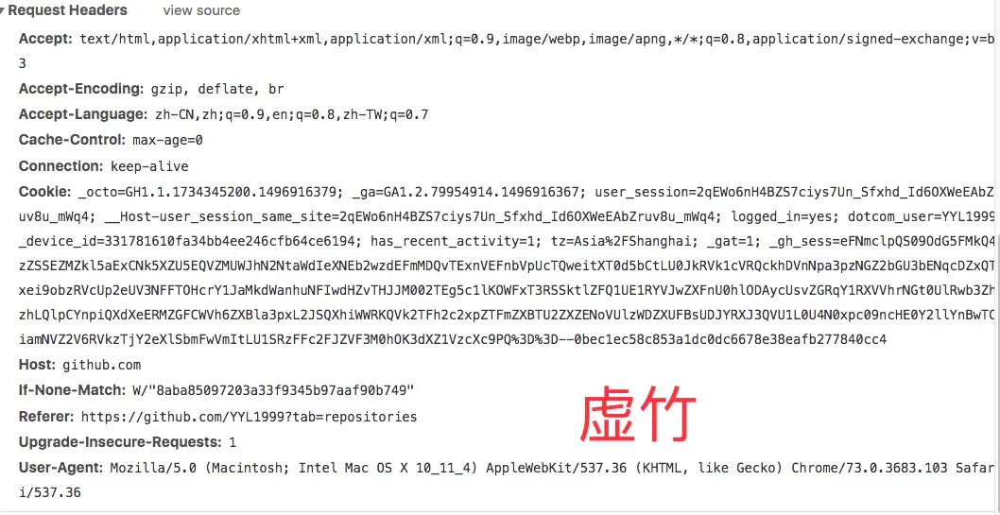
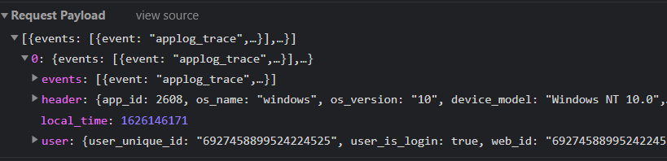

## 发送HTTP请求

请求报文=请求行+请求头+请求体

请求行包括三个部分：请求方法，请求url和http协议的版本号

### 请求方法：

http1.1提供了8个请求方式：

​	GET; POST, HEAD; PUT, DELETE, PATCH, OPTIONS, TRACE

### 请求头

Accept：指定客户端可以接受哪些类型的信息

Accept-Encoding： 指定客户端接受的编码方式

`Connection：keep-alive` 告诉客户端不要立即关闭TCP连接，下次请求使用相同的通道，省去建立TCP连接的时间

`cache-control: no-store, no-cache, must-revalidate`

### 请求体

请求头中有一些与请求体相关的信息，比如`Content-Type: application/json`,设置请求体为JSON类型的文本

### http缓存

[浏览器缓存](./01. 浏览器缓存（未整理完）)

## 服务器处理请求并返回结果

