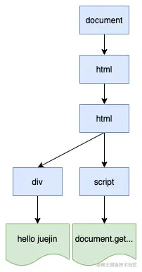
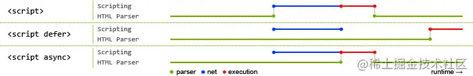

# 浏览器渲染

五个过程：

- **构建DOM树**：渲染引擎使用HTML解析器（调用XML解析器）解析HTML文档，将各个HTML元素逐个转化成DOM节点，从而生成DOM树；
- **构建CSSOM树**：CSS解析器解析CSS，并将其转化为CSS对象，将这些CSS对象组装起来，构建CSSOM树；
- **构建渲染树**：DOM 树和 CSSOM 树都构建完成以后，浏览器会根据这两棵树构建出一棵渲染树；
- **布局页面**：渲染树构建完毕之后，元素的位置关系以及需要应用的样式就确定了，这时浏览器会计算出所有元素的大小和绝对位置；
- **绘制页面**：页面布局完成之后，浏览器会将根据处理出来的结果，把每一个页面图层转换为像素，并对所有的媒体文件进行解码。

## 构建Dom树

​	渲染引擎中，DOM 有三个层面的作用：

- 从页面的视角来看，DOM 是生成页面的基础数据结构；
- 从 JavaScript 脚本视角来看，DOM 提供给 JavaScript 脚本操作的接口，通过这套接口，JavaScript 可以对 DOM 结构进行访问，从而改变文档的结构、样式和内容；


## 构建CSSOM树

CSSOM 树和 DOM 树类似，它主要有两个作用：

- 提供给 JavaScript 操作样式的能力；
- 为渲染树的合成提供基础的样式信息。


## JS阻塞和CSS阻塞

### JS阻塞：JS脚本会阻塞DOM的解析

当解析器解析HTML时，如果遇到了script标签，HTML解析器会暂停解析并去执行脚本文件。

来看一段代码：

```html
<html>
    <body>
        <div>hello juejin</div>
        <script>
            document.getElementsByTagName('div')[0].innerText = 'juejin yyds'
        </script>
        <p>hello world</p>
    </body>
</html>
```

这里，当解析完div标签后，就会解析script标签，这时的DOM结构如下：



这时，HTML解析器就会暂停工作，JavaScript引擎就会开始工作，并执行script标签中的脚本内容。由于这段脚本修改了第一个div的内容，所以执行完这个脚本之后，div中的文本就变成了“juejin yyds”，当脚本执行完成之后，HTML解析器就会恢复解析过程，继续解析后面的内容，直至生成最终的DOM。

上面我们说的JavaScript脚本是通过script标签直接嵌入到HTML中的。当在页面中引入JavaScript脚本时，情况就会变得复杂。比如：

```html
<html>
    <body>
        <div>hello juejin</div>
        <script type="text/javascript" src='./index.js'></script>
        <p>hello world</p>
    </body>
</html>
复制代码
```

其实这里的执行流程和上面时一样的，当遇到script标签时，HTML解析器都会暂停解析并去执行脚本文件。不过这里执行 JavaScript 脚本时，需要先下载脚本。脚本的下载过程会阻塞 DOM 的解析，而通常下载又是非常耗时的，会受到网络环境、JavaScript 脚本文件大小等因素的影响。


#### 解决方案：

1、可以通过CDN、压缩脚本等方式来加速 JavaScript 脚本的加载。

2、如果脚本文件中没有操作DOM的相关代码，可以把JavaScript脚本设置为异步加载

如何设置异步加载？给script标签添加 async 或 defer 属性来实现。使用方式如下：

```html
<script async type="text/javascript" src='./index.js'></script>
<script defer type="text/javascript" src='./index.js'></script>
```

下图可以直观的看出异步加载和直接加载的区别:  其中蓝色代表JavaScript脚本加载时间，红色代表JavaScript脚本执行时间，绿色代表HTML解析。

**async** 属性，让浏览器异步加载 JavaScript 文件，即在加载 JavaScript 文件时，浏览器不会暂停解析。

**defer**，设置该属性能够将 JavaScript 文件延迟到页面解析完毕后再运行。就是最后加载 JavaScript 文件。

 


### CSS阻塞

因为JS代码可能会操作css样式，所以默认要解析生成 CSSOM 对象之后，才能执行 JavaScript 脚本

示例代码如下：

```html
<html>
    <head>
  	<style src='./style.css'></style>
    </head>
    <body>
        <div>hello juejin</div>
        <script>
            const ele = document.getElementsByTagName('div')[0];
            ele.innerText = 'juejin yyds';    // 操作DOM
            ele.style.color = 'skyblue';      // 操作CSSOM
        </script>
        <p>hello world</p>
    </body>
</html>
```

上面的代码中，第9行是操作DOM的，而第10行是操作CSSOM的，所以在执行 JavaScript 脚本之前，还需要先解析 JavaScript 语句之上所有的 CSS 样式。所以如果代码里引用了外部的 CSS 文件，那么在执行 JavaScript 之前，还需要 等待外部的 CSS 文件下载完成，并解析生成 CSSOM 对象之后，才能执行 JavaScript 脚本。而 JavaScript 引擎在解析 JavaScript 之前，是不知道 JavaScript 是否操纵了 CSSOM 的，所以渲染引擎在遇到 JavaScript 脚本时，不管该脚本是否操纵了 CSSOM，都会执行 CSS 文件下载，解析操作，再执行 JavaScript 脚本。

所以，JavaScript 会阻塞 DOM 生成，而样式文件又会阻塞 JavaScript 的执行，我们在开发时需要格外注意这一点。

最后再来看一种情况，示例代码如下：

```html
<html>
    <head>
        <style src='./style.css'></style>
    </head>
    <body>
        <div>hello juejin</div>
        <script type="text/javascript" src='./index.js'></script>
        <p>hello world</p>
    </body>
</html>
复制代码
```

这段HTML代码中包含了CSS外部引用和JavaScript外部文件，在接收到 HTML 数据之后的预解析过程中，HTML 预解析器识别出来了有 CSS 文件和 JavaScript 文件需要下载，就会同时发起两个文件的下载请求。


