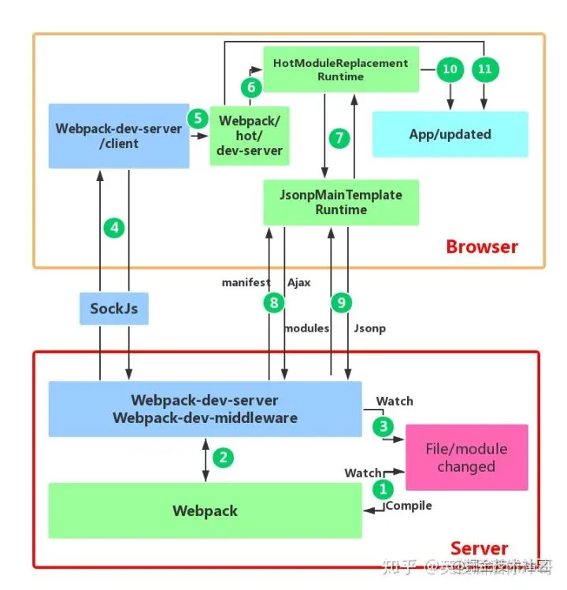

# webpack

## 基础篇


### 核心概念

**1、Entry（入口）：**指示 webpack 应该使用哪个模块，来作为构建其内部依赖图的开始。进入入口起点后，webpack 会找出有哪些模块和库是入口起点（直接和间接）依赖的。

**2、Output（出口）：**告诉 webpack 在哪里输出它所创建的结果文件，以及如何命名这些文件，默认值为./dist。

**3、Loader（模块转换器）：**将所有类型的文件转换为 webpack 能够处理的有效模块，然后你就可以利用 webpack 的打包能力，对它们进行处理。

**4、Plugins（插件）：**在 Webpack 构建流程中的特定时机注入扩展逻辑来改变构建结果或做你想要的事情。

**5、Module(模块)：**开发者将程序分解成离散功能块，并称之为模块


## Loader和Plugin


### 常见的Loader？分别解决什么问题？


**图片，视频等静态文件的加载**

- file-loader：把文件输出到一个文件夹中，在代码中通过相对 URL 去引用输出的文件
  - `file-loader`就是将文件在进行一些处理后（主要是处理文件名和路径、解析文件url），并将文件移动到输出的目录中
     `url-loader` 一般与`file-loader`搭配使用，功能与 file-loader 类似，如果文件小于限制的大小。则会返回 base64 编码，否则使用 file-loader 将文件移动到输出的目录中
- url-loader：和 file-loader 类似，但是能在文件很小的情况下以 base64 的方式把文件内容注入到代码中去

**调试**

- source-map-loader：加载额外的 Source Map 文件，以方便断点调试

  - 作为开发，代码调试当然少不了，那么问题来了，经过打包后的文件，你是不容易找到出错的地方的，`Source Map`就是用来解决这个问题的。通过如下配置，我们会在打包时生成对应于打包文件的`.map`文件，使得编译后的代码可读性更高，更易于调试。

    

    提到`sourceMap`，很多小伙伴可能会立刻想到`Webpack`配置里边的`devtool`参数，以及对应的`eval`，`eval-cheap-source-map`等等可选值以及它们的含义。

- image-loader：加载并且压缩图片文件

- babel-loader：把 ES6 转换成 ES5

  - 为了使我们的js代码兼容更多的环境我们需要安装依赖

    ```
    npm i -D babel-loader @babel/preset-env @babel/core
    复制代码
    ```

    - 注意 `babel-loader`与`babel-core`的版本对应关系

    1. `babel-loader` 8.x 对应`babel-core` 7.x
    2. `babel-loader` 7.x 对应`babel-core` 6.x 
        配置如下

    ```
    // webpack.config.js
    module.exports = {
        // 省略其它配置 ...
        module:{
            rules:[
              {
                test:/\.js$/,
                use:{
                  loader:'babel-loader',
                  options:{
                    presets:['@babel/preset-env']
                  }
                },
                exclude:/node_modules/
              },
           ]
        }
    }
    复制代码
    ```

    上面的`babel-loader`只会将 ES6/7/8语法转换为ES5语法，但是对新api并不会转换 例如(promise、Generator、Set、Maps、Proxy等)
     此时我们需要借助babel-polyfill来帮助我们转换

    ```
    npm i @babel/polyfill
    复制代码
    // webpack.config.js
    const path = require('path')
    module.exports = {
        entry: ["@babel/polyfill",path.resolve(__dirname,'../src/index.js')],    // 入口文件
    }
    ```


**样式**

- css-loader：加载 CSS，支持模块化、压缩、文件导入等特性

- style-loader：把 CSS 代码注入到 JavaScript 中，通过 DOM 操作去加载 CSS。

  简单说一下上面的配置：

  - `style-loader` 动态创建 `style` 标签，将 `css` 插入到 `head` 中.
  - `css-loader` 负责处理 `@import` 等语句。
  - `postcss-loader` 和 `autoprefixer`，自动生成浏览器兼容性前缀 —— 2020了，应该没人去自己徒手去写浏览器前缀了吧
  - `less-loader` 负责处理编译 `.less` 文件,将其转为 `css`

  


`Loader`的配置使用我们应该已经非常的熟悉：

在rules中使用test测试文件格式，用use使用对应的加载器

`loader`可以用数组的形式配置多个，所以当`Webpack`在转换该文件类型的时候，会按照顺序链式调用每一个`loader`，前一个`loader`返回的内容会作为下一个`loader`的入参


例子：

```js
// webpack.config.js
module.exports = {
  // ...other config
  module: {
    rules: [
      {
        test: /^your-regExp$/,
        use: [
          {
             loader: 'loader-name-A',
          }, 
          {
             loader: 'loader-name-B',
          }
        ]
      },
    ]
  }
}
```


### 常见的Plugin？解决什么问题？

- define-plugin：定义环境变量
- commons-chunk-plugin：提取公共代码
- uglifyjs-webpack-plugin：通过`UglifyES`压缩`ES6`代码

### Loader和Plugin的不同

- loader: 模块转换器，用于把模块原内容按照需求转换成新内容

  - 将所有类型的文件转换为 webpack 能够处理的有效模块，然后你就可以利用 webpack 的打包能力，对它们进行处理。

  - `Webpack`最后打包出来的成果是一份`Javascript`代码，实际上在`Webpack`内部默认也只能够处理`JS`模块代码，在打包过程中，会默认把所有遇到的文件都当作 `JavaScript`代码进行解析，因此当项目存在非`JS`类型文件时，我们需要先对其进行必要的转换，才能继续执行打包任务，这也是`Loader`机制存在的意义。

    

- 插件(plugins): 扩展插件，在webpack构建流程中的特定时机注入扩展逻辑来改变构建结果或做你想要做的事情

  - 在 Webpack 构建流程中的特定时机注入扩展逻辑来改变构建结果或做你想要的事情。

**不同的作用**

- **Loader**直译为"加载器"。Webpack将一切文件视为模块，但是webpack原生是只能解析js文件，如果想将其他文件也打包的话，就会用到`loader`。 所以Loader的作用是让webpack拥有了加载和解析*非JavaScript文件*的能力。
- **Plugin**直译为"插件"。Plugin可以扩展webpack的功能，让webpack具有更多的灵活性。 在 Webpack 运行的生命周期中会广播出许多事件，Plugin 可以监听这些事件，在合适的时机通过 Webpack 提供的 API 改变输出结果。

**不同的用法**

- **Loader**在`module.rules`中配置，也就是说他作为模块的解析规则而存在。 类型为数组，每一项都是一个`Object`，里面描述了对于什么类型的文件（`test`），使用什么加载(`loader`)和使用的参数（`options`）
- **Plugin**在`plugins`中单独配置。 类型为数组，每一项是一个`plugin`的实例，参数都通过构造函数传入。


### 手写Loader

从上面的打包代码我们其实可以知道，`Webpack`最后打包出来的成果是一份`Javascript`代码，实际上在`Webpack`内部默认也只能够处理`JS`模块代码，在打包过程中，会默认把所有遇到的文件都当作 `JavaScript`代码进行解析，因此当项目存在非`JS`类型文件时，我们需要先对其进行必要的转换，才能继续执行打包任务，这也是`Loader`机制存在的意义。

`Loader`的配置使用我们应该已经非常的熟悉：

```js
// webpack.config.js
module.exports = {
  // ...other config
  module: {
    rules: [
      {
        test: /^your-regExp$/,
        use: [
          {
             loader: 'loader-name-A',
          }, 
          {
             loader: 'loader-name-B',
          }
        ]
      },
    ]
  }
}
复制代码
```

通过配置可以看出，针对每个文件类型，`loader`是支持以数组的形式配置多个的，因此当`Webpack`在转换该文件类型的时候，会按顺序链式调用每一个`loader`，前一个`loader`返回的内容会作为下一个`loader`的入参。因此`loader`的开发需要遵循一些规范，比如返回值必须是标准的`JS`代码字符串，以保证下一个`loader`能够正常工作，同时在开发上需要严格遵循“单一职责”，只关心`loader`的输出以及对应的输出。

`loader`函数中的`this`上下文由`webpack`提供，可以通过`this`对象提供的相关属性，获取当前`loader`需要的各种信息数据，事实上，这个`this`指向了一个叫`loaderContext`的`loader-runner`特有对象。有兴趣的小伙伴可以自行阅读源码。

```js
module.exports = function(source) {
    const content = doSomeThing2JsString(source);
    
    // 如果 loader 配置了 options 对象，那么this.query将指向 options
    const options = this.query;
    
    // 可以用作解析其他模块路径的上下文
    console.log('this.context');
    
    /*
     * this.callback 参数：
     * error：Error | null，当 loader 出错时向外抛出一个 error
     * content：String | Buffer，经过 loader 编译后需要导出的内容
     * sourceMap：为方便调试生成的编译后内容的 source map
     * ast：本次编译生成的 AST 静态语法树，之后执行的 loader 可以直接使用这个 AST，进而省去重复生成 AST 的过程
     */
    this.callback(null, content);
    // or return content;
}
复制代码
```

更详细的开发文档可以直接查看官网的 [Loader API](https://link.juejin.cn?target=https%3A%2F%2Fwww.webpackjs.com%2Fapi%2Floaders%2F)。


Loader像一个"翻译官"把读到的源文件内容转义成新的文件内容，并且每个Loader通过链式操作，将源文件一步步翻译成想要的样子。

编写Loader时要遵循单一原则，每个Loader只做一种"转义"工作。 每个Loader的拿到的是源文件内容（`source`），可以通过返回值的方式将处理后的内容输出，也可以调用`this.callback()`方法，将内容返回给webpack。 还可以通过 `this.async()`生成一个`callback`函数，再用这个callback将处理后的内容输出出去。 此外`webpack`还为开发者准备了开发loader的工具函数集——`loader-utils`。


### 手写plugin

`plugin`通常是在`webpack`在打包的某个时间节点做一些操作，我们使用`plugin`的时候，一般都是`new Plugin()`这种形式使用，所以，首先应该明确的是，`plugin`应该是一个类。	


在`webpack.config.js`中使用它

```
const path = require('path')
const DemoWebpackPlugin = require('./demo-webpack-plugin')
module.exports = {
    mode: 'development',
    entry: {
        main: './src/index.js'
    },
    output: {
        path: path.resolve(__dirname, 'dist'),
        filename: '[name].js'
    },
    plugins: [
        new DemoWebpackPlugin()
    ]
}
复制代码
```


再来看`demo-webpack-plugin.js`的实现

```
class DemoWebpackPlugin {
    constructor () {
        console.log('plugin init')
    }
    apply (compiler) {

    }
}

module.exports = DemoWebpackPlugin
```

### webpack 插件如何实现

- webpack本质是一个事件流机制，核心模块：tabable(Sync + Async)Hooks 构造出 === Compiler(编译) + Compiletion(创建bundles)
- compiler对象代表了完整的webpack环境配置。这个对象在启动webpack时被一次性建立，并配置好所有可操作的设置，包括options、loader和plugin。当在webpack环境中应用一插件时，插件将收到此compiler对象的引用。可以使用它来访问webpack的主环境
- compilation对象代表了一次资源版本构建。当运行webpack开发环境中间件时，每当检测到一个文件变化，就会创建一个新的compilation,从而生成一个新的编译资源。一个compilation对象表现了当前的模块资源、编译生成资源、变化的文件、以及被跟踪依赖的状态的信息。compilation对象也提供了很多关键时机的回调，以供插件做自定义处理时选择使用
- 创建一个插件函数，在其prototype上定义apply方法，指定一个webpack自身的事件钩子
- 函数内部处理webpack内部实例的特定数据
- 处理完成后，调用webpack提供的回调函数

```
function MyWebpackPlugin()(
}；
// prototype 上定义 apply 方法
MyWebpackPlugin.prototype.apply=function(){
// 指定一个事件函数挂载到webpack
compiler.pluginCwebpacksEventHook"funcion (compiler)( console. log(“这是一个插件”)；
// 功能完成调用后webpack提供的回调函数
callback()
})
```


## 原理篇

### webpack的构建流程?（从读取配置到输出文件）

Webpack 的运行流程是一个串行的过程，从启动到结束会依次执行以下流程：

1. 初始化参数：从配置文件和 Shell 语句中读取与合并参数，得出最终的参数；
   1. 开始编译：用上一步得到的参数初始化 Compiler 对象，加载所有配置的插件，执行对象的 run 方法开始执行编译；
2. 确定入口：根据配置中的 entry 找出所有的入口文件；
3. 编译模块：从入口文件出发，调用所有配置的 Loader 对模块进行翻译，再找出该模块依赖的模块，再递归本步骤直到所有入口依赖的文件都经过了本步骤的处理；
4. 完成模块编译：在经过第4步使用 Loader 翻译完所有模块后，得到了每个模块被翻译后的最终内容以及它们之间的依赖关系；
5. 输出资源：根据入口和模块之间的依赖关系，组装成一个个包含多个模块的 Chunk，再把每个 Chunk 转换成一个单独的文件加入到输出列表，这步是可以修改输出内容的最后机会；
6. 输出完成：在确定好输出内容后，根据配置确定输出的路径和文件名，把文件内容写入到文件系统。

在以上过程中，Webpack 会在特定的时间点广播出特定的事件，插件在监听到感兴趣的事件后会执行特定的逻辑，并且插件可以调用 Webpack 提供的 API 改变 Webpack 的运行结果。


>compiler是webpack的入口执行实例，其主要功能是监控代码、启动和终止一个compilation等宏观任务。compilation是具体负责核心编译工作的，主要是模块依赖分析，优化、连接，打包等工作。打个粗略的比方，compiler是人，compilation是人的大脑，架构设计上是类似的。
>
>给webpack写plugin的时候，我们需要通过compiler提供的钩子来tap宏观生命周期，其中一个最主要的阶段就是compilation（创建编译对象）的hook，通过该hook，我们拿到编译对象，从而得以进一步tap入实际的编译过程。
>
>
>
>


### 写loader或plugin的思路？

Loader像一个"翻译官"把读到的源文件内容转义成新的文件内容，并且每个Loader通过链式操作，将源文件一步步翻译成想要的样子。

编写Loader时要遵循单一原则，每个Loader只做一种"转义"工作。 每个Loader的拿到的是源文件内容（`source`），可以通过返回值的方式将处理后的内容输出，也可以调用`this.callback()`方法，将内容返回给webpack。 还可以通过 `this.async()`生成一个`callback`函数，再用这个callback将处理后的内容输出出去。 此外`webpack`还为开发者准备了开发loader的工具函数集——`loader-utils`。

相对于Loader而言，Plugin的编写就灵活了许多。 webpack在运行的生命周期中会广播出许多事件，Plugin 可以监听这些事件，在合适的时机通过 Webpack 提供的 API 改变输出结果。

### webpack的热更新，说明其原理？

webpack的热更新又称热替换（Hot Module Replacement），缩写为HMR。 这个机制可以做到不用刷新浏览器而将新变更的模块替换掉旧的模块。

**原理：**



图片来自饿了么前端@知乎专栏

首先要知道server端和client端都做了处理工作

1. 第一步，在 webpack 的 watch 模式下，文件系统中某一个文件发生修改，webpack 监听到文件变化，根据配置文件对模块重新编译打包，并将打包后的代码通过简单的 JavaScript 对象保存在内存中。
2. 第二步是 webpack-dev-server 和 webpack 之间的接口交互，而在这一步，主要是 dev-server 的中间件 webpack-dev-middleware 和 webpack 之间的交互，webpack-dev-middleware 调用 webpack 暴露的 API对代码变化进行监控，并且告诉 webpack，将代码打包到内存中。
3. 第三步是 webpack-dev-server 对文件变化的一个监控，这一步不同于第一步，并不是监控代码变化重新打包。当我们在配置文件中配置了devServer.watchContentBase 为 true 的时候，Server 会监听这些配置文件夹中静态文件的变化，变化后会通知浏览器端对应用进行 live reload。注意，这儿是浏览器刷新，和 HMR 是两个概念。
4. 第四步也是 webpack-dev-server 代码的工作，该步骤主要是通过 sockjs（webpack-dev-server 的依赖）在浏览器端和服务端之间建立一个 websocket 长连接，将 webpack 编译打包的各个阶段的状态信息告知浏览器端，同时也包括第三步中 Server 监听静态文件变化的信息。浏览器端根据这些 socket 消息进行不同的操作。当然服务端传递的最主要信息还是新模块的 hash 值，后面的步骤根据这一 hash 值来进行模块热替换。
5. webpack-dev-server/client 端并不能够请求更新的代码，也不会执行热更模块操作，而把这些工作又交回给了 webpack，webpack/hot/dev-server 的工作就是根据 webpack-dev-server/client 传给它的信息以及 dev-server 的配置决定是刷新浏览器呢还是进行模块热更新。当然如果仅仅是刷新浏览器，也就没有后面那些步骤了。
6. HotModuleReplacement.runtime 是客户端 HMR 的中枢，它接收到上一步传递给他的新模块的 hash 值，它通过 JsonpMainTemplate.runtime 向 server 端发送 Ajax 请求，服务端返回一个 json，该 json 包含了所有要更新的模块的 hash 值，获取到更新列表后，该模块再次通过 jsonp 请求，获取到最新的模块代码。这就是上图中 7、8、9 步骤。
7. 而第 10 步是决定 HMR 成功与否的关键步骤，在该步骤中，HotModulePlugin 将会对新旧模块进行对比，决定是否更新模块，在决定更新模块后，检查模块之间的依赖关系，更新模块的同时更新模块间的依赖引用。
8. 最后一步，当 HMR 失败后，回退到 live reload 操作，也就是进行浏览器刷新来获取最新打包代码。

### 9.如何利用webpack来优化前端性能？（提高性能和体验）

用webpack优化前端性能是指优化webpack的输出结果，让打包的最终结果在浏览器运行快速高效。

- 压缩代码。删除多余的代码、注释、简化代码的写法等等方式。可以利用webpack的`UglifyJsPlugin`和`ParallelUglifyPlugin`来压缩JS文件， 利用`cssnano`（css-loader?minimize）来压缩css
- 利用CDN加速。在构建过程中，将引用的静态资源路径修改为CDN上对应的路径。可以利用webpack对于`output`参数和各loader的`publicPath`参数来修改资源路径
- 删除死代码（Tree Shaking）。将代码中永远不会走到的片段删除掉。可以通过在启动webpack时追加参数`--optimize-minimize`来实现
- 提取公共代码。

## webpack优化篇

### 如何提高webpack的构建速度？

1. 多入口情况下，使用`CommonsChunkPlugin`来提取公共代码
2. 通过`externals`配置来提取常用库
3. 利用`DllPlugin`和`DllReferencePlugin`预编译资源模块 通过`DllPlugin`来对那些我们引用但是绝对不会修改的npm包来进行预编译，再通过`DllReferencePlugin`将预编译的模块加载进来。
4. 使用`Happypack` 实现多线程加速编译
5. 使用`webpack-uglify-parallel`来提升`uglifyPlugin`的压缩速度。 原理上`webpack-uglify-parallel`采用了多核并行压缩来提升压缩速度
6. 使用`Tree-shaking`和`Scope Hoisting`来剔除多余代码


### 如何优化 Webpack 的构建速度？

(这个问题就像能不能说一说**「从URL输入到页面显示发生了什么」**一样）

(我只想说：您希望我讲多长时间呢？)

(面试官：。。。)

- 使用`高版本`的 Webpack 和 Node.js
- `多进程/多实例构建`：HappyPack(不维护了)、thread-loader
- `压缩代码`
  - 多进程并行压缩
    - webpack-paralle-uglify-plugin
    - uglifyjs-webpack-plugin 开启 parallel 参数 (不支持ES6)
    - terser-webpack-plugin 开启 parallel 参数
  - 通过 mini-css-extract-plugin 提取 Chunk 中的 CSS 代码到单独文件，通过 css-loader 的 minimize 选项开启 cssnano 压缩 CSS。
- `图片压缩`
  - 使用基于 Node 库的 imagemin (很多定制选项、可以处理多种图片格式)
  - 配置 image-webpack-loader
- `缩小打包作用域`：
  - exclude/include (确定 loader 规则范围)
  - resolve.modules 指明第三方模块的绝对路径 (减少不必要的查找)
  - resolve.mainFields 只采用 main 字段作为入口文件描述字段 (减少搜索步骤，需要考虑到所有运行时依赖的第三方模块的入口文件描述字段)
  - resolve.extensions 尽可能减少后缀尝试的可能性
  - noParse 对完全不需要解析的库进行忽略 (不去解析但仍会打包到 bundle 中，注意被忽略掉的文件里不应该包含 import、require、define 等模块化语句)
  - IgnorePlugin (完全排除模块)
  - 合理使用alias
- `提取页面公共资源`：
  - 基础包分离：
    - 使用 html-webpack-externals-plugin，将基础包通过 CDN 引入，不打入 bundle 中
    - 使用 SplitChunksPlugin 进行(公共脚本、基础包、页面公共文件)分离(Webpack4内置) ，替代了 CommonsChunkPlugin 插件
- `DLL`：
  - 使用 DllPlugin 进行分包，使用 DllReferencePlugin(索引链接) 对 manifest.json 引用，让一些基本不会改动的代码先打包成静态资源，避免反复编译浪费时间。
  - HashedModuleIdsPlugin 可以解决模块数字id问题
- `充分利用缓存提升二次构建速度`：
  - babel-loader 开启缓存
  - terser-webpack-plugin 开启缓存
  - 使用 cache-loader 或者 hard-source-webpack-plugin
- `Tree shaking`
  - 打包过程中检测工程中没有引用过的模块并进行标记，在资源压缩时将它们从最终的bundle中去掉(只能对ES6 Modlue生效) 开发中尽可能使用ES6 Module的模块，提高tree shaking效率
  - 禁用 babel-loader 的模块依赖解析，否则 Webpack 接收到的就都是转换过的 CommonJS 形式的模块，无法进行 tree-shaking
  - 使用 PurifyCSS(不在维护) 或者 uncss 去除无用 CSS 代码
    - purgecss-webpack-plugin 和 mini-css-extract-plugin配合使用(建议)
- `Scope hoisting`
  - 构建后的代码会存在大量闭包，造成体积增大，运行代码时创建的函数作用域变多，内存开销变大。Scope hoisting 将所有模块的代码按照引用顺序放在一个函数作用域里，然后适当的重命名一些变量以防止变量名冲突
  - 必须是ES6的语法，因为有很多第三方库仍采用 CommonJS 语法，为了充分发挥 Scope hoisting 的作用，需要配置 mainFields 对第三方模块优先采用 jsnext:main 中指向的ES6模块化语法
- `动态Polyfill`
  - 建议采用 polyfill-service 只给用户返回需要的polyfill，社区维护。 (部分国内奇葩浏览器UA可能无法识别，但可以降级返回所需全部polyfill)


### 11.怎么配置单页应用？怎么配置多页应用？

单页应用可以理解为webpack的标准模式，直接在`entry`中指定单页应用的入口即可，这里不再赘述

多页应用的话，可以使用webpack的 `AutoWebPlugin`来完成简单自动化的构建，但是前提是项目的目录结构必须遵守他预设的规范。 多页应用中要注意的是：

- 每个页面都有公共的代码，可以将这些代码抽离出来，避免重复的加载。比如，每个页面都引用了同一套css样式表
- 随着业务的不断扩展，页面可能会不断的追加，所以一定要让入口的配置足够灵活，避免每次添加新页面还需要修改构建配置

### 12.npm打包时需要注意哪些？如何利用webpack来更好的构建？

`Npm`是目前最大的 JavaScript 模块仓库，里面有来自全世界开发者上传的可复用模块。你可能只是JS模块的使用者，但是有些情况你也会去选择上传自己开发的模块。 关于NPM模块上传的方法可以去[官网](https://link.juejin.cn?target=https%3A%2F%2Flink.zhihu.com%2F%3Ftarget%3Dhttps%3A%2F%2Fdocs.npmjs.com%2F)上进行学习，这里只讲解如何利用webpack来构建。

NPM模块需要注意以下问题：

1. 要支持CommonJS模块化规范，所以要求打包后的最后结果也遵守该规则。
2. Npm模块使用者的环境是不确定的，很有可能并不支持ES6，所以打包的最后结果应该是采用ES5编写的。并且如果ES5是经过转换的，请最好连同SourceMap一同上传。
3. Npm包大小应该是尽量小（有些仓库会限制包大小）
4. 发布的模块不能将依赖的模块也一同打包，应该让用户选择性的去自行安装。这样可以避免模块应用者再次打包时出现底层模块被重复打包的情况。
5. UI组件类的模块应该将依赖的其它资源文件，例如`.css`文件也需要包含在发布的模块里。


基于以上需要注意的问题，我们可以对于webpack配置做以下扩展和优化：

1. CommonJS模块化规范的解决方案： 设置`output.libraryTarget='commonjs2'`使输出的代码符合CommonJS2 模块化规范，以供给其它模块导入使用
2. 输出ES5代码的解决方案：使用`babel-loader`把 ES6 代码转换成 ES5 的代码。再通过开启`devtool: 'source-map'`输出SourceMap以发布调试。
3. Npm包大小尽量小的解决方案：Babel 在把 ES6 代码转换成 ES5 代码时会注入一些辅助函数，最终导致每个输出的文件中都包含这段辅助函数的代码，造成了代码的冗余。解决方法是修改`.babelrc`文件，为其加入`transform-runtime`插件
4. 不能将依赖模块打包到NPM模块中的解决方案：使用`externals`配置项来告诉webpack哪些模块不需要打包。
5. 对于依赖的资源文件打包的解决方案：通过`css-loader`和`extract-text-webpack-plugin`来实现，配置如下：

```
const ExtractTextPlugin = require('extract-text-webpack-plugin');

module.exports = {
  module: {
    rules: [
      {
        // 增加对 CSS 文件的支持
        test: /\.css/,
        // 提取出 Chunk 中的 CSS 代码到单独的文件中
        use: ExtractTextPlugin.extract({
          use: ['css-loader']
        }),
      },
    ]
  },
  plugins: [
    new ExtractTextPlugin({
      // 输出的 CSS 文件名称
      filename: 'index.css',
    }),
  ],
};
复制代码
```

### 13.如何在vue项目中实现按需加载？

**Vue UI组件库的按需加载** 为了快速开发前端项目，经常会引入现成的UI组件库如ElementUI、iView等，但是他们的体积和他们所提供的功能一样，是很庞大的。 而通常情况下，我们仅仅需要少量的几个组件就足够了，但是我们却将庞大的组件库打包到我们的源码中，造成了不必要的开销。

不过很多组件库已经提供了现成的解决方案，如Element出品的`babel-plugin-component`和AntDesign出品的`babel-plugin-import` 安装以上插件后，在`.babelrc`配置中或`babel-loader`的参数中进行设置，即可实现组件按需加载了。

```
{
  "presets": [["es2015", { "modules": false }]],
  "plugins": [
    [
      "component",
      {
        "libraryName": "element-ui",
        "styleLibraryName": "theme-chalk"
      }
    ]
  ]
}
复制代码
```

**单页应用的按需加载** 现在很多前端项目都是通过单页应用的方式开发的，但是随着业务的不断扩展，会面临一个严峻的问题——首次加载的代码量会越来越多，影响用户的体验。

通过`import(*)`语句来控制加载时机，webpack内置了对于`import(*)`的解析，会将`import(*)`中引入的模块作为一个新的入口在生成一个chunk。 当代码执行到`import(*)`语句时，会去加载Chunk对应生成的文件。`import()`会返回一个Promise对象，所以为了让浏览器支持，需要事先注入`Promise polyfill`


