# webpack


### webpack 的核心概念

- entry: 入口
- output: 输出
- loader: 模块转换器，用于把模块原内容按照需求转换成新内容
- 插件(plugins): 扩展插件，在webpack构建流程中的特定时机注入扩展逻辑来改变构建结果或做你想要做的事情


#### 1.1 初始化项目

初始化npm

```
npm init
```

webpack是运行在node环境中的,我们需要安装以下两个npm包

```
npm i -D webpack webpack-cli
```


新建一个文件夹`src` ,然后新建一个文件`main.js`,写一点代码测试一下

```
console.log('call me 老yuan')
```

配置package.json命令

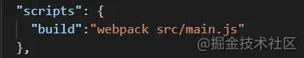

执行`npm run build`，如果生成了一个dist文件夹，并且内部含有main.js说明已经打包成功了

### 1.2 开始我们自己的配置

上面的例子只是webpack自己默认的配置，下面我们要自定义一些配置
 新建一个`build`文件夹,里面新建一个`webpack.config.js`

```js
// webpack.config.js

const path = require('path');
module.exports = {
    mode:'development', // 开发模式
    entry: path.resolve(__dirname,'../src/main.js'),    // 入口文件
    output: {
        filename: 'output.js',      // 打包后的文件名称
        path: path.resolve(__dirname,'../dist')  // 打包后的目录
    }
}
```

更改我们的打包命令

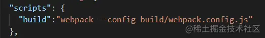


### 1.3 配置html模板

js文件打包好了,但是我们不可能每次在`html`文件中手动引入打包好的js

> 这里可能有的朋友会认为我们打包js文件名称不是一直是固定的嘛(output.js)？这样每次就不用改动引入文件名称了呀？实际上我们日常开发中往往会这样配置:

```
module.exports = {
    // 省略其他配置
    output: {
      filename: '[name].[hash:8].js',      // 打包后的文件名称
      path: path.resolve(__dirname,'../dist')  // 打包后的目录
    }
}
```

这时候生成的`dist`目录文件如下

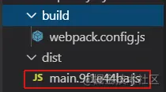

为了缓存，你会发现打包好的js文件的名称每次都不一样。webpack打包出来的js文件我们需要引入到html中，但是每次我们都手动修改js文件名显得很麻烦，因此我们需要一个插件来帮我们完成这件事情


```
npm i -D html-webpack-plugin
```

新建一个`build`同级的文件夹`public`,里面新建一个index.html
 具体配置文件如下

```
// webpack.config.js
const path = require('path');
const HtmlWebpackPlugin = require('html-webpack-plugin')
module.exports = {
    mode:'development', // 开发模式
    entry: path.resolve(__dirname,'../src/main.js'),    // 入口文件
    output: {
      filename: '[name].[hash:8].js',      // 打包后的文件名称
      path: path.resolve(__dirname,'../dist')  // 打包后的目录
    },
    plugins:[
      new HtmlWebpackPlugin({
        template:path.resolve(__dirname,'../public/index.html')
      })
    ]
}
复制代码
```

生成目录如下(图片)

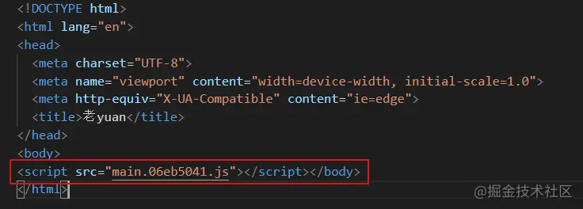

可以发现打包生成的js文件已经被自动引入html文件中


#### 1.3.1 多入口文件如何开发

> 生成多个html-webpack-plugin实例来解决这个问题

```
const path = require('path');
const HtmlWebpackPlugin = require('html-webpack-plugin')
module.exports = {
    mode:'development', // 开发模式
    entry: {
      main:path.resolve(__dirname,'../src/main.js'),
      header:path.resolve(__dirname,'../src/header.js')
  }, 
    output: {
      filename: '[name].[hash:8].js',      // 打包后的文件名称
      path: path.resolve(__dirname,'../dist')  // 打包后的目录
    },
    plugins:[
      new HtmlWebpackPlugin({
        template:path.resolve(__dirname,'../public/index.html'),
        filename:'index.html',
        chunks:['main'] // 与入口文件对应的模块名
      }),
      new HtmlWebpackPlugin({
        template:path.resolve(__dirname,'../public/header.html'),
        filename:'header.html',
        chunks:['header'] // 与入口文件对应的模块名
      }),
    ]
}

复制代码
```

此时会发现生成以下目录

[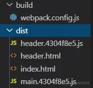](https://link.juejin.cn?target=https%3A%2F%2Fpostimg.cc%2F4m9c76yW)


#### 1.3.2 clean-webpack-plugin

> 每次执行npm run build 会发现dist文件夹里会残留上次打包的文件，这里我们推荐一个plugin来帮我们在打包输出前清空文件夹`clean-webpack-plugin`

```
const {CleanWebpackPlugin} = require('clean-webpack-plugin')
module.exports = {
    // ...省略其他配置
    plugins:[new CleanWebpackPlugin()]
}
复制代码
```

### 1.4 引用CSS

我们的入口文件是js，所以我们在入口js中引入我们的css文件

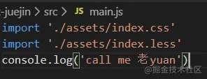

同时我们也**需要一些loader来解析我们的css文件**

```
npm i -D style-loader css-loader
```

如果我们使用less来构建样式，则需要多安装两个

```
npm i -D less less-loader
```

配置文件如下

```
// webpack.config.js
module.exports = {
    // ...省略其他配置
    module:{
      rules:[
        {
          test:/\.css$/,
          use:['style-loader','css-loader'] // 从右向左解析原则
        },
        {
          test:/\.less$/,
          use:['style-loader','css-loader','less-loader'] // 从右向左解析原则
        }
      ]
    }
} 
复制代码
```

浏览器打开`html`如下

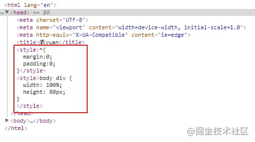


#### 1.4.1 为css添加浏览器前缀

```
npm i -D postcss-loader autoprefixer  
```

配置如下

```
// webpack.config.js
module.exports = {
    module:{
        rules:[
            {
                test:/\.less$/,
                use:['style-loader','css-loader','postcss-loader','less-loader'] // 从右向左解析原则
           }
        ]
    }
} 
复制代码
```

接下来，我们还需要引入`autoprefixer`使其生效,这里有两种方式

1，在项目根目录下创建一个`postcss.config.js`文件，配置如下：

```
module.exports = {
    plugins: [require('autoprefixer')]  // 引用该插件即可了
}

```

2，直接在`webpack.config.js`里配置

```
// webpack.config.js
module.exports = {
    //...省略其他配置
    module:{
        rules:[{
            test:/\.less$/,
            use:['style-loader','css-loader',{
                loader:'postcss-loader',
                options:{
                    plugins:[require('autoprefixer')]
                }
            },'less-loader'] // 从右向左解析原则
        }]
    }
}
复制代码
```

这时候我们发现css通过style标签的方式添加到了html文件中，但是如果样式文件很多，全部添加到html中，难免显得混乱。这时候我们想用把css拆分出来用外链的形式引入css文件怎么做呢？这时候我们就需要借助插件来帮助我们

#### 1.4.2 拆分css

```
npm i -D mini-css-extract-plugin
复制代码
```

> webpack 4.0以前，我们通过`extract-text-webpack-plugin`插件，把css样式从js文件中提取到单独的css文件中。webpack4.0以后，官方推荐使用`mini-css-extract-plugin`插件来打包css文件

配置文件如下

```
const MiniCssExtractPlugin = require("mini-css-extract-plugin");
module.exports = {
  //...省略其他配置
  module: {
    rules: [
      {
        test: /\.less$/,
        use: [
           MiniCssExtractPlugin.loader,
          'css-loader',
          'less-loader'
        ],
      }
    ]
  },
  plugins: [
    new MiniCssExtractPlugin({
        filename: "[name].[hash].css",
        chunkFilename: "[id].css",
    })
  ]
}
复制代码
```

#### 1.4.3 拆分多个css

> 这里需要说的细一点,上面我们所用到的`mini-css-extract-plugin`会将所有的css样式合并为一个css文件。如果你想拆分为一一对应的多个css文件,我们需要使用到`extract-text-webpack-plugin`，而目前`mini-css-extract-plugin`还不支持此功能。我们需要安装@next版本的`extract-text-webpack-plugin`

```
npm i -D extract-text-webpack-plugin@next
复制代码
// webpack.config.js

const path = require('path');
const ExtractTextWebpackPlugin = require('extract-text-webpack-plugin')
let indexLess = new ExtractTextWebpackPlugin('index.less');
let indexCss = new ExtractTextWebpackPlugin('index.css');
module.exports = {
    module:{
      rules:[
        {
          test:/\.css$/,
          use: indexCss.extract({
            use: ['css-loader']
          })
        },
        {
          test:/\.less$/,
          use: indexLess.extract({
            use: ['css-loader','less-loader']
          })
        }
      ]
    },
    plugins:[
      indexLess,
      indexCss
    ]
}
复制代码
```

### 1.5 打包 图片、字体、媒体、等文件

`file-loader`就是将文件在进行一些处理后（主要是处理文件名和路径、解析文件url），并**将文件移动到输出的目录中**
 `url-loader` 一般与`file-loader`搭配使用，功能与 file-loader 类似，**如果文件小于设置好的限制大小，则会返回 base64 编码；否则使用 file-loader 将文件移动到输出的目录中**

```
// webpack.config.js
module.exports = {
  // 省略其它配置 ...
  module: {
    rules: [
      // ...
      {
        test: /\.(jpe?g|png|gif)$/i, //图片文件
        use: [
          {
            loader: 'url-loader',
            options: {
              limit: 10240,
              fallback: {
                loader: 'file-loader',
                options: {
                    name: 'img/[name].[hash:8].[ext]'
                }
              }
            }
          }
        ]
      },
      {
        test: /\.(mp4|webm|ogg|mp3|wav|flac|aac)(\?.*)?$/, //媒体文件
        use: [
          {
            loader: 'url-loader',
            options: {
              limit: 10240,
              fallback: {
                loader: 'file-loader',
                options: {
                  name: 'media/[name].[hash:8].[ext]'
                }
              }
            }
          }
        ]
      },
      {
        test: /\.(woff2?|eot|ttf|otf)(\?.*)?$/i, // 字体
        use: [
          {
            loader: 'url-loader',
            options: {
              limit: 10240,
              fallback: {
                loader: 'file-loader',
                options: {
                  name: 'fonts/[name].[hash:8].[ext]'
                }
              }
            }
          }
        ]
      },
    ]
  }
}
复制代码
```

### 1.6 用babel转义js文件


为了使我们的js代码兼容更多的环境我们需要安装依赖

```
npm i -D babel-loader @babel/preset-env @babel/core
```

- 注意 `babel-loader`与`babel-core`的版本对应关系

1. `babel-loader` 8.x 对应`babel-core` 7.x
2. `babel-loader` 7.x 对应`babel-core` 6.x 
    配置如下

```
// webpack.config.js
module.exports = {
    // 省略其它配置 ...
    module:{
        rules:[
          {
            test:/\.js$/,
            use:{
              loader:'babel-loader',
              options:{
                presets:['@babel/preset-env']
              }
            },
            exclude:/node_modules/
          },
       ]
    }
}
复制代码
```

上面的`babel-loader`只会将 ES6/7/8语法转换为ES5语法，但是对新api并不会转换 例如(promise、Generator、Set、Maps、Proxy等)
 此时我们需要借助babel-polyfill来帮助我们转换

```
npm i @babel/polyfill
复制代码
// webpack.config.js
const path = require('path')
module.exports = {
    entry: ["@babel/polyfill",path.resolve(__dirname,'../src/index.js')],    // 入口文件
}
复制代码
```


我们可以在 `.babelrc` 中编写 `babel` 的配置，也可以在 `webpack.config.js` 中进行配置。

#### 创建一个 .babelrc

配置如下：

```
{
    "presets": ["@babel/preset-env"],
    "plugins": [
        [
            "@babel/plugin-transform-runtime",
            {
                "corejs": 3
            }
        ]
    ]
}
复制代码
```

现在，我们重新执行  `npx webpack --mode=development`，查看 `dist/main.js`，会发现已经被编译成了低版本的JS代码。

#### 在webpack中配置 babel

```
//webpack.config.js
module.exports = {
    // mode: 'development',
    module: {
        rules: [
            {
                test: /\.jsx?$/,
                use: {
                    loader: 'babel-loader',
                    options: {
                        presets: ["@babel/preset-env"],
                        plugins: [
                            [
                                "@babel/plugin-transform-runtime",
                                {
                                    "corejs": 3
                                }
                            ]
                        ]
                    }
                },
                exclude: /node_modules/
            }
        ]
    }
}
复制代码
```

这里有几点需要说明：

- `loader` 需要配置在 `module.rules` 中，`rules` 是一个数组。
- `loader` 的格式为:

```
{
    test: /\.jsx?$/,//匹配规则
    use: 'babel-loader'
}
复制代码
```

或者也可以像下面这样:

```
//适用于只有一个 loader 的情况
{
    test: /\.jsx?$/,
    loader: 'babel-loader',
    options: {
        //...
    }
}
复制代码
```

`test` 字段是匹配规则，针对符合规则的文件进行处理。

`use` 字段有几种写法

- 可以是一个字符串，例如上面的 `use: 'babel-loader'`
- `use` 字段可以是一个数组，例如处理CSS文件是，`use: ['style-loader', 'css-loader']`
- `use` 数组的每一项既可以是字符串也可以是一个对象，当我们需要在`webpack` 的配置文件中对 `loader` 进行配置，就需要将其编写为一个对象，并且在此对象的 `options` 字段中进行配置，如：

```
rules: [
    {
        test: /\.jsx?$/,
        use: {
            loader: 'babel-loader',
            options: {
                presets: ["@babel/preset-env"]
            }
        },
        exclude: /node_modules/
    }
]
复制代码
```

上面我们说了如何将JS的代码编译成向下兼容的代码，当然你可以还需要一些其它的 `babel` 的插件和预设，例如 `@babel/preset-react`，`@babel/plugin-proposal-optional-chaining` 等，不过，`babel` 的配置并非本文的重点，我们继续往下。

不要说细心的小伙伴了，即使是粗心的小伙伴肯定也发现了，我们在使用 `webpack` 进行打包的时候，一直运行的都是 `npx webpack --mode=development` 是否可以将 `mode` 配置在 `webpack.config.js` 中呢？显然是可以的。


作者：刘小夕
链接：https://juejin.cn/post/6844904079219490830
来源：稀土掘金
著作权归作者所有。商业转载请联系作者获得授权，非商业转载请注明出处。


## 2 搭建vue开发环境

上面的小例子已经帮助而我们实现了打包css、图片、js、html等文件。 但是我们还需要以下几种配置

#### 2.1 解析.vue文件

```
npm i -D vue-loader vue-template-compiler vue-style-loader
npm i -S vue
复制代码
```

`vue-loader` 用于解析`.vue`文件
 `vue-template-compiler` 用于编译模板 配置如下

```
const vueLoaderPlugin = require('vue-loader/lib/plugin')
module.exports = {
    module:{
        rules:[{
            test:/\.vue$/,
            use:['vue-loader']
        },]
     },
    resolve:{
        alias:{
          'vue$':'vue/dist/vue.runtime.esm.js',
          ' @':path.resolve(__dirname,'../src')
        },
        extensions:['*','.js','.json','.vue']
   },
   plugins:[
        new vueLoaderPlugin()
   ]
}
复制代码
```

#### 2.2 配置webpack-dev-server进行热更新

```
npm i -D webpack-dev-server
复制代码
```

配置如下

```
const Webpack = require('webpack')
module.exports = {
  // ...省略其他配置
  devServer:{
    port:3000,
    hot:true,
    contentBase:'../dist'
  },
  plugins:[
    new Webpack.HotModuleReplacementPlugin()
  ]
}
复制代码
```

完整配置如下

```
// webpack.config.js
const path = require('path');
const {CleanWebpackPlugin} = require('clean-webpack-plugin')
const HtmlWebpackPlugin = require('html-webpack-plugin')
const MiniCssExtractPlugin = require("mini-css-extract-plugin");
const ExtractTextWebpackPlugin = require('extract-text-webpack-plugin')
const vueLoaderPlugin = require('vue-loader/lib/plugin')
const Webpack = require('webpack')
module.exports = {
    mode:'development', // 开发模式
    entry: {
      main:path.resolve(__dirname,'../src/main.js'),
    }, 
    output: {
      filename: '[name].[hash:8].js',      // 打包后的文件名称
      path: path.resolve(__dirname,'../dist')  // 打包后的目录
    },
    module:{
      rules:[
        {
          test:/\.vue$/,
          use:['vue-loader']
        },
        {
          test:/\.js$/,
          use:{
            loader:'babel-loader',
            options:{
              presets:[
                ['@babel/preset-env']
              ]
            }
          }
        },
        {
          test:/\.css$/,
          use: ['vue-style-loader','css-loader',{
            loader:'postcss-loader',
            options:{
              plugins:[require('autoprefixer')]
            }
          }]
        },
        {
          test:/\.less$/,
          use: ['vue-style-loader','css-loader',{
            loader:'postcss-loader',
            options:{
              plugins:[require('autoprefixer')]
            }
          },'less-loader']
        }
      ]
    },
    resolve:{
      alias:{
        'vue$':'vue/dist/vue.runtime.esm.js',
        ' @':path.resolve(__dirname,'../src')
      },
      extensions:['*','.js','.json','.vue']
    },
    devServer:{
      port:3000,
      hot:true,
      contentBase:'../dist'
    },
    plugins:[
      new CleanWebpackPlugin(),
      new HtmlWebpackPlugin({
        template:path.resolve(__dirname,'../public/index.html'),
        filename:'index.html'
      }),
      new vueLoaderPlugin(),
      new Webpack.HotModuleReplacementPlugin()
    ]
}
复制代码
```

### 2.3 配置打包命令


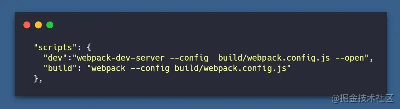

打包文件已经配置完毕，接下来让我们测试一下
 首先在src新建一个main.js

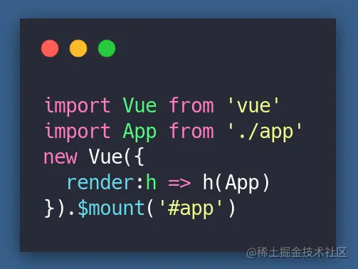

新建一个App.vue

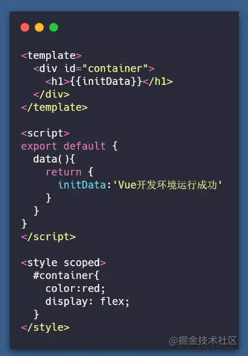

新建一个public文件夹，里面新建一个index.html

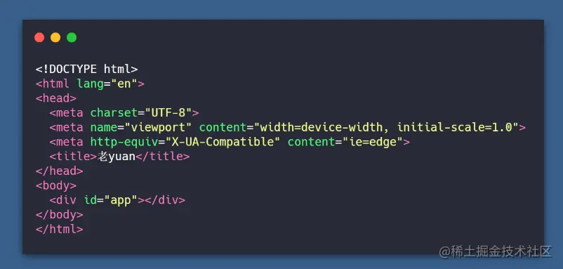

执行`npm run dev`这时候如果浏览器出现Vue开发环境运行成功，那么恭喜你，已经成功迈出了第一步


### 2.4 区分开发环境与生产环境

实际应用到项目中，我们需要区分开发环境与生产环境，我们在原来webpack.config.js的基础上再新增两个文件

- `webpack.dev.js`   开发环境配置文件

```
开发环境主要实现的是热更新,不要压缩代码，完整的sourceMap
复制代码
```

- `webpack.prod.js`  生产环境配置文件

```
生产环境主要实现的是压缩代码、提取css文件、合理的sourceMap、分割代码
需要安装以下模块:
npm i -D  webpack-merge copy-webpack-plugin optimize-css-assets-webpack-plugin uglifyjs-webpack-plugin
复制代码
```

- `webpack-merge` 合并配置
- `copy-webpack-plugin` 拷贝静态资源
- `optimize-css-assets-webpack-plugin` 压缩css
- `uglifyjs-webpack-plugin` 压缩js

> `webpack mode`设置`production`的时候会自动压缩js代码。原则上不需要引入`uglifyjs-webpack-plugin`进行重复工作。但是`optimize-css-assets-webpack-plugin`压缩css的同时会破坏原有的js压缩，所以这里我们引入`uglifyjs`进行压缩

#### 2.4.1 webpack.config.js

```
const path = require('path')
const {CleanWebpackPlugin} = require('clean-webpack-plugin')
const HtmlWebpackPlugin = require('html-webpack-plugin')
const vueLoaderPlugin = require('vue-loader/lib/plugin')
const MiniCssExtractPlugin = require("mini-css-extract-plugin")
const devMode = process.argv.indexOf('--mode=production') === -1;
module.exports = {
  entry:{
    main:path.resolve(__dirname,'../src/main.js')
  },
  output:{
    path:path.resolve(__dirname,'../dist'),
    filename:'js/[name].[hash:8].js',
    chunkFilename:'js/[name].[hash:8].js'
  },
  module:{
    rules:[
      {
        test:/\.js$/,
        use:{
          loader:'babel-loader',
          options:{
            presets:['@babel/preset-env']
          }
        },
        exclude:/node_modules/
      },
      {
        test:/\.vue$/,
        use:[{
          loader:'vue-loader',
          options:{
            compilerOptions:{
              preserveWhitespace:false
            }
          }
        }]
      },
      {
        test:/\.css$/,
        use:[{
          loader: devMode ? 'vue-style-loader' : MiniCssExtractPlugin.loader,
          options:{
            publicPath:"../dist/css/",
            hmr:devMode
          }
        },'css-loader',{
          loader:'postcss-loader',
          options:{
            plugins:[require('autoprefixer')]
          }
        }]
      },
      {
        test:/\.less$/,
        use:[{
          loader:devMode ? 'vue-style-loader' : MiniCssExtractPlugin.loader,
          options:{
            publicPath:"../dist/css/",
            hmr:devMode
          }
        },'css-loader','less-loader',{
          loader:'postcss-loader',
          options:{
            plugins:[require('autoprefixer')]
          }
        }]
      },
      {
        test:/\.(jep?g|png|gif)$/,
        use:{
          loader:'url-loader',
          options:{
            limit:10240,
            fallback:{
              loader:'file-loader',
              options:{
                name:'img/[name].[hash:8].[ext]'
              }
            }
          }
        }
      },
      {
        test:/\.(mp4|webm|ogg|mp3|wav|flac|aac)(\?.*)?$/,
        use:{
          loader:'url-loader',
          options:{
            limit:10240,
            fallback:{
              loader:'file-loader',
              options:{
                name:'media/[name].[hash:8].[ext]'
              }
            }
          }
        }
      },
      {
        test:/\.(woff2?|eot|ttf|otf)(\?.*)?$/i,
        use:{
          loader:'url-loader',
          options:{
            limit:10240,
            fallback:{
              loader:'file-loader',
              options:{
                name:'media/[name].[hash:8].[ext]'
              }
            }
          }
        }
      }
    ]
  },
  resolve:{
    alias:{
      'vue$':'vue/dist/vue.runtime.esm.js',
      ' @':path.resolve(__dirname,'../src')
    },
    extensions:['*','.js','.json','.vue']
  },
  plugins:[
    new CleanWebpackPlugin(),
    new HtmlWebpackPlugin({
      template:path.resolve(__dirname,'../public/index.html')
    }),
    new vueLoaderPlugin(),
    new MiniCssExtractPlugin({
      filename: devMode ? '[name].css' : '[name].[hash].css',
      chunkFilename: devMode ? '[id].css' : '[id].[hash].css'
    })
  ]
}
复制代码
```

#### 2.4.2 webpack.dev.js

```
const Webpack = require('webpack')
const webpackConfig = require('./webpack.config.js')
const WebpackMerge = require('webpack-merge')
module.exports = WebpackMerge(webpackConfig,{
  mode:'development',
  devtool:'cheap-module-eval-source-map',
  devServer:{
    port:3000,
    hot:true,
    contentBase:'../dist'
  },
  plugins:[
    new Webpack.HotModuleReplacementPlugin()
  ]
})
复制代码
```

#### 2.4.3 webpack.prod.js

```
const path = require('path')
const webpackConfig = require('./webpack.config.js')
const WebpackMerge = require('webpack-merge')
const CopyWebpackPlugin = require('copy-webpack-plugin')
const OptimizeCssAssetsPlugin = require('optimize-css-assets-webpack-plugin')
const UglifyJsPlugin = require('uglifyjs-webpack-plugin')
module.exports = WebpackMerge(webpackConfig,{
  mode:'production',
  devtool:'cheap-module-source-map',
  plugins:[
    new CopyWebpackPlugin([{
      from:path.resolve(__dirname,'../public'),
      to:path.resolve(__dirname,'../dist')
    }]),
  ],
  optimization:{
    minimizer:[
      new UglifyJsPlugin({//压缩js
        cache:true,
        parallel:true,
        sourceMap:true
    }),
    new OptimizeCssAssetsPlugin({})
    ],
    splitChunks:{
      chunks:'all',
      cacheGroups:{
        libs: {
          name: "chunk-libs",
          test: /[\\/]node_modules[\\/]/,
          priority: 10,
          chunks: "initial" // 只打包初始时依赖的第三方
        }
      }
    }
  }
})
复制代码
```

