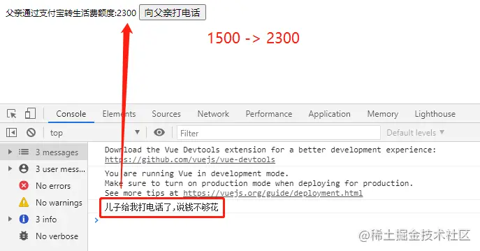
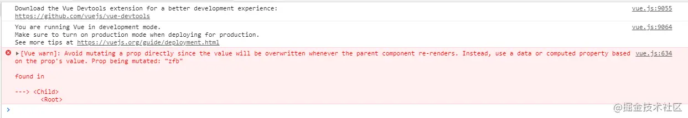

# Vue的反向传值 ($emit事件)

# 首先介绍一下什么叫单项数据流？

　　我们都知道在Vue中组件之间是单项数据流的，规定子组件不可以直接访问父组件的数据，只能通过props属性让父组件把数据传递给子组件。并且子组件不可以直接修改父组件传递给子组件的数据。（props是只读的）

　　有了大概了解之后直接上代码看看怎么使用。

```js
<div id="app">
        <h2>{{age}}</h2>
        <my-label v-bind:a="age" b="hello" :c="age >= 18?'已成年':'未成年'"/>
    </div>

 <script>
        new Vue({
            el: '#app',
            data: {
                age: 15
            },
            components: {
                'my-label': {
                    // 给当前my-label设置了三个自定义属性a b c
                    // 组件组件自身就可以通过 this.props.a
                    props: ['a','b','c'],
                    data: () => ({
                        name: 'my-label'
                    }),
                    template: `
                    <div>
                        <p>a:{{a}}</p>
                        <p>b:{{b}}</p>
                        <p>c:{{c}}</p>
                        <child-a v-bind:name="name" :rootage="a"></child-a>
                    </div>
                    `,
                    components: {
                        'child-a': {
                            props: ['name','rootage'],
                            template: '<div>我是childA 父组件的name为{{name}} rootAge{{rootage}}</div>'
                        }
                    }
                }
            }
        })
    </script>
复制代码
```

　　通过上述代码我们可以知道new Vue() 就是父组件，data中的age通过props传递到子组件中，使用的使用就要通过v-bind（缩写就是一个冒号 : ）绑定到组件标签上。这样就可以拿到父组件里的数据。但是数据是只读的，不能直接修改。那这时候就有个疑问，我们又想修改呢？那该怎么办，对吧！所以就有了反向传值这个概念。那接下来我们看看什么是反向传值！！！

# 反向传值

　　概念：因为Vue是单项数据流的,规定只允许父组件向子组件传递状态,而不允许子组件直接修改父组件传递过来的状态。Vue提供了自定义事件API,通过父组件监听子组件自定义事件, 当子组件想要修改父组件的状态时会通过$emit方法触发自定义事件。父组件对应监听子组件自定义事件的回调函数就会被触发，这样父组件自身的方法就会相应的去修改自身的状态。子组件的props就会更新

```
语法： $emit('自定义事件名', 向父组件回调函数传递参数)
注意: $emit只接受两个参数:参数一触发父组件监听的指定事件名（自定义）,参数二(可选)向父组件监听事件回调函数传递的参数
```

接下来模拟一个情景： 儿子问父亲拿生活费，原本一个月的生活费是1500，之后发现1500不够花了。这时候是不是得打电话给父亲说我零花钱不够了，要加钱，父亲才能给你。对吧！那这时候是怎么一个过程呢？首先不够了是不是得问父亲拿，那你不能直接拿呀，钱是父亲的不是你的，问了之后他才给你对不对。严格意义上不问直接拿就是偷钱了，当然你们关系好经常这样干那也没办法啊！然后通过什么方式呢？是不是有现金，微信转账，支付宝转账等方式呀！那父亲肯定是包含儿子的吧，你有什么事就给我绑定什么事件，在这个情景的话就比如说生活费不够花了这个事件，父亲接到你的电话说不够了才能做下一步操作。

那么换成代码 $emit() 就帮我们干了这件事，通过一个手段来变更数据。重点来了，那我们既然有了这个情景，就换成代码来实现。

```js
<div id="father">
        <child :zfb="money" @call="callHandel"/>
 </div>

    <script>
    // 父组件通过props传递的值都是只读属性，而不能直接修改的
    // vue子组件不能修改父组件props的值,否则在控制台中会报错
    // 不能在子组件内部修改props中zfb的值
        new Vue({
            el:'#father',
            data: {
                money: 1500
            },
            methods: {
                // 调用方法 （加生活费的操作）
                callHandel(m) {
                    // m 在原本的基础上加多少
                    console.log('儿子给我打电话了,说钱不够花')
                    this.money += m
                }
            },
            components: {
                'child': {
                    props: ['zfb'],
                    template: `
                    <div>
                        父亲通过支付宝转生活费额度:{{zfb}}
                        <button @click="$emit('call',800)">向父亲打电话</button>
                    </div>
                `
                },

            }
        })
    </script>
复制代码
```

　　图示：



　　 `结果：通过截图我们可以知道，点一次就加800，$emit()帮我们实现了反向修改原本props传递过来的1500变成了2300`

可能会有疑问：emit('call',800)" 中的800去哪里了呢？ 这里的800就是上面说的*e**m**i**t*(′*c**a**l**l*′,800)"中的800去哪里了呢？这里的800就是上面说的emit()的第二个参数，我们在子组件里使用了$emit()绑定了一个叫call的事件。换成刚刚那个情景的意思就是你是不是得打电话告诉父亲说生活费不够了，父亲接收到了才能给你加吧！所以在使用的时候
`<child :zfb="money" @call="callHandel"/>` @call绑定了就调用callHandel方法进行给你加生活费的操作。最后你就拿到了新的生活费，整个流程就结束了。

那这时候又有小伙伴问了你凭什么就说$emit()可以改，而props传过来的不能直接改？那我们来个对比！只需修改一部分代码就可以看出效果！

那我们修改一下template里的代码

```js
template: `
       <div>
            父亲通过支付宝转生活费额度:{{zfb}}
            <button @click="zfb+=800">向父亲打电话</button> // 更改之前 <button @click="$emit('call',800)">向父亲打电话</button>
       </div>
    `
复制代码
```

当我点击按钮的时候出现了以下报错信息



　　大概意思是：通过props传递给子组件的zfb，不能在子组件内部修改props中的zfb值。那我们就知道不能更改 prop使其和父组件同步 , 而是让应该这个组件提交个事件给父组件，可以用 watch 变量，如果变量发生改变就$emit()事件。

```
总结：通过对比我们就得出了当我们需要双向改变值的时候就要用到反向传值(子组件需要改变父组件的属性或状态)。
```

总结：通过对比我们就得出了当我们需要双向改变值的时候就要用到反向传值(子组件需要改变父组件的属性或状态)。