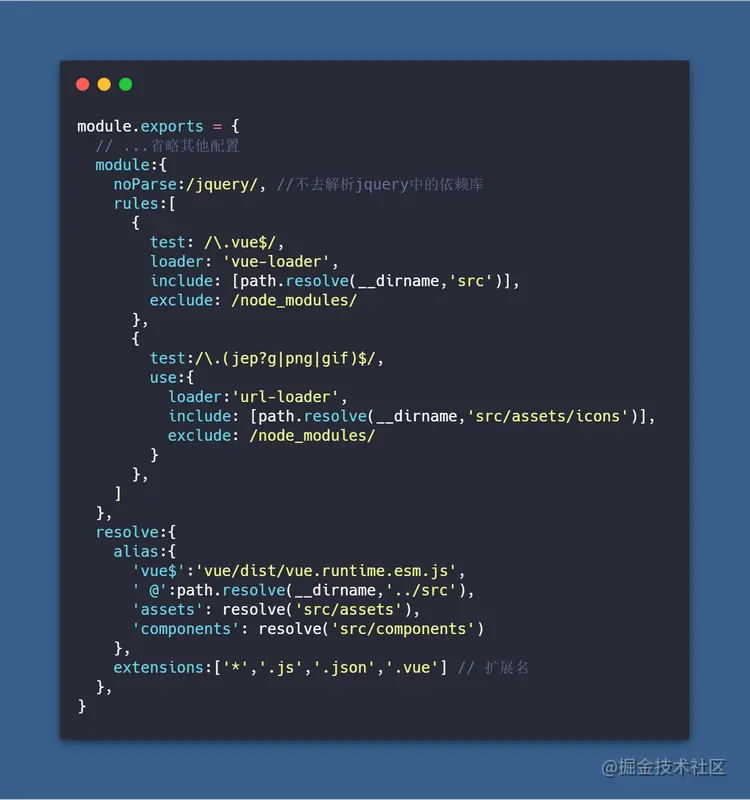
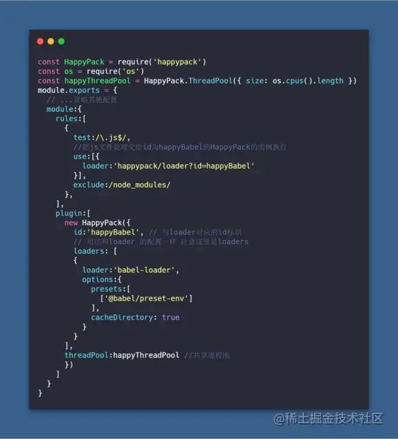
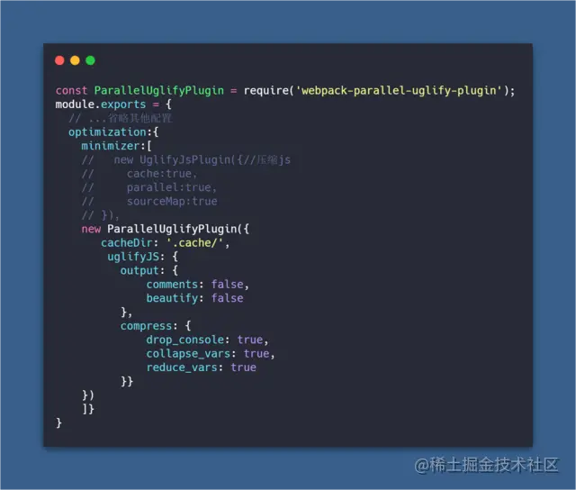
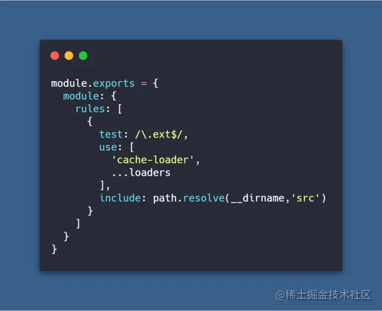
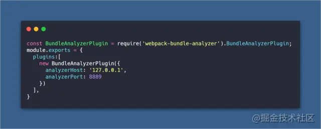

## 2.5 优化webpack配置

看到这里你或许有些累了，但是要想获取更好的offer,更高的薪水，下面必须继续深入

[](https://link.juejin.cn?target=https%3A%2F%2Fpostimg.cc%2FZCRcC9tS)

优化配置对我们来说非常有实际意义，这实际关系到你打包出来文件的大小，打包的速度等。 具体优化可以分为以下几点：


### 2.5.1 优化打包速度

> 构建速度指的是我们每次修改代码后热更新的速度以及发布前打包文件的速度。

#### 2.5.1.1 合理的配置mode参数与devtool参数

`mode`可设置`development`` production`两个参数
 如果没有设置，`webpack4` 会将 `mode` 的默认值设置为 `production` 
 `production`模式下会进行`tree shaking`(去除无用代码)和`uglifyjs`(代码压缩混淆)

#### 2.5.1.2 缩小文件的搜索范围(配置include exclude alias noParse extensions)

- `alias`: 当我们代码中出现 `import 'vue'`时， webpack会采用向上递归搜索的方式去`node_modules` 目录下找。为了减少搜索范围我们可以直接告诉webpack去哪个路径下查找。也就是别名(`alias`)的配置。

- `include exclude` 同样配置`include exclude`也可以减少`webpack loader`的搜索转换时间。

- `noParse ` 当我们代码中使用到`import jq from 'jquery'`时，`webpack`会去解析jq这个库是否有依赖其他的包。但是我们对类似`jquery`这类依赖库，一般会认为不会引用其他的包(特殊除外,自行判断)。增加`noParse`属性,告诉`webpack`不必解析，以此增加打包速度。

- ```
  extensions 
  ```

  ```
  webpack
  ```

  会根据

  ```
  extensions
  ```

  定义的后缀查找文件(频率较高的文件类型优先写在前面)

  

#### 2.5.1.3 使用HappyPack开启多进程Loader转换

> 在webpack构建过程中，实际上耗费时间大多数用在loader解析转换以及代码的压缩中。日常开发中我们需要使用Loader对js，css，图片，字体等文件做转换操作，并且转换的文件数据量也是非常大。由于js单线程的特性使得这些转换操作不能并发处理文件，而是需要一个个文件进行处理。HappyPack的基本原理是将这部分任务分解到多个子进程中去并行处理，子进程处理完成后把结果发送到主进程中，从而减少总的构建时间

```
npm i -D happypack
复制代码
```





#### 2.5.1.4 使用webpack-parallel-uglify-plugin  增强代码压缩

> 上面对于loader转换已经做优化，那么下面还有另一个难点就是优化代码的压缩时间。

```
npm i -D webpack-parallel-uglify-plugin
复制代码
```





#### 2.5.1.5 抽离第三方模块

> 对于开发项目中不经常会变更的静态依赖文件。类似于我们的`elementUi、vue`全家桶等等。因为很少会变更，所以我们不希望这些依赖要被集成到每一次的构建逻辑中去。 这样做的好处是每次更改我本地代码的文件的时候，`webpack`只需要打包我项目本身的文件代码，而不会再去编译第三方库。以后只要我们不升级第三方包的时候，那么`webpack`就不会对这些库去打包，这样可以快速的提高打包的速度。

这里我们使用`webpack`内置的`DllPlugin DllReferencePlugin`进行抽离
 在与`webpack`配置文件同级目录下新建`webpack.dll.config.js` 代码如下

```
// webpack.dll.config.js
const path = require("path");
const webpack = require("webpack");
module.exports = {
  // 你想要打包的模块的数组
  entry: {
    vendor: ['vue','element-ui'] 
  },
  output: {
    path: path.resolve(__dirname, 'static/js'), // 打包后文件输出的位置
    filename: '[name].dll.js',
    library: '[name]_library' 
     // 这里需要和webpack.DllPlugin中的`name: '[name]_library',`保持一致。
  },
  plugins: [
    new webpack.DllPlugin({
      path: path.resolve(__dirname, '[name]-manifest.json'),
      name: '[name]_library', 
      context: __dirname
    })
  ]
};
复制代码
```

在`package.json`中配置如下命令

```
"dll": "webpack --config build/webpack.dll.config.js"
复制代码
```

接下来在我们的`webpack.config.js`中增加以下代码

```
module.exports = {
  plugins: [
    new webpack.DllReferencePlugin({
      context: __dirname,
      manifest: require('./vendor-manifest.json')
    }),
    new CopyWebpackPlugin([ // 拷贝生成的文件到dist目录 这样每次不必手动去cv
      {from: 'static', to:'static'}
    ]),
  ]
};
复制代码
```

执行

```
npm run dll
复制代码
```

会发现生成了我们需要的集合第三地方 代码的`vendor.dll.js` 我们需要在`html`文件中手动引入这个`js`文件

```
<!DOCTYPE html>
<html lang="en">
<head>
  <meta charset="UTF-8">
  <meta name="viewport" content="width=device-width, initial-scale=1.0">
  <meta http-equiv="X-UA-Compatible" content="ie=edge">
  <title>老yuan</title>
  <script src="static/js/vendor.dll.js"></script>
</head>
<body>
  <div id="app"></div>
</body>
</html>
复制代码
```

这样如果我们没有更新第三方依赖包，就不必`npm run dll`。直接执行`npm run dev npm run build`的时候会发现我们的打包速度明显有所提升。因为我们已经通过`dllPlugin`将第三方依赖包抽离出来了。

#### 2.5.1.6 配置缓存

> 我们每次执行构建都会把所有的文件都重复编译一遍，这样的重复工作是否可以被缓存下来呢，答案是可以的，目前大部分 `loader` 都提供了`cache` 配置项。比如在 `babel-loader` 中，可以通过设置`cacheDirectory` 来开启缓存，`babel-loader?cacheDirectory=true` 就会将每次的编译结果写进硬盘文件（默认是在项目根目录下的`node_modules/.cache/babel-loader`目录内，当然你也可以自定义）

但如果 `loader` 不支持缓存呢？我们也有方法,我们可以通过`cache-loader` ，它所做的事情很简单，就是 `babel-loader` 开启 `cache `后做的事情，将 `loader` 的编译结果写入硬盘缓存。再次构建会先比较一下，如果文件较之前的没有发生变化则会直接使用缓存。使用方法如官方 demo 所示，在一些性能开销较大的 loader 之前添加此 loader即可

```
npm i -D cache-loader
复制代码
```





### 2.5.2 优化打包文件体积

> 打包的速度我们是进行了优化，但是打包后的文件体积却是十分大，造成了页面加载缓慢，浪费流量等，接下来让我们从文件体积上继续优化

#### 2.5.2.1 引入webpack-bundle-analyzer分析打包后的文件

`webpack-bundle-analyzer`将打包后的内容束展示为方便交互的直观树状图，让我们知道我们所构建包中真正引入的内容

```
npm i -D webpack-bundle-analyzer
复制代码
```




接下来在`package.json`里配置启动命令


```
"analyz": "NODE_ENV=production npm_config_report=true npm run build" 
复制代码
```

windows请安装`npm i -D cross-env`

```
"analyz": "cross-env NODE_ENV=production npm_config_report=true npm run build" 
复制代码
```

接下来`npm run analyz`浏览器会自动打开文件依赖图的网页

#### 2.5.2.3 externals

> 按照官方文档的解释，如果我们想引用一个库，但是又不想让`webpack`打包，并且又不影响我们在程序中以`CMD、AMD`或者`window/global`全局等方式进行使用，那就可以通过配置`Externals`。这个功能主要是用在创建一个库的时候用的，但是也可以在我们项目开发中充分使用 `Externals`的方式，我们将这些不需要打包的静态资源从构建逻辑中剔除出去，而使用 `CDN` 的方式，去引用它们。

有时我们希望我们通过`script`引入的库，如用CDN的方式引入的`jquery`，我们在使用时，依旧用`require`的方式来使用，但是却不希望`webpack`将它又编译进文件中。这里官网案例已经足够清晰明了，大家有兴趣可以点击了解  

[webpack](https://link.juejin.cn?target=https%3A%2F%2Fwebpack.js.org%2Fconfiguration%2Fexternals%2F%23root) 官网案例如下

```
<script
  src="https://code.jquery.com/jquery-3.1.0.js"
  integrity="sha256-slogkvB1K3VOkzAI8QITxV3VzpOnkeNVsKvtkYLMjfk="
  crossorigin="anonymous">
</script>
复制代码
module.exports = {
  //...
  externals: {
    jquery: 'jQuery'
  }
};
复制代码
import $ from 'jquery';
$('.my-element').animate(/* ... */);
复制代码
```

#### 2.5.2.3 Tree-shaking

> 这里单独提一下`tree-shaking`,是因为这里有个坑。`tree-shaking`的主要作用是用来清除代码中无用的部分。目前在`webpack4` 我们设置`mode`为`production`的时候已经自动开启了`tree-shaking`。但是要想使其生效，生成的代码必须是ES6模块。不能使用其它类型的模块如`CommonJS`之流。如果使用`Babel`的话，这里有一个小问题，因为`Babel`的预案（preset）默认会将任何模块类型都转译成`CommonJS`类型，这样会导致`tree-shaking`失效。修正这个问题也很简单，在`.babelrc`文件或在`webpack.config.js`文件中设置`modules： false`就好了

```
// .babelrc
{
  "presets": [
    ["@babel/preset-env",
      {
        "modules": false
      }
    ]
  ]
}
复制代码
```

或者

```
// webpack.config.js

module: {
    rules: [
        {
            test: /\.js$/,
            use: {
                loader: 'babel-loader',
                options: {
                    presets: ['@babel/preset-env', { modules: false }]
                }
            }，
            exclude: /(node_modules)/
        }
    ]
}
复制代码
```

> 经历过上面两个系列的洗礼，到现在我们成为了一名合格的webpack配置工程师。但是光拧螺丝，自身的可替代性还是很高，下面我们将深入webpack的原理中去


## 3 手写webpack系列

> 经历过上面两个部分，我们已经可以熟练的运用相关的loader和plugin对我们的代码进行转换、解析。接下来我们自己手动实现loader与plugin，使其在平时的开发中获得更多的乐趣。

### 3.1 手写webpack loader

> `loader`从本质上来说其实就是一个`node`模块。相当于一台榨汁机`(loader)`将相关类型的文件代码`(code)`给它。根据我们设置的规则，经过它的一系列加工后还给我们加工好的果汁`(code)`。

`loader`编写原则

- 单一原则: 每个 `Loader` 只做一件事；
- 链式调用: `Webpack` 会按顺序链式调用每个 `Loader`；
- 统一原则: 遵循 `Webpack` 制定的设计规则和结构，输入与输出均为字符串，各个 `Loader` 完全独立，即插即用；

在日常开发环境中，为了方便调试我们往往会加入许多`console`打印。但是我们不希望在生产环境中存在打印的值。那么这里我们自己实现一个`loader`去除代码中的`console`

> 知识点普及之`AST`。`AST`通俗的来说，假设我们有一个文件`a.js`,我们对`a.js`里面的1000行进行一些操作处理,比如为所有的`await` 增加`try catch`,以及其他操作，但是`a.js`里面的代码本质上来说就是一堆字符串。那我们怎么办呢，那就是转换为带标记信息的对象(抽象语法树)我们方便进行增删改查。这个带标记的对象(抽象语法树)就是`AST`。这里推荐一篇不错的AST文章 [AST快速入门](https://link.juejin.cn?target=https%3A%2F%2Fsegmentfault.com%2Fa%2F1190000016231512)

```
npm i -D @babel/parser @babel/traverse @babel/generator @babel/types
复制代码
```

- `@babel/parser` 将源代码解析成 `AST`
- `@babel/traverse` 对`AST`节点进行递归遍历，生成一个便于操作、转换的`path`对象
- `@babel/generator` 将`AST`解码生成`js`代码
- `@babel/types`通过该模块对具体的`AST`节点进行进行增、删、改、查

新建`drop-console.js`

```
const parser = require('@babel/parser')
const traverse = require('@babel/traverse').default
const generator = require('@babel/generator').default
const t = require('@babel/types')
module.exports=function(source){
  const ast = parser.parse(source,{ sourceType: 'module'})
  traverse(ast,{
    CallExpression(path){ 
      if(t.isMemberExpression(path.node.callee) && t.isIdentifier(path.node.callee.object, {name: "console"})){
        path.remove()
      }
    }
  })
  const output = generator(ast, {}, source);
  return output.code
}
复制代码
```

如何使用

```
const path = require('path')
module.exports = {
  mode:'development',
  entry:path.resolve(__dirname,'index.js'),
  output:{
    filename:'[name].[contenthash].js',
    path:path.resolve(__dirname,'dist')
  },
  module:{
    rules:[{
      test:/\.js$/,
      use:path.resolve(__dirname,'drop-console.js')
      }
    ]
  }
}
复制代码
```

> 实际上在`webpack4`中已经集成了去除`console`功能，在`minimizer`中可配置 [去除console](https://link.juejin.cn?target=https%3A%2F%2Fwebpack.js.org%2Fplugins%2Fterser-webpack-plugin%2F%23root)

附上官网 [如何编写一个loader ](https://link.juejin.cn?target=https%3A%2F%2Fwebpack.docschina.org%2Fcontribute%2Fwriting-a-loader%2F)

### 3.2 手写webpack plugin

> 在 `Webpack` 运行的生命周期中会广播出许多事件，`Plugin` 可以监听这些事件，在合适的时机通过`Webpack`提供的`API`改变输出结果。通俗来说：一盘美味的 [盐豆炒鸡蛋](https://link.juejin.cn?target=https%3A%2F%2Fwww.meishij.net%2Fzuofa%2Fyandouchaojidan.html) 需要经历烧油 炒制 调味到最后的装盘等过程，而`plugin`相当于可以监控每个环节并进行操作，比如可以写一个少放胡椒粉`plugin`,监控`webpack`暴露出的生命周期事件(调味)，在调味的时候执行少放胡椒粉操作。那么它与`loader`的区别是什么呢？上面我们也提到了`loader`的单一原则,`loader`只能一件事，比如说`less-loader`,只能解析`less`文件，`plugin`则是针对整个流程执行广泛的任务。

一个基本的plugin插件结构如下

```
class firstPlugin {
  constructor (options) {
    console.log('firstPlugin options', options)
  }
  apply (compiler) {
    compiler.plugin('done', compilation => {
      console.log('firstPlugin')
    ))
  }
}

module.exports = firstPlugin
复制代码
```

> compiler 、compilation是什么？

- `compiler` 对象包含了`Webpack` 环境所有的的配置信息。这个对象在启动 `webpack` 时被一次性建立，并配置好所有可操作的设置，包括 `options`，`loader` 和 `plugin`。当在 `webpack` 环境中应用一个插件时，插件将收到此 `compiler` 对象的引用。可以使用它来访问 `webpack` 的主环境。
- `compilation`对象包含了当前的模块资源、编译生成资源、变化的文件等。当运行`webpack` 开发环境中间件时，每当检测到一个文件变化，就会创建一个新的 `compilation`，从而生成一组新的编译资源。`compilation` 对象也提供了很多关键时机的回调，以供插件做自定义处理时选择使用。

**compiler和 compilation的区别在于** 

- compiler代表了整个webpack从启动到关闭的生命周期，而compilation 只是代表了一次新的编译过程
- compiler和compilation暴露出许多钩子，我们可以根据实际需求的场景进行自定义处理

[compiler钩子文档](https://link.juejin.cn?target=https%3A%2F%2Fwww.webpackjs.com%2Fapi%2Fcompiler-hooks%2F)

[compilation钩子文档](https://link.juejin.cn?target=https%3A%2F%2Fwww.webpackjs.com%2Fapi%2Fcompilation-hooks%2F)

下面我们手动开发一个简单的需求,在生成打包文件之前自动生成一个关于打包出文件的大小信息

新建一个`webpack-firstPlugin.js`

```
class firstPlugin{
  constructor(options){
    this.options = options
  }
  apply(compiler){
    compiler.plugin('emit',(compilation,callback)=>{
      let str = ''
      for (let filename in compilation.assets){
        str += `文件:${filename}  大小${compilation.assets[filename]['size']()}\n`
      }
      // 通过compilation.assets可以获取打包后静态资源信息，同样也可以写入资源
      compilation.assets['fileSize.md'] = {
        source:function(){
          return str
        },
        size:function(){
          return str.length
        }
      }
      callback()
    })
  }
}
module.exports = firstPlugin
复制代码
```

如何使用

```
const path = require('path')
const firstPlugin = require('webpack-firstPlugin.js')
module.exports = {
    // 省略其他代码
    plugins:[
        new firstPlugin()
    ]
}
复制代码
```

执行 `npm run build`即可看到在`dist`文件夹中生成了一个包含打包文件信息的`fileSize.md`

> 上面两个`loader`与`plugin`案例只是一个引导，实际开发需求中的`loader`与`plugin`要考虑的方面很多，建议大家自己多动手尝试一下。

附上官网 [如何编写一个plugin](https://link.juejin.cn?target=https%3A%2F%2Fwww.webpackjs.com%2Fcontribute%2Fwriting-a-plugin%2F)

### 3.3 手写webpack

> 由于篇幅过长，且原理深入较多。鉴于本篇以快速上手应用于实际开发的原则，这里决定另起一篇新的文章去详细剖析`webpack`原理以及实现一个`demo`版本。待格式校准后，将会贴出文章链接在下方