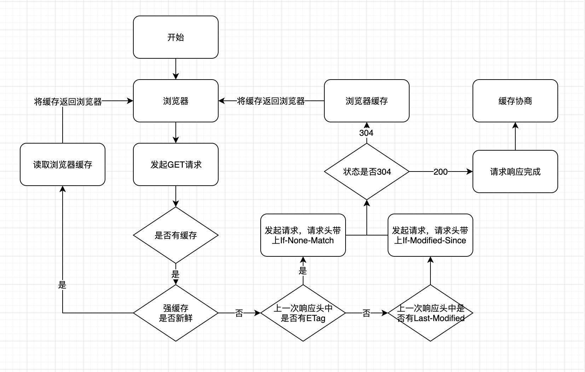

## 浏览器缓存

浏览器缓存分为两种，一种是强缓存，另一种是协商缓存。缓存的主要作用是加快资源获取速度，提升用户体验，减少网络传输，缓解服务端压力。具体流程图如下：




#### 一、强缓存

强缓存通过`Expires`和`Cache-Control`两种响应头实现

##### 1、Expires

Expires是http1.0提出的一个表示资源过期时间的header，它描述的是一个绝对时间，是在第一次请求数据时，由服务器返回的。
缺点：Expires 返回的是服务器时间。有可能浏览器的本地时间和服务器时间对不上，造成误差。

```
Expires: Wed, 11 May 2018 07:20:00 GMT
```

##### 2、Cache-Control

Cache-Control 出现于 HTTP / 1.1，优先级高于 Expires ,表示的是相对时间

```
Cache-Control: max-age=315360000
```

###### Cache-Control缓存指令

| 指令             | 参数(*表示required) | 说明                                                         |
| ---------------- | ------------------- | ------------------------------------------------------------ |
| public           | 无                  | 表明响应可以被任何对象（包括：发送请求的客户端，代理服务器，等等）缓存 |
| private          | 可省略              | 表明响应只能被单个用户缓存，不能作为共享缓存（即代理服务器不能缓存它）。私有缓存可以缓存响应内容（例如用户本地的浏览器） |
| no-cache         | 无                  | 强制向源服务器再次验证。<br />在浏览器使用缓存前，会往返对比 ETag，如果 ETag 没变，返回 304，则使用缓存。no-cache是会发送if-none-match 请求头的<br />使用 `no-cache` 的目的是为了防止从缓存中返回已过期的资源。<br />**客户端**发送的请求中如果包含 `no-cache` ，表示客户端不会接收缓存过的响应，**要求先和服务端确认返回的资源是否发生了变化**，如果资源未发生变化，才会使用缓存好的资源；<br />**服务器**返回的响应中包含了 `no-cache` ，那么缓存服务器不能对资源进行缓存。源服务器以后也不再对缓存服务器请求中提出对资源有效性进行校验，并且禁止缓存服务器对响应资源进行缓存。 |
| no-store         | 无                  | 不缓存请求或响应的任何内容。<br />彻底禁用缓冲，所有内容都不会被缓存到缓存或临时文件中。 |
| no-transform     | 无                  | 代理不可更改媒体类型。 `Content-Encoding、Content-Range、Content-Type` 等 `HTTP` 头不能由代理修改。 |
| must-revalidate  | 无                  | 可以缓存但必须再向服务器进行确认                             |
| proxy-revalidate | 无                  | 要求中间缓存服务器对缓存有效性再进行确认                     |
| max-age=[秒]     | *number             | **客户端**发送的请求包含 `max-age` 时，如果判定缓存资源的时间比 `max-age` 小，客户端就接收缓存资源，否则将请求转发到源服务器。如果指定 `max-age` 为0时，缓存服务器需要将请求转发到源服务器<br />**服务器**返回的响应中包含 `max-age` 时，缓存服务器将不再对缓存的资源做有效性判断。`max-age` 代表资源作为缓存的最长时间 |
| s-maxage=[秒]    | *number             | `s-maxage` 与 `max-age` 作用相同，不同在它只适用于共享缓存，私有缓存会忽略它 |


#### 二、协商缓存

如何验证协商缓存是否命中：
如果命中，请求响应返回的http状态为`304`且显示一个`Not Modified`的字符串

协商缓存用`【If-Modified-Since，Last-Modified】`和`【If-None-Match，ETag】`两对请求头和响应头来管理

##### 1、Last-Modified，If-Modified-Since：最后修改的时间

###### 说一下机制

- 在浏览器第一次给服务器发送请求后，服务器会在响应头中加上 `Last-Modified` 字段，存放最后修改的时间
- 浏览器接收到后，如果再次请求，会在请求头中携带初次请求响应头中的 `Last-Modified` 时间，放到 `If-Modified-Since` 中
- 服务器拿到请求头中的 `If-Modified-Since` 后，会与服务器中最后一次修改时间进行比对
- 若请求头中值小于最后修改时间，说明需要更新。于是返回新资源，流程与常规HTTP请求无异
- 若相等，返回304并加载浏览器缓存

######  缺点：

1. Last-Modified的感知单位时间是秒级别的，若一秒内多次改变则无法体现出修改。

2. 如果这个资源在服务器上被修改了，但是最后的内容却没有变。这时候Last-Modified就匹配不上了，相当于多返回了一个相同的资源文件，浪费了流量。

3. 本地打开缓存文件，可以修改` Last-Modified`字段。导致误差。

   


##### 2、ETag、If-None-Match：最后修改的行动ID

Etag`就像一个指纹，资源变化都会导致ETag变化，跟最后修改时间没有关系，`ETag`可以保证每一个资源是唯一的`

###### 机制：

`If-None-Match`的header会将上次返回的`Etag`发送给服务器，询问该资源的`Etag`是否有更新，有变动就会发送新的资源回来

###### 流程：

- 服务器通过响应头把这个值给浏览器
- 浏览器接收到后，如果再次请求，会把这个值作为If-None-Match这个字段的内容放到请求头中，发给服务器
- 服务器接收该值后与资源的ETag进行比对
- 若不同，说明需要更新，返回新资源
- 相同返回304，直接使用浏览器缓存

`ETag`的优先级比`Last-Modified`更高


###### 扩展-ETag支持强弱校验：

 `ETag` 机制同时支持强校验和弱校验，弱校验只有服务器上的文件差异达到能够触发 `hash` 值后缀变化的时候，才会真正请求资源。

​	使用的强验证还是弱验证，通过 `ETag` 标识符的开头是否存在 `W/`（weak） 来区分，例如：

```
"123456789" ——强 ETag 验证
W/"123456789" ——弱 ETag 验证
```

###### 为什么要用`ETag`？

- 一些文件也许会周期性的更改，但是他的内容并不改变(仅仅改变的修改时间)，这个时候我们并不希望客户端认为这个文件被修改了，而重新GET；
- 某些文件修改非常频繁，比如在秒以下的时间内进行修改，(比方说1s内修改了N次)，If-Modified-Since能检查到的粒度是秒级的，这种修改无法判断(或者说UNIX记录MTIME只能精确到秒)；
- 某些服务器不能精确的得到文件的最后修改时间。

总而言之，如果是last-modified，s级别内的修改不能被察觉，或者某一些服务器返回的修改时间不准确；要么就是文件内容未改，只是修改时间发生改变，也被检测出修改了


### 四、几种状态码的区别

- `200(from cache)`: 强缓Expires/Cache-Control两者都存在且未过期，Cache-Control优先于Expires，浏览器从本地获取资源成功
- `304(Not Modified )`：协商缓存Last-modified/Etag没有过期时，服务端返回状态码304


#### 1、基本原理

- 1）浏览器在加载资源时，根据请求头的`expires`和`cache-control`判断是否命中强缓存，是则直接从缓存读取资源，不会发请求到服务器。
- 2）如果没有命中强缓存，浏览器一定会发送一个请求到服务器，通过`last-modified`和`etag`验证资源是否命中协商缓存，如果命中，服务器会将这个请求返回，但是不会返回这个资源的数据，依然是从缓存中读取资源
- 3）如果前面两者都没有命中，直接从服务器加载资源

##### 网络请求整体流程图


#### 2、相同点

如果命中，都是从客户端缓存中加载资源，而不是从服务器加载资源数据；

#### 3、不同点

强缓存不发请求到服务器，协商缓存会发请求到服务器。


