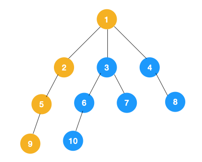

## 深度优先遍历

特点是不撞南墙不回头，先走完一条路，再换一条路继续走。

我们来看看树用深度优先遍历该怎么遍历。

[](https://s2.51cto.com/oss/202004/16/7baebe9f8daff26cc7d0cd7759be096b.png-wh_651x-s_3563755664.png)

1、我们从根节点 1 开始遍历，它相邻的节点有 2，3，4，先遍历节点 2，再遍历 2 的子节点 5，然后再遍历 5 的子节点 9。

[](https://s4.51cto.com/oss/202004/16/ca375e4d1d4a377b4a15dc9e548123d1.png)

其他节点以此类推。


## 广度优先遍历

```
从图的一个未遍历的节点出发，先遍历这个节点的相邻节点，再依次遍历每个相邻节点的相邻节点。
```


[](https://s2.51cto.com/oss/202004/16/29dc30c1546cc73846153359b0fad8fb.gif)

