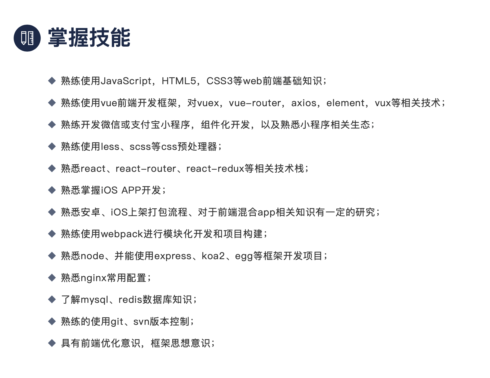
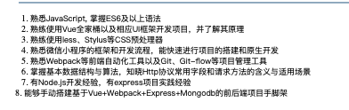
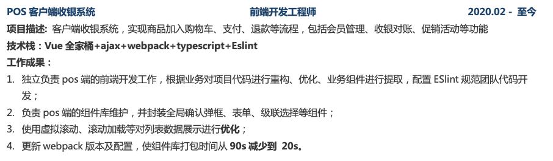
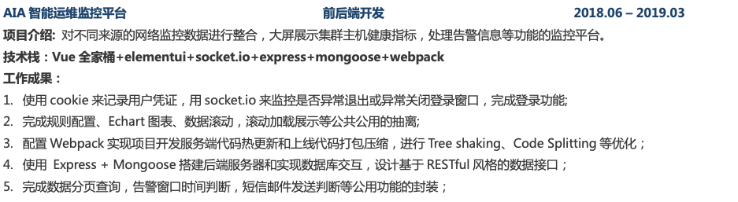

你哪怕改成熟练使用react，知其实现原理

node让你写熟悉，无非就是问个洋葱模型，中间件顺序，cjs和esm的区别而已

app和h5交互

小程序开发

比如huksy制定git规范，eslint规范，jest单测

应该突出用什么技术或工具进行代码审核，肉眼看吗？

>前端组长黑哥王云鹏:
>不然我会认为你是组里喊口号的角色
>
>前端组长黑哥王云鹏:
>比如说你写负责全局公共组件拆分
>
>前端组长黑哥王云鹏:
>要突出技术，技术，还是技术
>
>前端组长黑哥王云鹏:
>前四条都可以写为一条
>
>前端组长黑哥王云鹏:
>第二条你说对代码进行审核
>
>前端组长黑哥王云鹏:
>应该突出用什么技术或工具进行代码审核，肉眼看吗？
>
>

